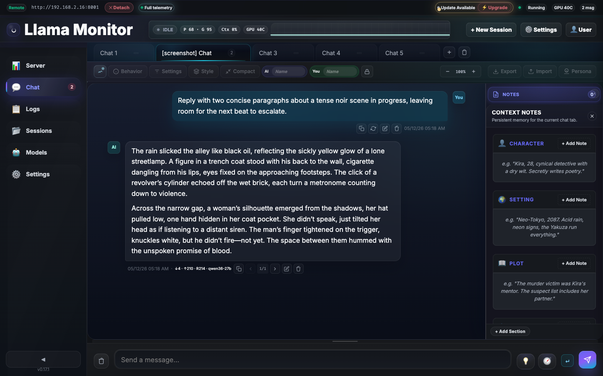
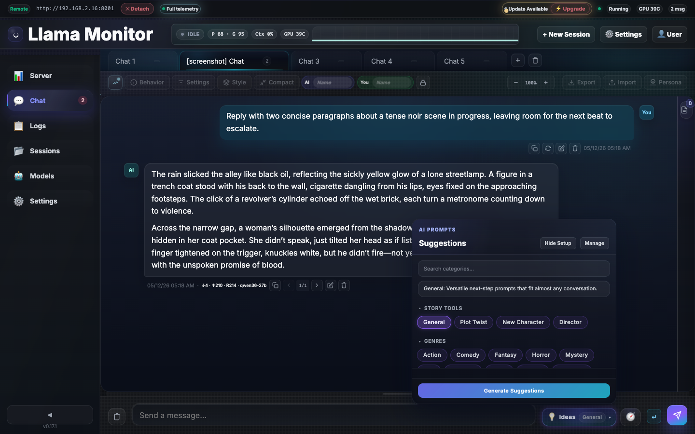
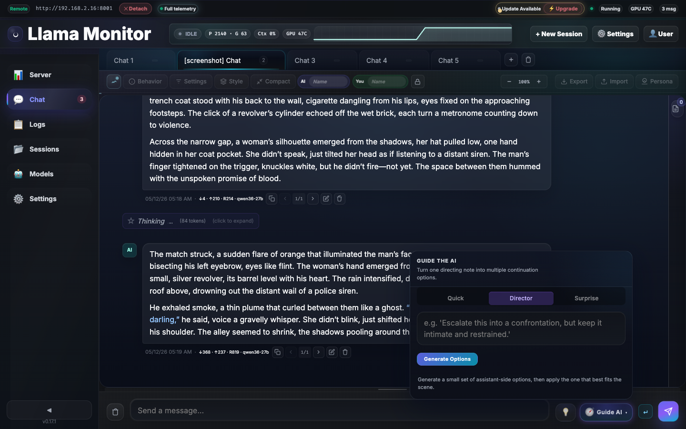
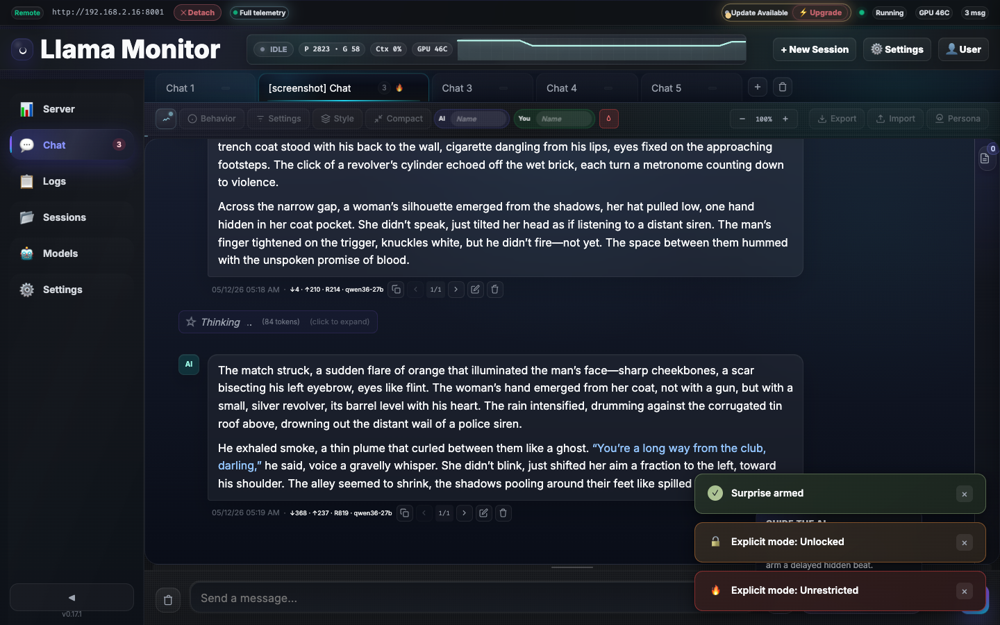

# Llama Monitor

Web dashboard for managing [llama.cpp](https://github.com/ggml-org/llama.cpp) servers with real-time GPU and system monitoring. Supports local and remote deployments, multi-session management, and a lightweight agent mode for headless machines.

## Quick Start

```bash
./llama-monitor
# Open http://localhost:7778
```

On first launch, attach to an existing server or spawn a new one:


## Features

### Monitoring

GPU metrics (temperature, load, VRAM, power, clocks) for AMD ROCm, NVIDIA, Apple Silicon. System metrics (CPU, RAM, motherboard). Inference metrics with live context window gauge.


### Chat

Multi-tab streaming conversations with system prompts, per-tab model parameters, reasoning blocks, and context compaction.


- **Tag cloud search** — Browse and filter suggestions by category (15+ topics)
- **Director mode** — AI-directed multi-step generation with plan-and-execute
- **Persona dropdown** — Switch conversation styles with built-in templates
- **Message actions** — Edit, regenerate, copy, export, import

### Guided Generation

Structured workflow for creative and technical writing. The context notes sidebar sets project goals, tone, and constraints. The suggestions dropdown offers 15+ categories from brainstorming to code review.




The quick guide feature provides step-by-step assistance: **Director** (AI plans then executes) or **Surprise** (AI takes creative liberties).



*Full details in [docs/reference/chat.md](docs/reference/chat.md)*

### Explicit Mode

Three-level content policy system with persona-aware guardrails: **Off** (default safety), **Unlocked** (relaxed for adult themes), **Unrestricted** (no filtering).



*Full details in [docs/reference/chat.md](docs/reference/chat.md)*

## Supported Hardware

| Vendor | Tool | Detection |
|--------|------|-----------|
| AMD | `rocm-smi` | Auto-detected |
| NVIDIA | `nvidia-smi` | Auto-detected |
| Apple Silicon | `mactop` | Auto-detected |
| Windows (CPU temp) | `sensor_bridge.exe` | Bundled with release |

## Installation

Pre-built binaries on the [Releases page](../../releases/latest). Or build from source:

```bash
git clone https://github.com/nmorgowicz-org/llama-monitor.git && cd llama-monitor
cargo build --release
```

## Documentation

- [Dashboard Capabilities](docs/reference/dashboard.md) — Metrics, monitoring, hardware support
- [Remote Agent](docs/reference/remote-agent.md) — Headless deployment, SSH management, auto-update
- [Chat](docs/reference/chat.md) — Multi-tab chat, guided generation, explicit mode, context compaction
- [Real-Time Communication](docs/reference/realtime-communication.md) — WebSocket schema, polling, network detection
- [API Reference](docs/reference/api.md) — REST endpoints
- [CLI Reference](docs/reference/cli-flags.md) — All flags and options
- [Cross-Compilation](docs/reference/cross-compilation.md) — Build targets and toolchains
- [Capability Flags](docs/reference/capabilities.md) — Metric capability system

## Development

```bash
cargo run              # Debug mode
cargo test             # Run tests
cargo clippy -- -D warnings  # Lint
cargo fmt              # Format
cargo build --release  # Production binary
```

Frontend in `static/` is embedded at compile time. No Node.js build step for the backend.

## License

MIT
