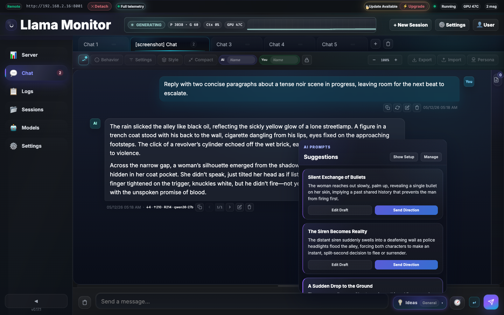
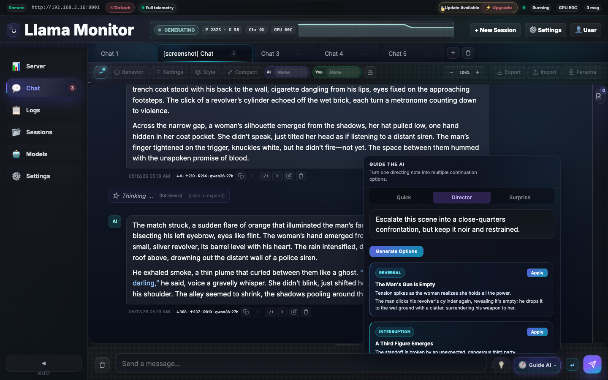
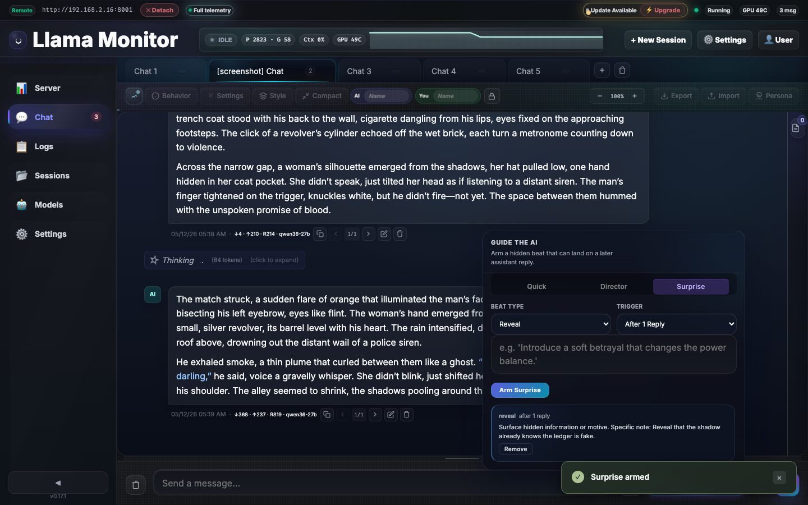

# Llama Monitor

Web dashboard for managing [llama.cpp](https://github.com/ggml-org/llama.cpp) servers with real-time GPU monitoring, multi-session management, and AI-powered creative chat.

## Quick Start

```bash
./llama-monitor
# Open http://localhost:7778
```

## Features

### Monitoring

GPU metrics (temperature, load, VRAM, power, clocks) for AMD ROCm, NVIDIA, Apple Silicon. System metrics (CPU, RAM). Live inference context window gauge.


### Chat

Multi-tab streaming conversations with system prompts, per-tab model parameters, reasoning blocks, and context compaction.


### AI-Generated Suggestions

Real, creative suggestions from the model — not canned templates. The AI reads your context and generates story ideas, plot twists, and scene directions.



### Director Mode

AI-directed multi-step generation. The model plans a scene, then executes it with dramatic reversals and cinematic pacing.



### Surprise Mode

Arm the AI to deliver an unexpected reveal after a set number of replies. Perfect for interactive fiction and roleplay.



**Guided Generation** — AI-powered story beats, scene direction, and timed surprises — [details](docs/reference/chat.md)
**Explicit Mode** — Three-level content policy (Off/Unlocked/Unrestricted) with persona-aware guardrails — [details](docs/reference/chat.md)

## Supported Hardware

| Vendor | Tool | Detection |
|--------|------|-----------|
| AMD | `rocm-smi` | Auto-detected |
| NVIDIA | `nvidia-smi` | Auto-detected |
| Apple Silicon | `mactop` | Auto-detected |
| Windows (CPU temp) | `sensor_bridge.exe` | Bundled |

## Installation

Pre-built binaries on the [Releases page](../../releases/latest). Or build from source:

```bash
git clone https://github.com/nmorgowicz-org/llama-monitor.git && cd llama-monitor
cargo build --release
```

## Documentation

- [Dashboard Capabilities](docs/reference/dashboard.md) — Metrics, monitoring, hardware support
- [Remote Agent](docs/reference/remote-agent.md) — Headless deployment, SSH management, auto-update
- [Chat](docs/reference/chat.md) — Multi-tab chat, guided generation, explicit mode, context compaction
- [Real-Time Communication](docs/reference/realtime-communication.md) — WebSocket schema, polling, network detection
- [API Reference](docs/reference/api.md) — REST endpoints
- [CLI Reference](docs/reference/cli-flags.md) — All flags and options
- [Cross-Compilation](docs/reference/cross-compilation.md) — Build targets and toolchains
- [Capability Flags](docs/reference/capabilities.md) — Metric capability system

## Development

```bash
cargo run              # Debug mode
cargo test             # Run tests
cargo clippy -- -D warnings  # Lint
cargo fmt              # Format
cargo build --release  # Production binary
```

Frontend in `static/` is embedded at compile time. No Node.js build step for the backend.

## License

MIT
