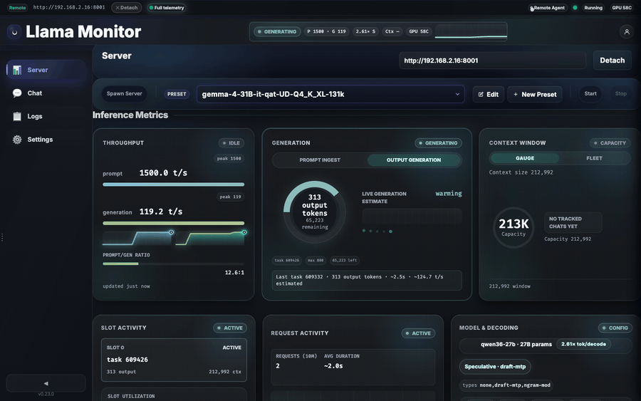
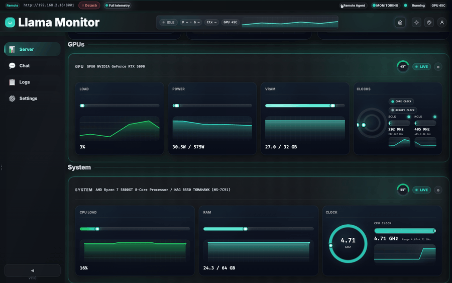
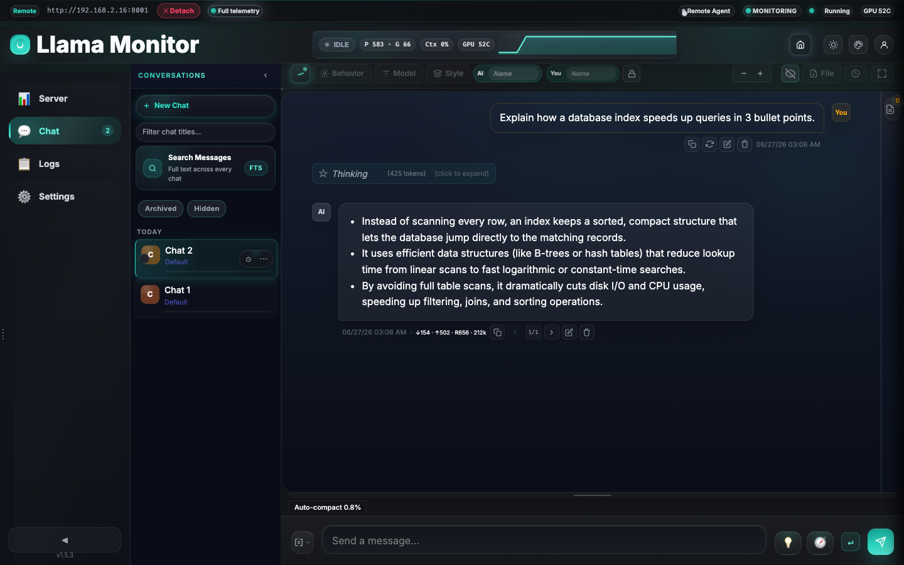
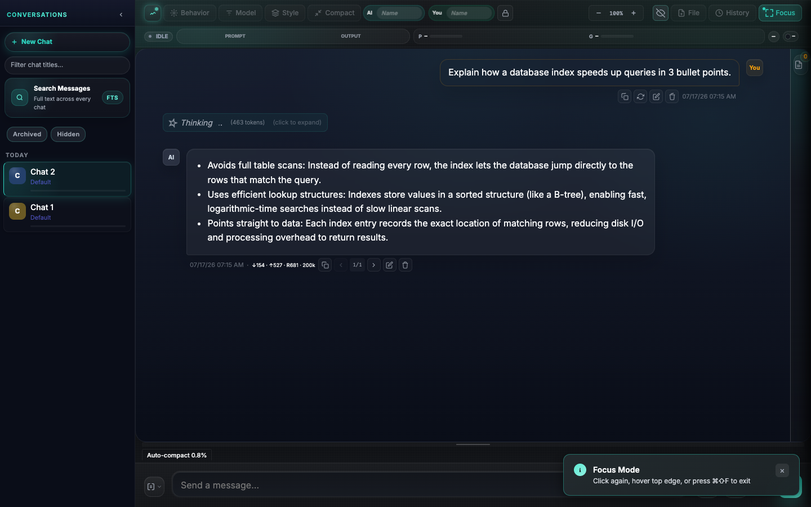
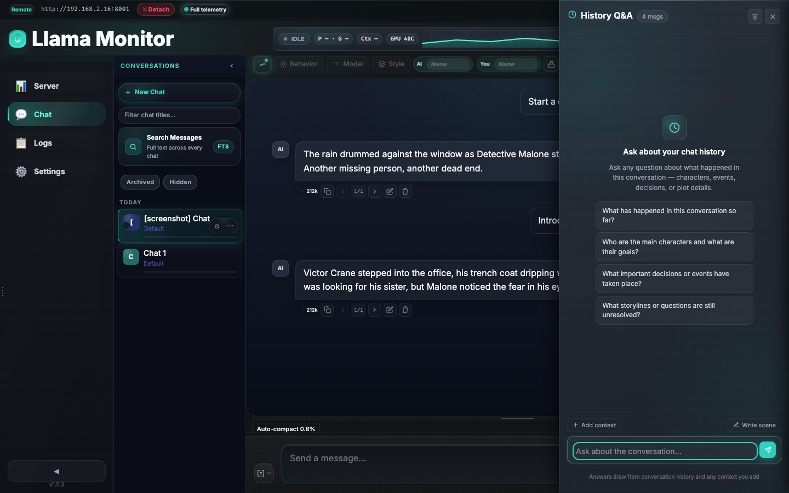
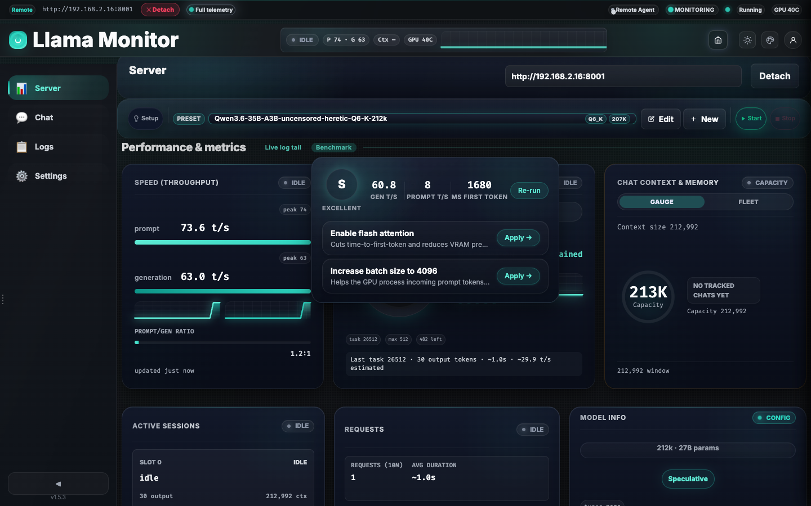
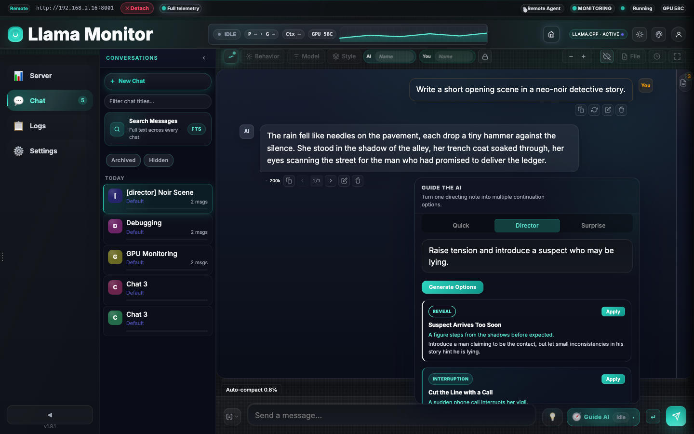
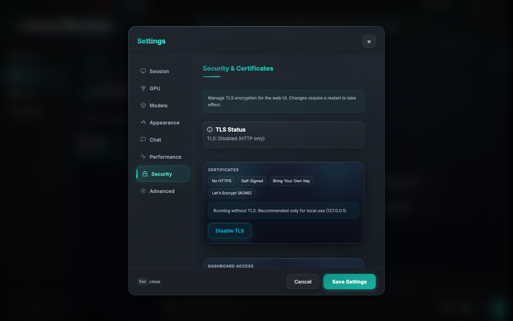

# Llama Monitor

One dashboard for local AI models on macOS, Linux, and Windows. Performance metrics, GPU and system telemetry, active sessions, chat, and a hardware-aware setup wizard.

## Getting started

Run Llama Monitor and open it in your browser:

```bash
./llama-monitor
# Open http://localhost:7778
```

If you’re unsure whether your setup looks healthy, look for green status indicators and no red warnings in the dashboard.

Quick start:

- Open Llama Monitor and connect to a running server.
- Or use the Setup wizard to pick a model, tune settings, and start a server.
- Use the dashboard to check speed, active sessions, and resource usage.
- Start a new conversation from the chat workspace when ready.

## Features

### Live Monitoring Cockpit

Top nav and Server tab show Speed (throughput), context pressure, connection details, active sessions, and model/runtime details in real time. Local sessions read host telemetry directly; remote sessions gain the same depth via the remote agent.



### GPU & System Telemetry

Real-time GPU utilization, temperature, memory, and power, plus CPU and system-level metrics. Designed for local-first and secure remote setups.



### Chat Workspace & Focus Mode

Chat tabs, prompt controls, telemetry overlays, and logs live next to the monitoring dashboard. Focus mode hides all chrome for a distraction-free view.

- Multi-session chats with full history and search
- Per-tab prompt and sampling controls
- Focus mode: hide nav, sidebars, and chrome




### Chat History Q&A

Ask questions about your conversation in a dedicated sliding panel. It searches message history, pulls relevant context, and streams answers without altering your live chat.



### Benchmarking & MTP Sweep
Run live throughput tests and empirical sweeps for Multi-Token Prediction (MTP) draft models directly in the Tuning panel.



### Guided Generation & Prompt Tooling
A per-tab notes sidebar, AI-generated suggestions, quick guide flows, and director/surprise tools help you steer replies without rebuilding the prompt stack.

- Director mode: type one directive and get four distinct continuation options.
- Surprise mode: arm a beat that triggers at a later reply.



### TLS, ACME & mTLS

Built-in TLS with ACME (Let's Encrypt) and mTLS for remote agents. Choose No HTTPS, Self-Signed, Bring Your Own Key, or fully automated ACME with DNS-01 and renewal.

See [TLS Architecture](docs/reference/tls-architecture.md) for full details.



### Start a Server

An integrated setup wizard for discovering, downloading, configuring, and launching a llama-server instance. No CLI flags required.

- **Hardware profiles**: Quick / Balanced / Workstation / Advanced
- **Model sources**:
  - HuggingFace search and curated community picks
  - Third-party import (Ollama, LM Studio, Jan, GPT4All, HF cache)
  - Local GGUF files with VRAM estimates
- **VRAM-aware tuning**: live breakdown bar with auto-size and quant-compare
- **llama.cpp binary management**: auto-download, install, and update the llama.cpp runtime


**Details**:
[Setup wizard](docs/reference/setup-wizard.md) ·
[VRAM Estimator](docs/reference/vram-estimator.md)

---

**Monitoring reference**: [Dashboard Capabilities](docs/reference/dashboard.md)  
**Remote telemetry setup**: [Remote Agent](docs/reference/remote-agent.md)  
**Chat and guided generation**: [Chat](docs/reference/chat.md)  
**TLS / ACME / mTLS**: [TLS Architecture](docs/reference/tls-architecture.md)

## Supported Hardware

| Vendor | Tool | Detection |
|--------|------|-----------|
| AMD | `rocm-smi` | Auto-detected |
| NVIDIA | `nvidia-smi` | Auto-detected |
| Apple Silicon | `mactop` | Auto-detected |
| Windows (CPU temp) | `sensor_bridge.exe` | Bundled |

## Installation

Pre-built binaries are available on the [latest release](../../releases/latest). To build from source:

```bash
git clone https://github.com/nmorgowicz-org/llama-monitor.git
cd llama-monitor
cargo build --release
```

## Documentation

- [Dashboard Capabilities](docs/reference/dashboard.md) — Monitoring, telemetry, refresh behavior
- [Remote Agent](docs/reference/remote-agent.md) — Remote host telemetry, SSH setup, agent lifecycle
- [Chat](docs/reference/chat.md) — Chat tabs, guided generation, prompt tooling
- [Setup wizard](docs/reference/setup-wizard.md) — Configure, download, and start a server; model discovery; VRAM tuning
- [VRAM Estimator](docs/reference/vram-estimator.md) — Architecture-aware VRAM heuristics
- [Real-Time Communication](docs/reference/realtime-communication.md) — WebSocket schema, polling, network detection
- [API Reference](docs/reference/api.md) — REST endpoints
- [CLI Reference](docs/reference/cli-flags.md) — Supported flags
- [Cross-Compilation](docs/reference/cross-compilation.md) — Build targets and toolchains
- [Capability Flags](docs/reference/capabilities.md) — Metric capability system

## Development

```bash
cargo run
cargo test
cargo clippy -- -D warnings
cargo fmt
cargo build --release
```

Frontend assets under `static/` are embedded at compile time. There is no Node build step for the shipped app, but the repo uses Node-based tooling for linting, UI tests, and screenshot capture.

## License

MIT