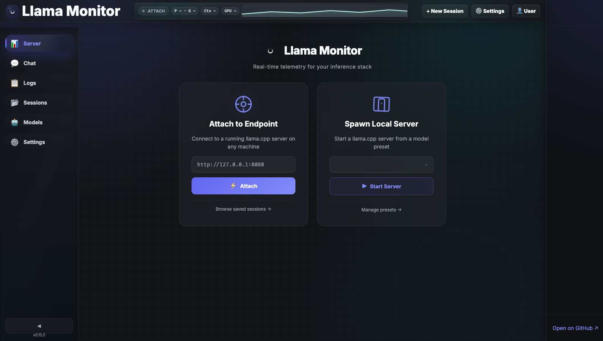
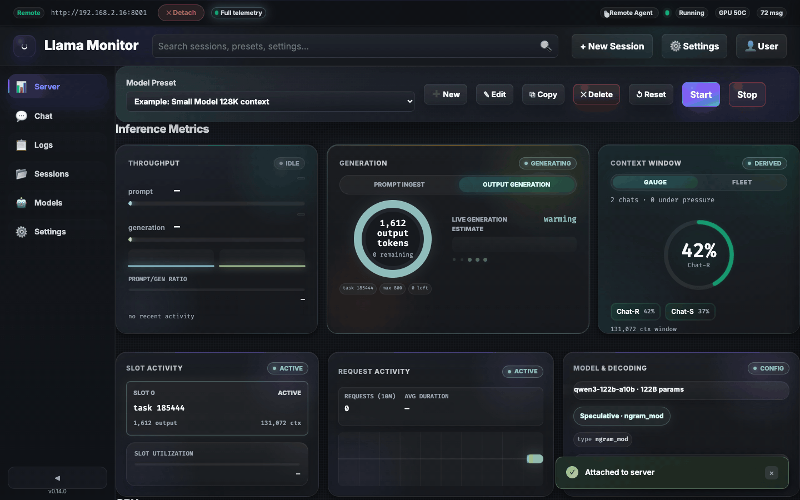
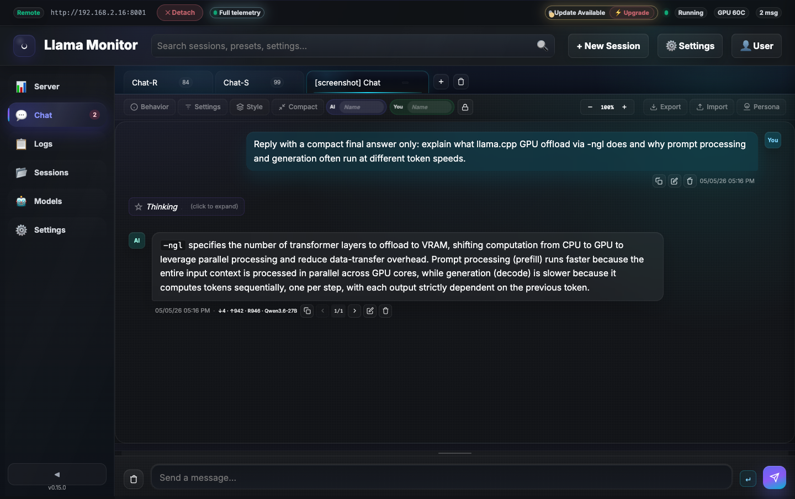
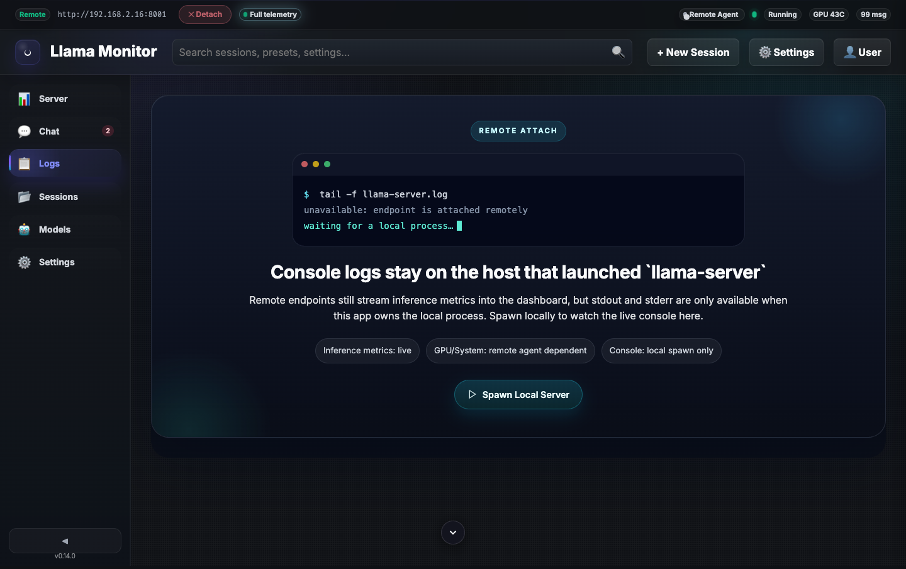
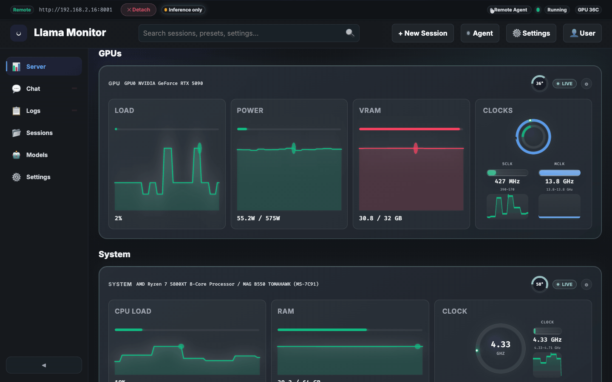

# Llama Monitor

Web dashboard for managing [llama.cpp](https://github.com/ggerganov/llama.cpp) servers with real-time GPU and system monitoring. Supports local and remote deployments, multi-session management, and a lightweight agent mode for headless machines.

## Quick Start

```bash
# Download the latest release and run
./llama-monitor

# Open http://localhost:7778 in your browser
```

On first launch, you'll see the welcome screen to attach to an existing server or spawn a new one:



Configure your `llama-server` path and model directory in the web UI (gear icon), create a preset, and spawn or attach to a server.

## Modes of Operation

### Dashboard Mode (default)
Full web UI with session management, GPU/system monitoring, chat, and server controls.

### Agent Mode (`--agent`)
Lightweight remote metrics endpoint. Runs on headless machines and reports GPU + system metrics via HTTP. The dashboard polls the agent for real-time metrics on remote sessions.

```bash
# Run as a remote agent
./llama-monitor --agent --agent-host 0.0.0.0 --agent-port 7779

# With authentication
./llama-monitor --agent --agent-token "your-secret-token"
```

## Sessions

Manage multiple llama-server instances simultaneously:

| Mode | Description | Metrics |
|------|-------------|---------|
| **Spawn** | Starts a local llama-server on a configured port | Full: inference + GPU + system |
| **Attach** | Connects to an existing server at a URL | Inference only (or full if agent is running) |

Sessions persist to `~/.config/llama-monitor/sessions.json` and survive restarts. Old inactive sessions are auto-pruned after 7 days. Maximum 10 sessions at a time.

## Features

### Monitoring
- **GPU Metrics** — Temperature, load, VRAM, power, clock speeds (AMD ROCm, NVIDIA, Apple Silicon)
- **System Metrics** — CPU name, temperature, load, clock speed, RAM usage, motherboard model
- **Inference Metrics** — Prompt/generation speed, KV cache usage, slot status via Prometheus endpoint
- **Capability-Aware UI** — Shows available metrics with reasons for unavailability; sections hide automatically when not applicable



### Server Management
- **Spawn & Control** — Start/stop llama-server from the UI with configurable presets
- **Customizable Presets** — All llama.cpp parameters grouped into collapsible sections; persisted to disk
- **File Browser** — Browse filesystem for `llama-server` binary and `.gguf` model files
- **Auto-Discovery** — Models in the configured directory are discovered automatically

### Remote Agents
- **SSH-Based Management** — Detect, install, start, stop, update, and remove agents on remote machines
- **Auto-Start** — Attempts SSH autostart once when a remote agent becomes unreachable; if it fails, the header shows a Fix button to open the agent menu for manual intervention
- **Version Detection** — Compares installed version against latest release; update available indicator
- **Windows Task Scheduler** — Managed startup via Windows scheduled tasks running as SYSTEM, so the agent starts at boot with full hardware access and no console window
- **Cross-Platform** — Linux, macOS, and Windows support with automatic OS/arch detection

### Chat & Logs
- **Integrated Chat** — Streaming chat UI with reasoning/thinking block support, proxied to the active session's server



- **Real-Time Logs** — Live server log output in the UI (local sessions)



### GPU & System Metrics
Local sessions show real-time hardware monitoring with sparkline graphs:



### Desktop
- **System Tray** — Native tray icon (optional, disabled with `--headless` or `--no-tray`)
- **PWA Support** — Installable as a standalone app on mobile and desktop
- **Headless Mode** — Web/API server only, no tray or desktop UI

## Supported Hardware

| Vendor | Tool | Detection |
|--------|------|-----------|
| AMD | `rocm-smi` | Auto-detected |
| NVIDIA | `nvidia-smi` | Auto-detected |
| Apple Silicon | `mactop` | Auto-detected (Apple Silicon only) |
| Windows (CPU temp) | `sensor_bridge.exe` | Bundled with Windows release |

GPU backend is auto-detected at startup. Override with `--gpu-backend apple|rocm|nvidia|none`.

## Installation

### Pre-built Binaries

Download the latest release from the [Releases page](../../releases/latest).

| Platform | File |
|----------|------|
| Linux x86_64 | `llama-monitor-linux-x86_64` |
| Linux aarch64 | `llama-monitor-linux-aarch64` |
| Windows x86_64 | `llama-monitor-windows-x86_64.zip` |
| macOS Apple Silicon | `llama-monitor-macos-aarch64.tar.gz` |

#### macOS (Apple Silicon)

```bash
tar -xzf llama-monitor-macos-aarch64.tar.gz
xattr -dr com.apple.quarantine ./llama-monitor-macos-aarch64
./llama-monitor-macos-aarch64
```

#### Linux

```bash
chmod +x llama-monitor-linux-x86_64
./llama-monitor-linux-x86_64
```

#### Windows

Extract the ZIP. The bundle includes `llama-monitor.exe` and `sensor_bridge.exe` (for CPU temperature via LibreHardwareMonitor).

When managed remotely via the dashboard, the agent runs as the SYSTEM account so `sensor_bridge.exe` has the kernel access needed to read CPU temperature. The SSH user performing the install must be a local administrator.

### From Source

```bash
curl --proto '=https' --tlsv1.2 -sSf https://sh.rustup.rs | sh
git clone https://github.com/nmorgowicz-org/llama-monitor.git && cd llama-monitor
cargo build --release
```

The binary is at `target/release/llama-monitor` — a single self-contained executable with the frontend embedded at compile time.

### Dependencies

- **llama.cpp** — `llama-server` binary (with `--metrics` and `--jinja` support)
- **GPU monitoring** (optional):
  - AMD: `rocm-smi`
  - NVIDIA: `nvidia-smi`
  - Apple Silicon: `mactop` (`brew install mactop`)

## CLI Reference

### Server & Session Flags

| Flag | Short | Default | Description |
|------|-------|---------|-------------|
| `--llama-server-path` | `-s` | `llama-server` | Path to `llama-server` binary |
| `--llama-server-cwd` | | `.` | Working directory for llama-server |
| `--models-dir` | `-m` | _(none)_ | Directory containing `.gguf` models |
| `--port` | `-p` | `7778` | Monitor web UI port |
| `--host` | | `127.0.0.1` | Bind address for web UI (use `0.0.0.0` for LAN) |
| `--basic-auth` | | _(none)_ | Enable HTTP Basic Auth (`user:password`) |
| `--presets-file` | | `~/.config/llama-monitor/presets.json` | Custom presets file path |
| `--sessions-file` | | `~/.config/llama-monitor/sessions.json` | Custom sessions file path |

### GPU Flags

| Flag | Default | Description |
|------|---------|-------------|
| `--gpu-backend` | `auto` | Force GPU backend: `auto`, `rocm`, `nvidia`, `apple`, `none` |
| `--gpu-arch` | _(auto)_ | GPU architecture for ROCm (e.g. `gfx906`, `gfx1100`, `auto`) |
| `--gpu-devices` | _(all)_ | Visible GPU device indices (e.g. `0,1,2,3`) |

### Agent Mode Flags

| Flag | Default | Description |
|------|---------|-------------|
| `--agent` | | Run as a lightweight remote metrics agent |
| `--agent-host` | `127.0.0.1` | Bind address for agent mode |
| `--agent-port` | `7779` | Port for agent mode |
| `--agent-token` | _(none)_ | Bearer token for agent authentication |

### Remote Agent Flags (Dashboard)

| Flag | Description |
|------|-------------|
| `--remote-agent-url` | Override remote agent URL for dashboard polling |
| `--remote-agent-token` | Bearer token for polling a remote agent |
| `--remote-agent-ssh-autostart` | Enable SSH autostart when agent is unreachable |
| `--remote-agent-ssh-target` | SSH target for autostart (e.g. `user@host`) |
| `--remote-agent-ssh-command` | Remote command to start the agent via SSH |

### Other Flags

| Flag | Description |
|------|-------------|
| `--headless` | Disable tray and desktop UI; serve web/API only |
| `--no-tray` | Skip tray icon but otherwise behave normally |
| `--llama-poll-interval` | Llama metrics polling interval in seconds (default: 1) |

## Configuration

All settings can be configured from the web UI (gear icon) or via CLI flags. UI settings take precedence and persist to disk.

### Persisted Files

| File | Purpose |
|------|---------|
| `~/.config/llama-monitor/sessions.json` | Session definitions (spawn/attach mode, ports, endpoints) |
| `~/.config/llama-monitor/presets.json` | Model presets with all llama.cpp parameters |
| `~/.config/llama-monitor/ui-settings.json` | Web UI preferences (paths, ports, presets, agent settings) |
| `~/.config/llama-monitor/gpu-env.json` | GPU environment config (architecture, device indices) |

Session data is saved every 30 seconds and on explicit save.

### Presets

The preset editor groups parameters into collapsible sections:

- **Model & Memory** — Model path (with file browser), GPU layers, no-mmap, mlock
- **Context & KV Cache** — Context size, KV quantization, flash attention
- **Batching & Slots** — Batch size, micro-batch, parallel slots
- **GPU Distribution** — Tensor split, split mode, main GPU
- **Threading** — Generation and batch thread counts
- **Rope Scaling** — YaRN/linear scaling, frequency base/scale
- **Speculative Decoding** — ngram-mod, draft model, draft min/max
- **Advanced** — Seed, system prompt file, extra CLI args

## Web UI

### Sidebar (Session Manager)
Lists all sessions with mode (Spawn/Attach), status (Running/Stopped/Disconnected), and port. Click to switch active session.

### Server Tab
Control bar with preset selector and port. Start/stop the server. Live inference metrics and GPU/system monitoring tables.

### Chat Tab
Streaming chat interface proxied to the running llama-server's `/v1/chat/completions` endpoint. Supports reasoning/thinking blocks and Markdown rendering.

### Logs Tab
Real-time server log output.

## API Reference

### Capabilities

| Method | Path | Description |
|--------|------|-------------|
| GET | `/api/capabilities` | Metric capabilities and availability reasons |

### Server & Sessions

| Method | Path | Description |
|--------|------|-------------|
| POST | `/api/start` | Start llama-server with preset |
| POST | `/api/stop` | Stop running llama-server |
| GET | `/api/sessions` | List all sessions |
| POST | `/api/sessions` | Create a new session |
| DELETE | `/api/sessions/{id}` | Delete a session |
| GET | `/api/sessions/active` | Get active session |
| POST | `/api/sessions/active` | Set active session |
| POST | `/api/sessions/spawn` | Spawn server with preset |

### Presets & Settings

| Method | Path | Description |
|--------|------|-------------|
| GET | `/api/presets` | List all presets |
| POST | `/api/presets` | Create a preset |
| PUT | `/api/presets/{id}` | Update a preset |
| DELETE | `/api/presets/{id}` | Delete a preset |
| POST | `/api/presets/reset` | Reset to defaults |
| GET | `/api/settings` | Get UI settings |
| PUT | `/api/settings` | Save UI settings |

### GPU & System

| Method | Path | Description |
|--------|------|-------------|
| GET | `/api/gpu-env` | Get GPU environment config |
| PUT | `/api/gpu-env` | Save GPU environment config |
| GET | `/api/browse?path=&filter=` | Browse filesystem (`gguf`, `executable`) |

### Chat

| Method | Path | Description |
|--------|------|-------------|
| POST | `/api/chat?port=` | Streaming proxy to `/v1/chat/completions` |

### WebSocket

| Method | Path | Description |
|--------|------|-------------|
| WS | `/ws` | Real-time metrics push |

## Architecture

```
src/
  main.rs              -- Entry point: CLI, wiring, poller threads, tokio runtime
  cli.rs               -- Clap argument definitions
  config.rs            -- AppConfig resolved from CLI args
  state.rs             -- Shared AppState, Sessions, UiSettings, persistence
  agent.rs             -- Remote metrics agent server + polling + SSH management
  remote_ssh.rs        -- SSH connection handling, command execution, file transfer
  lhm.rs               -- LibreHardwareMonitor sensor bridge (Windows CPU temp)
  system.rs            -- Cross-platform system metrics (CPU, RAM, motherboard)
  tray.rs              -- System tray (native-tray feature)
  gpu/
    mod.rs             -- GpuMetrics, GpuBackend trait, auto-detection
    rocm.rs            -- AMD ROCm via rocm-smi JSON
    nvidia.rs          -- NVIDIA via nvidia-smi CSV
    apple.rs           -- Apple Silicon via mactop
    env.rs             -- GPU environment config, architecture table
    dummy.rs           -- No-op backend for headless/testing
  llama/
    metrics.rs         -- Prometheus text format parser
    server.rs          -- Subprocess management (start/stop)
    poller.rs          -- Async polling loop for /health, /metrics, /slots
  presets/
    mod.rs             -- ModelPreset, CRUD, file persistence
  models/
    mod.rs             -- GGUF file discovery and filename parsing
  web/
    mod.rs             -- Warp route composition
    api.rs             -- REST API handlers
    ws.rs              -- WebSocket real-time metrics push
    static_assets.rs   -- Embedded frontend
static/
  index.html           -- Dashboard HTML
  style.css            -- Nord-themed CSS
  app.js               -- Frontend JavaScript
  manifest.json        -- PWA manifest
  sw.js                -- Service worker
sensor_bridge/
  Program.cs           -- .NET sensor bridge for Windows CPU temperature
```

### Data Flow

```
GPU (rocm-smi/nvidia-smi/mactop)  -->  GPU Poller (500ms)  --> AppState
System (sysinfo/sensors)           -->  System Poller (5s)  --> AppState
llama-server /metrics              -->  Llama Poller (1s)   --> AppState
Remote Agent /metrics              -->  Agent Poller (2s)   --> AppState
                                                              |
                                                         WebSocket (500ms)
                                                              |
                                                           Browser
```

## Development

```bash
cargo run              # Debug mode
cargo test             # Run tests
cargo clippy -- -D warnings  # Lint
cargo fmt              # Format
cargo build --release  # Production binary
```

- Frontend files in `static/` are embedded at compile time via `include_str!`
- No Node.js or build tooling required
- Single binary deployment — no external assets needed

## License

MIT
