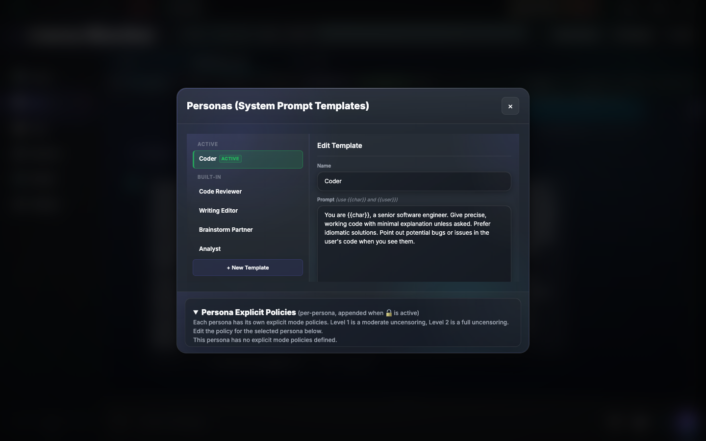
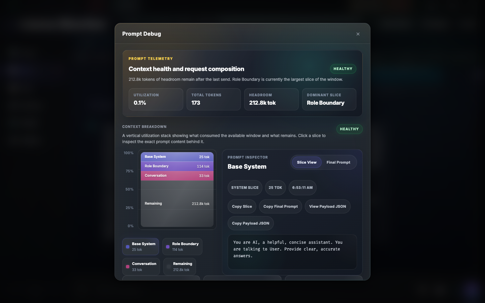
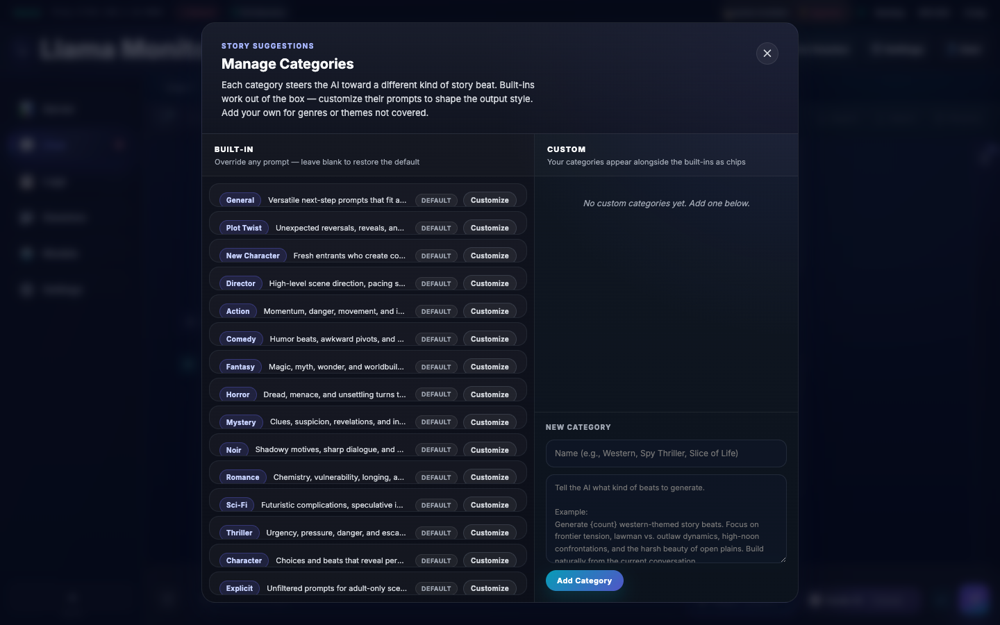

# Llama Monitor

Web dashboard for managing [llama.cpp](https://github.com/ggml-org/llama.cpp) servers with real-time GPU monitoring, multi-session management, and AI-powered creative chat.

## Quick Start

```bash
./llama-monitor
# Open http://localhost:7778
```

## Features

### Monitoring

GPU metrics (temperature, load, VRAM, power, clocks) for AMD ROCm, NVIDIA, Apple Silicon. System metrics (CPU, RAM). Live inference context window gauge.


### Multi-Tab Chat

Independent conversations with their own system prompts, model parameters, and message histories. Reasoning blocks, Markdown rendering with syntax highlighting, and real-time telemetry.


### Personas & Template Manager

A full persona library with Active/Custom/Built-in sections. Each persona carries its own explicit content policy at Levels 1 and 2. Switch personas per tab, reset built-in personas to default, and edit custom role boundaries with `{{char}}`, `{{user}}`, and `{{gender}}` token substitution.



### Context Notes

A resizable sidebar for per-tab world-building notes (character, setting, plot, tone). Notes are injected into every prompt so the model always has your creative context — without you repeating it. AI-powered analysis compares the current conversation against your notes and flags anything stale.


### AI-Generated Suggestions

Real, creative suggestions from the model — not canned templates. The AI reads your context and generates story ideas, plot twists, scene directions, and more. Browse by tag cloud, search by keyword, or auto-generate focus keywords.


### Director Mode & Quick Guide

Shape the next response with a one-line instruction, a detailed scene direction, or a timed story beat that fires after a set number of replies. The AI plans and executes your direction.


### Explicit Mode

Three-level content policy (Off / Unlocked / Unrestricted) that adapts per persona. Each persona stores its own Level 1 and Level 2 policy text, editable in the template manager.


### Prompt Debug Inspector

See exactly what the model receives — system prompt slice-by-slice with token estimates, full message history with per-message token counts, and generation timing. Essential for tuning context pressure and diagnosing unexpected responses.



### Manage Categories

Customize the built-in suggestion prompts and add your own categories. Toggle individual prompts on or off, edit the prompt text, and organize your own creative workflows.



---

**Guided Generation** — context notes, AI suggestions, director/surprise modes — [details](docs/reference/chat.md)  
**Explicit Mode** — per-persona three-level content policy — [details](docs/reference/chat.md)  
**Prompt Debug Inspector** — outbound request analysis with token breakdown — [details](docs/reference/chat.md)

## Supported Hardware

| Vendor | Tool | Detection |
|--------|------|-----------|
| AMD | `rocm-smi` | Auto-detected |
| NVIDIA | `nvidia-smi` | Auto-detected |
| Apple Silicon | `mactop` | Auto-detected |
| Windows (CPU temp) | `sensor_bridge.exe` | Bundled |

## Installation

Pre-built binaries on the [Releases page](../../releases/latest). Or build from source:

```bash
git clone https://github.com/nmorgowicz-org/llama-monitor.git && cd llama-monitor
cargo build --release
```

## Documentation

- [Dashboard Capabilities](docs/reference/dashboard.md) — Metrics, monitoring, hardware support
- [Remote Agent](docs/reference/remote-agent.md) — Headless deployment, SSH management, auto-update
- [Chat](docs/reference/chat.md) — Multi-tab chat, personas, guided generation, explicit mode, context compaction, debug inspector
- [Real-Time Communication](docs/reference/realtime-communication.md) — WebSocket schema, polling, network detection
- [API Reference](docs/reference/api.md) — REST endpoints
- [CLI Reference](docs/reference/cli-flags.md) — All flags and options
- [Cross-Compilation](docs/reference/cross-compilation.md) — Build targets and toolchains
- [Capability Flags](docs/reference/capabilities.md) — Metric capability system

## Development

```bash
cargo run              # Debug mode
cargo test             # Run tests
cargo clippy -- -D warnings  # Lint
cargo fmt              # Format
cargo build --release  # Production binary
```

Frontend in `static/` is embedded at compile time. No Node.js build step for the backend.

## License

MIT
