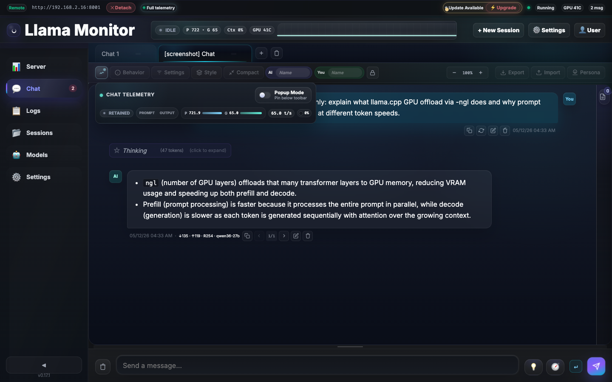
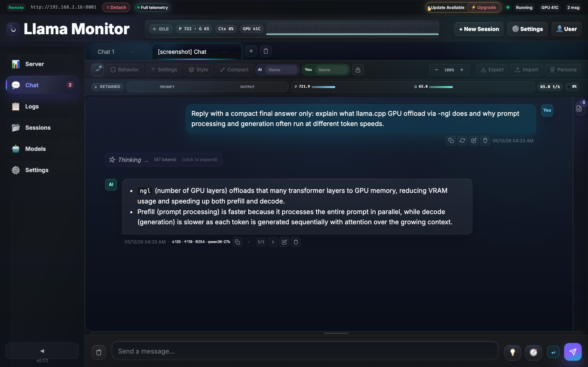
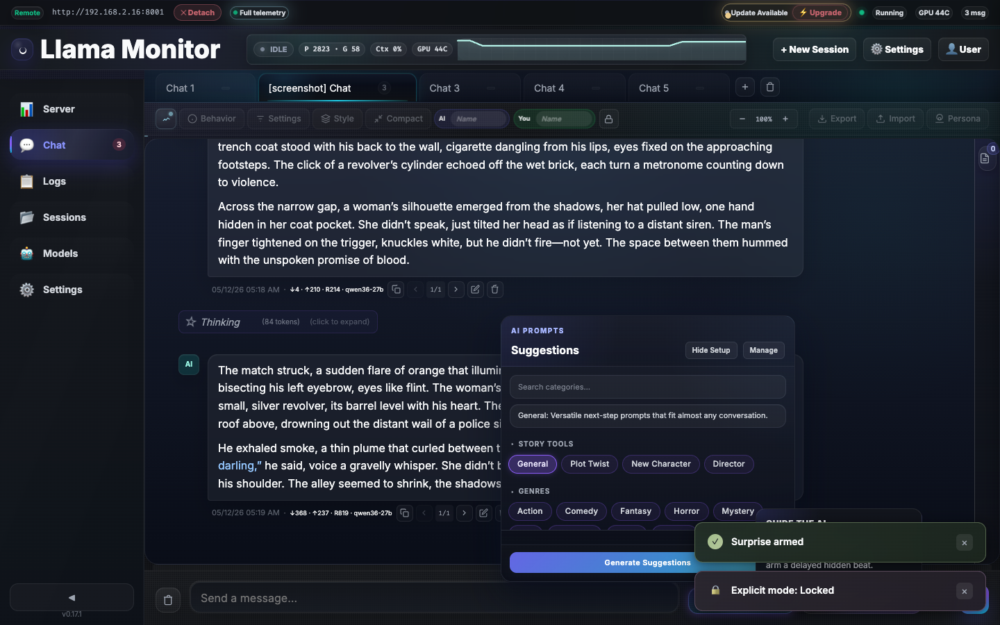
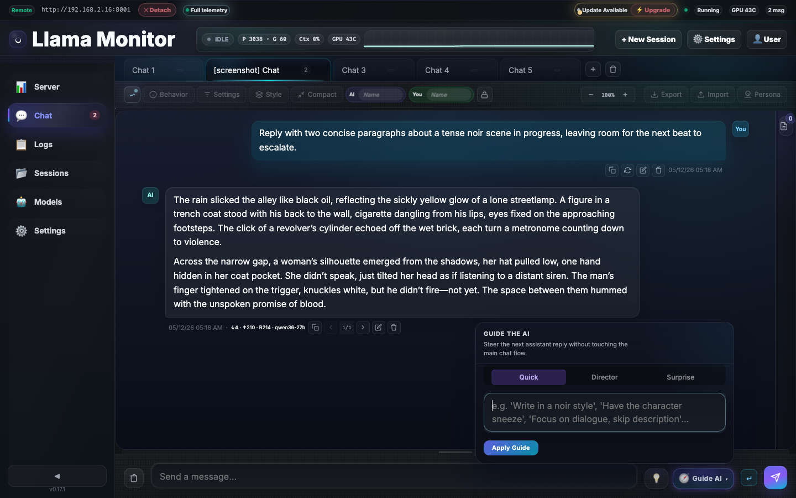
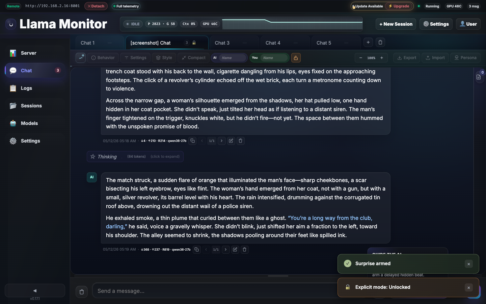

# Chat

The chat tab provides multi-tab streaming conversations with the connected llama.cpp server, per-tab configuration, and real-time telemetry.

## Tab Management

- **Multi-tab** — Parallel conversations with independent system prompts, model parameters, and message history
- **Pin tabs** — Pinned tabs stay at the front and persist across sessions
- **Keyboard switching** — Ctrl+1–9 by position, Ctrl+Shift+←/→ to cycle
- **Rename** — Custom tab names persist in `chat-tabs.json`
- **Maximum 10 tabs** — Old inactive tabs are auto-pruned

## Messaging

- **Streaming** — Real-time SSE streaming from `/v1/chat/completions`
- **Reasoning blocks** — Thinking/reasoning content rendered in expandable blocks
- **Markdown rendering** — Full Markdown with syntax-highlighted code blocks (highlight.js, atom-one-dark theme)
- **Code block headers** — Language label, line count, and copy button per block
- **Token estimates** — Input shows `~N tok` with color warnings at 800+ (yellow) and 1500+ (red) tokens
- **Smart scroll** — Auto-scroll only when near bottom; scroll-to-bottom button with unread count badge
- **History pagination** — Long conversations render only the most recent N messages (default 15); "Load More" reveals older batches

### Message Actions

| Action | Description |
|--------|-------------|
| **Edit** | Edit any user message (not just the last one) and regenerate from that point |
| **Regenerate** | Re-send from any user message to get a different response |
| **Copy** | Copy message text to clipboard |
| **Export** | Download entire chat history as formatted JSON |
| **Import** | Import conversations from `.json` (full tab restore) or `.md` (append messages to active tab) |

## System Prompts & Personas

- **Custom system prompts** — Per-tab system prompt with live editing
- **Template library** — Pre-built persona templates with policy management
- **Persona dropdown** — Select a persona template from the dropdown menu; persists per-tab via `active_template_id`
- **Template manager** — Create, edit, and delete custom persona templates with policy management
- **Explicit mode** — See "Explicit Mode v2" section below for the three-level system

## Model Parameters

Per-tab controls for generation behavior. An active-params dot indicator appears when non-defaults are set.

| Parameter | Description |
|-----------|-------------|
| Temperature | Randomness (0.0–2.0) |
| top_p | Nucleus sampling threshold |
| top_k | Top-k sampling |
| min_p | Minimum probability threshold |
| repeat_penalty | Repetition avoidance |
| max_tokens | Output length limit |

## Context Compaction

Recover from full context windows by summarizing earlier conversation into a tombstone message.

- **Manual compaction** — Click Compact to summarize messages above the threshold
- **Auto-compaction** — Per-tab threshold control; compacts automatically when context pressure exceeds the limit
- **Multi-compact safe** — Tombstones are preserved across re-compactions
- **Context ring** — Live context pressure indicator in the telemetry rail

## Chat Telemetry

Real-time metrics for the active chat tab, accessible via the telemetry toggle in the chat header.

### Summary Rail (always visible)
- **State chip** — Current generation state (idle, prompting, generating)
- **Prompt/Output stage** — Visual indicator of current processing phase
- **Throughput bars** — Live prompt (P) and generation (G) token speeds with mini progress bars
- **Live rate** — Current generation rate in tokens/sec
- **Context ring** — Current tab context pressure with percentage

### Expanded Detail Panel
- **Throughput grid** — Detailed prompt and generation speed metrics
- **Sparkline** — Throughput history chart
- **Task metadata** — Task ID, context usage, model info
- **Slot tiles** — Per-slot status with generation progress
- **Activity timeline** — 5-minute rolling window of recent tasks

### Popup Mode
The telemetry panel can float as a popover or pin inline below the chat toolbar. The popup mode includes a pin toggle to switch between floating and inline layouts.




## Chat Style

The style panel (gear icon in chat header) controls the visual appearance of messages.

| Style | Description |
|-------|-------------|
| **Rounded** | Default — rounded message bubbles with subtle shadows |
| **Compact** | Tighter spacing, thinner borders, reduced padding |
| **Minimal** | Flat design, no shadows, minimal chrome |
| **Bubbly** | Larger bubbles with gradient backgrounds |

Style selection persists in `localStorage` key `llama-monitor-chat-style`.

### Font Scaling

Adjust message font size from 70% to 150% in 10% increments via the style panel. Stored as CSS variable `--chat-font-scale`.

### Date Format

Control how timestamps appear on messages via Settings > Appearance > Date Format:

| Format | Example |
|--------|---------|
| `MM/DD/YY` | 05/06/26 |
| `DD/MM/YY` | 06/05/26 |
| `YYYY-MM-DD` | 2026-05-06 |
| `locale` | Browser locale default |

### Enter Behavior

Toggle whether Enter sends the message or inserts a newline. When off, use Ctrl+Enter to send. Persists per-user in preferences.

## Guided Generation

Guided generation tools help shape conversations through structured notes, contextual suggestions, and pre-built prompts.

### Context Notes Sidebar

A persistent, resizable sidebar with predefined sections for organizing creative direction:

- **Character** — Character descriptions, motivations, and voice notes
- **Setting** — World-building details, locations, and atmosphere
- **Plot** — Story beats, plot points, and narrative arcs
- **Tone** — Mood, pacing, and stylistic preferences

Notes persist per-tab and are included as context when generating responses.


### Suggestions Dropdown

An AI-powered suggestion system with 15+ category chips organized in collapsible groups:

- **Story Tools** — Scene transitions, dialogue prompts, conflict generators
- **Genres** — Genre-specific writing prompts and tropes
- **Explicit** — Mature content suggestions and direction

The dropdown includes a search filter for quick access to specific suggestion types.




### Quick Guide

An inline instruction panel with three modes for controlling generation:

| Mode | Description |
|------|-------------|
| **Quick** | Direct instruction — send a one-line command to steer the next response |
| **Director** | Custom prompt — write a detailed scene direction for the AI to follow |
| **Surprise** | Timed injection — schedule a prompt to appear after a set number of messages |




### Suggestion History

Recently used suggestions are tracked per-tab for quick reuse. The history panel shows the last 20 suggestions with timestamps.

### Pathweaver Prompts

17 pre-built prompts for different genres and creative scenarios:

- **Action** — Fight scenes, chase sequences, and high-stakes moments
- **Comedy** — Dialogue-driven humor and situational comedy
- **Fantasy** — World-building, magic systems, and epic quests
- **Horror** — Suspense, atmosphere, and jump-scare pacing
- **Mystery** — Clues, red herrings, and detective work
- **Romance** — Emotional beats and relationship dynamics
- **Sci-Fi** — Technology, space exploration, and future societies
- **Thriller** — Tension, pacing, and plot twists
- **Drama** — Character development and emotional arcs

## Explicit Mode v2

A three-level content filtering system that adapts to the active persona's content policy.

### Levels

| Level | Icon | Description |
|-------|------|-------------|
| **Off** | 🔒 | Default — standard content filtering for all personas |
| **Unlocked** | 🔓 | Level 1 — relaxed filtering, allows mild mature content |
| **Unrestricted** | 🔥 | Level 2 — full uncensored mode, no content restrictions |

### Persona-Specific Policies

Each persona has its own default explicit mode setting:

| Persona | Default Level | Notes |
|---------|--------------|-------|
| **Roleplay Companion** | Unlocked | Allows mild romance and emotional intimacy |
| **Study Partner** | Off | Educational content only |
| **Therapist** | Unlocked | Allows discussion of sensitive topics |
| **Business Advisor** | Off | Professional content only |
| **Philosopher** | Off | Academic and intellectual content |

### Controls

- **Chat footer toggle** — Quick toggle between levels in the chat input footer
- **Settings panel** — Full explicit mode controls in Settings > Content Policy




## Model Parameters (Extended)

Additional per-tab parameters beyond the core sampling controls:

| Parameter | Default | Description |
|-----------|---------|-------------|
| `stream_timeout` | 120s | Maximum time to wait for a streaming response before timing out |

## Context Compaction (Extended)

Two compaction modes control how the chat recovers from full context windows:

| Mode | Behavior |
|------|----------|
| **Percent** | Triggers when context usage exceeds a configurable threshold (default 80%) |
| **Optimized** | Triggers when fewer than 25,000 tokens remain in the context window |

- **Auto-summarize** — When enabled, dropped messages are sent to the LLM for summarization instead of simple truncation
- **Threshold slider** — Adjust auto-compact trigger from 0% to 100% per tab
- **Context pressure bar** — Visual indicator in the chat header showing current context usage

## Message Management

| Feature | Description |
|---------|-------------|
| **Message limit** | Control how many messages are rendered (5–200, default 15). Tabs with long conversations render only the most recent N messages; click "Load More" for older batches |
| **Copy settings** | Copy system prompt and model parameters from any other tab to the active tab via the copy settings dropdown |
| **AI/You names** | Customize the display names for assistant and user roles per tab |
| **Tab trash** | Deleted tabs are retained for 24 hours and can be restored via the tab trash menu |

## Export & Import

Export and import support two formats for chat conversations.

### Markdown Export

Exports chat history as formatted Markdown with:

- **Role labels** — `**User**: content` and `**Assistant**: content` blocks
- **Token counts** — Each message includes input/output token estimates
- **Timestamps** — Message timestamps in ISO 8601 format
- **Metadata** — System prompt, model parameters, and tab name in a header block

### JSON Export

Exports raw message array as `{tab-name}.json` with:

- **Full message objects** — `{role, content, tokens, timestamp}` per message
- **Tab metadata** — System prompt, model parameters, and settings included
- **Full tab restore** — Importing a JSON file restores the entire tab state

### Import

| Format | Behavior |
|--------|----------|
| **Markdown** | Parses role/content pairs and appends messages to the active tab (preserves existing history) |
| **JSON** | Parses `{role, content}` objects and appends to active tab; if file contains tab metadata, offers full tab restore |

## Data Flow

```
User message → /v1/chat/completions (SSE stream) → Browser renders tokens live
                                                    ↓
                                            WebSocket metrics (500ms) → Telemetry rail updates
```

## Persistence

Chat tabs, messages, system prompts, and model parameters persist to `~/.config/llama-monitor/chat-tabs.json`. Data is saved on every change (debounced) and survives app restarts.
