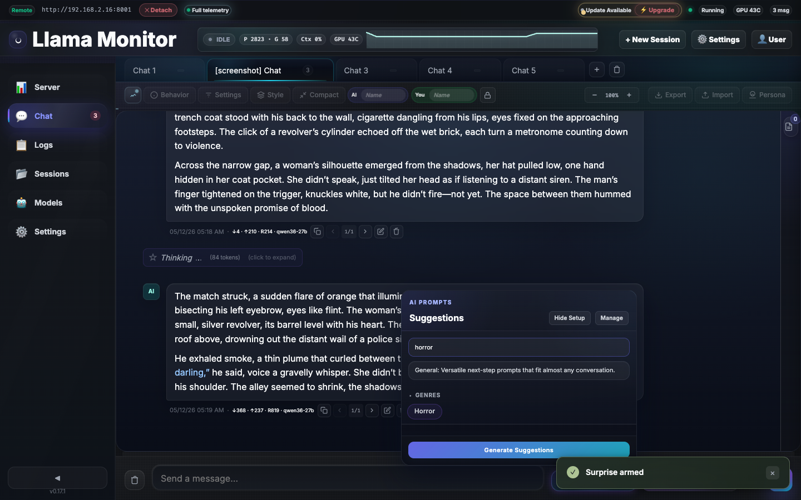
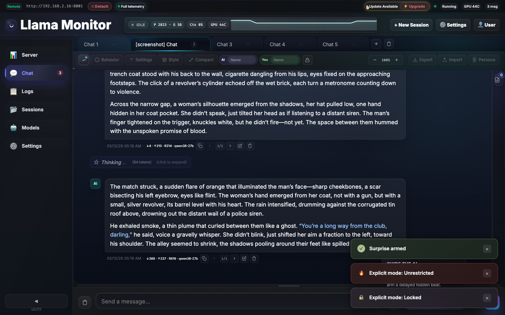

# Chat

The chat tab provides multi-tab streaming conversations with the connected llama.cpp server, per-tab configuration, and real-time telemetry.

## Tab Management

- **Multi-tab** — Parallel conversations with independent system prompts, model parameters, and message history
- **Pin tabs** — Pinned tabs stay at the front and persist across sessions
- **Keyboard switching** — Ctrl+1–9 by position, Ctrl+Shift+←/→ to cycle
- **Rename** — Custom tab names persist in `chat-tabs.json`
- **Maximum 10 tabs** — Old inactive tabs are auto-pruned
- **Periodic save** — Tabs auto-save every 30 seconds to prevent data loss on force-kill

## Messaging

- **Streaming** — Real-time SSE streaming from `/v1/chat/completions`
- **Reasoning blocks** — Thinking/reasoning content rendered in expandable blocks; raw content stored in `thinking_content` field per message
- **Markdown rendering** — Full Markdown with syntax-highlighted code blocks (highlight.js, atom-one-dark theme)
- **Code block headers** — Language label, line count, and copy button per block
- **Token estimates** — Input shows `~N tok` with color warnings at 800+ (yellow) and 1500+ (red) tokens
- **Smart scroll** — Auto-scroll only when near bottom; scroll-to-bottom button with unread count badge
- **History pagination** — Long conversations render only the most recent N messages (default 15); "Load More" reveals older batches
- **RP text colorization** — Dialogue quoted with any Unicode double-quote variant (", ", „, ‟, «, ») is highlighted. Works correctly across inline formatting like bold and italic.

### Message Actions

| Action | Description |
|--------|-------------|
| **Edit** | Edit any user message (not just the last one) and regenerate from that point |
| **Regenerate** | Re-send from any user message to get a different response |
| **Copy** | Copy message text to clipboard |
| **Export** | Download entire chat history as formatted JSON |
| **Import** | Import conversations from `.json` (full tab restore) or `.md` (append messages to active tab) |

## Personas & Template Manager

The template manager is the central place for managing all chat personas.


### Template List Sections

The persona list organizes templates into three sections:

| Section | Description |
|---------|-------------|
| **Active** | The persona currently applied to this chat tab — shown at the top with an "Active" badge |
| **Custom** | User-created personas |
| **Built-in** | Pre-built personas shipped with llama-monitor |

### Applying a Persona

- Click the persona chip in the chat header to open a quick-select menu
- Select a persona to apply it to the current tab; the `active_template_id` is saved per-tab
- Open the template manager (pencil icon on the persona chip) for full editing

### Per-Persona Explicit Policies

Each template stores independent policy text for Level 1 (moderate) and Level 2 (unrestricted) explicit modes. These policies are appended to the system prompt when explicit mode is active, replacing the global policy.

### Reset to Default

Built-in personas can be reset to their original prompt and explicit policies via the reset button in the template manager. User copies of built-in personas are overwritten; pure built-in entries (no user copy) show "Already at default."

### Token Substitution

System prompts support these substitution tokens:

| Token | Replaced With |
|-------|---------------|
| `{{char}}` | The AI name for this tab |
| `{{user}}` | The user name for this tab |
| `{{gender}}` | The AI gender (`male`, `female`, or `neutral`) — defaults to `neutral` |

Set `ai_gender` on any tab to control how `{{gender}}` resolves throughout the system prompt and explicit policies.

### Custom Role Boundary

By default, the role boundary instruction tells the model to write only the assistant's reply and not speak for the user. You can override this per-tab with a custom `role_boundary_custom` text field. Leave blank to use the auto-generated default.

## Behavior Panel

The behavior panel (flag icon in the chat toolbar) provides quick access to the persona system prompt, role boundary configuration, and AI gender setting for the current tab.


## Model Parameters

Per-tab controls for generation behavior. An active-params dot indicator appears when non-defaults are set.

| Parameter | Default | Description |
|-----------|---------|-------------|
| Temperature | 0.7 | Randomness (0.0–2.0) |
| top_p | 0.9 | Nucleus sampling threshold |
| top_k | 40 | Top-k sampling |
| min_p | 0.01 | Minimum probability threshold |
| repeat_penalty | 1.0 | Repetition avoidance |
| max_tokens | 4096 | Output length limit |
| stream_timeout | 120s | Maximum wait for streaming response |


## Context Compaction

Recover from full context windows by summarizing earlier conversation into a tombstone message.

### Compact Confirmation Modal

Clicking Compact opens a confirmation dialog before any messages are dropped:

- **Stats preview** — Shows total message count, how many will be dropped vs. kept, estimated tokens freed, current context %, and model capacity
- **Summary preview** — When auto-summarize is enabled, the summary is generated in the background and displayed inline. You can edit the summary text before confirming, or restore the auto-generated version.
- **Exit animation** — The modal fades out to confirm the action completed

### Compaction Modes

| Mode | Behavior |
|------|----------|
| **Percent** | Triggers when context usage exceeds a configurable threshold (default 80%) |
| **Optimized** | Triggers when fewer than 25,000 tokens remain in the context window |

- **Auto-summarize** — When enabled, dropped messages are sent to the LLM for summarization instead of simple truncation
- **Threshold slider** — Adjust auto-compact trigger from 0% to 100% per tab
- **Multi-compact safe** — Tombstones are preserved across re-compactions

## Prompt Debug Inspector

The debug inspector shows exactly what the model receives for each request. Open it with the `{...}` button in the chat input toolbar.


### What It Shows

| Section | Description |
|---------|-------------|
| **System slices** | Each component of the final system prompt (base persona, role boundary, explicit policy, context notes, armed story beat) with individual token estimates |
| **History** | Every message in the outbound request with per-message token estimates |
| **Totals** | Combined system and history token counts vs. model context capacity |
| **Timing** | Prompt processing time and generation time from the model's response timings |
| **Model params** | The exact sampling parameters sent with this request |

Token estimates are rough (1 token ≈ 4 characters). The actual count from the model's `timings` object is shown once the response completes.

## Chat Telemetry

Real-time metrics for the active chat tab, accessible via the telemetry toggle in the chat header.

### Summary Rail (always visible)
- **State chip** — Current generation state (idle, prompting, generating)
- **Prompt/Output stage** — Visual indicator of current processing phase
- **Throughput bars** — Live prompt (P) and generation (G) token speeds with mini progress bars
- **Live rate** — Current generation rate in tokens/sec
- **Context ring** — Current tab context pressure with percentage

### Expanded Detail Panel
- **Throughput grid** — Detailed prompt and generation speed metrics
- **Sparkline** — Throughput history chart
- **Task metadata** — Task ID, context usage, model info
- **Slot tiles** — Per-slot status with generation progress
- **Activity timeline** — 5-minute rolling window of recent tasks

### Popup Mode
The telemetry panel can float as a popover or pin inline below the chat toolbar.


## Chat Style

The style panel controls the visual appearance of messages.

| Style | Description |
|-------|-------------|
| **Rounded** | Default — rounded message bubbles with subtle shadows |
| **Compact** | Tighter spacing, thinner borders, reduced padding |
| **Minimal** | Flat design, no shadows, minimal chrome |
| **Bubbly** | Larger bubbles with gradient backgrounds |

Style selection persists in `localStorage` key `llama-monitor-chat-style`.

### Font Scaling

Adjust message font size from 70% to 150% in 10% increments via the style panel. Stored as CSS variable `--chat-font-scale`.

### Date Format

Control how timestamps appear on messages via Settings > Appearance > Date Format:

| Format | Example |
|--------|---------|
| `MM/DD/YY` | 05/06/26 |
| `DD/MM/YY` | 06/05/26 |
| `YYYY-MM-DD` | 2026-05-06 |
| `locale` | Browser locale default |

### Enter Behavior

Toggle whether Enter sends the message or inserts a newline. When off, use Ctrl+Enter to send. Persists per-user in preferences.

## Guided Generation

Guided generation tools help shape conversations through structured notes, contextual suggestions, and pre-built prompts.

### Context Notes Sidebar

A persistent, resizable sidebar that injects per-tab world-building notes into every prompt.


**Predefined sections:**

| Section | Purpose |
|---------|---------|
| Character | Character descriptions, motivations, and voice notes |
| Setting | World-building details, locations, and atmosphere |
| Plot/Scenario | Story beats, plot points, and narrative arcs |
| Tone | Mood, pacing, and stylistic preferences |

The sidebar expanded state persists in `localStorage` — it reopens in the same state on reload.

#### AI Analysis

The "Analyze" button compares the current conversation against your existing notes via `POST /api/context-notes/analyze`. For each section it returns:

- `new` — no existing note; a first suggestion is provided
- `current` — existing note still accurately reflects the conversation
- `stale` — existing note is outdated or contradicted by recent events, with a reason

### Suggestions Dropdown

An AI-powered suggestion system with 15+ category chips organized in collapsible groups.


The dropdown includes a search filter and tag cloud for quick browsing.




Suggestions are generated by the active model using the current system prompt, context notes, and conversation history.


#### Focus Keywords

The "Focus Keywords" field in the suggestions setup lets you steer what the AI generates toward. Auto-generate populates it using `POST /api/keywords/generate`, which calls the model with thinking disabled for a fast response.

#### Custom Categories

Create your own suggestion categories alongside the built-in ones. Custom categories appear in the tag cloud and dropdown.

### Manage Categories

Customize built-in suggestion prompts and add your own categories.


- **Built-in prompts** — Edit, disable, or reorder the 15+ pre-built prompts in each category
- **Custom categories** — Create new groups with your own prompts
- **Prompt editing** — Name, description, and prompt text; changes persist in `~/.config/llama-monitor/suggestion-categories.json`
- **Enable/disable** — Toggle individual prompts on or off without deleting them

### Quick Guide

An inline panel with three modes for directing generation:

| Mode | Description |
|------|-------------|
| **Quick** | Direct instruction — one-line command to steer the next response |
| **Director** | Custom scene direction — detailed prompt the AI follows |
| **Surprise** | Timed injection — a prompt that fires after a set number of messages |


Director results show the AI following your scene instructions with narrative beats and structure.


### Surprise Mode

Arms a timed injection that fires after a set number of subsequent messages. An armed indicator shows the countdown.


## Explicit Mode

A three-level content filtering system that adapts to the active persona's policy.

### Levels

| Level | Icon | Description |
|-------|------|-------------|
| **Off** | 🔒 | Default — standard content filtering |
| **Unlocked** | 🔓 | Level 1 — relaxed filtering, mild mature content |
| **Unrestricted** | 🔥 | Level 2 — full uncensored mode |




### Persona-Specific Policies

Each persona stores its own Level 1 and Level 2 policy text. When explicit mode is active, the persona's policy is appended to the system prompt. Edit policies in the template manager footer when a persona is selected.

### Controls

- **Chat footer toggle** — Quick toggle between levels in the chat input footer
- **Behavior panel** — Full explicit mode controls accessible via the flag button in the chat toolbar

## Message Management

| Feature | Description |
|---------|-------------|
| **Message limit** | Control how many messages are rendered (5–200, default 15). "Load More" reveals older batches |
| **Copy settings** | Copy system prompt and model parameters from any other tab to the active tab |
| **AI/You names** | Customize display names for assistant and user roles per tab |
| **Tab trash** | Deleted tabs retained for 24 hours, restorable via the tab trash menu |

## Export & Import

### Markdown Export

- **Role labels** — `**User**: content` and `**Assistant**: content` blocks
- **Token counts** — Each message includes input/output token estimates
- **Timestamps** — Message timestamps in ISO 8601 format
- **Metadata** — System prompt, model parameters, and tab name in a header block

### JSON Export

- **Full message objects** — `{role, content, tokens, timestamp}` per message
- **Tab metadata** — System prompt, model parameters, and settings included
- **Full tab restore** — Importing a JSON file restores the entire tab state

### Import

| Format | Behavior |
|--------|----------|
| **Markdown** | Parses role/content pairs and appends to the active tab |
| **JSON** | Parses `{role, content}` objects and appends; if file contains tab metadata, offers full tab restore |

## Data Flow

```
User message → /v1/chat/completions (SSE stream) → Browser renders tokens live
                                                    ↓
                                            WebSocket metrics (500ms) → Telemetry rail updates
```

## Persistence

Chat tabs, messages, system prompts, and model parameters persist to `~/.config/llama-monitor/chat-tabs.json`. Data is saved on every change (debounced) and additionally every 30 seconds as a safety save.
