# Chat

The chat tab provides multi-conversation streaming chat against the connected llama.cpp server, with per-conversation prompts, parameters, guided-generation tools, and live telemetry.

## Tab Management

- **Multi-tab conversations** — Each tab keeps its own message history, system prompt, persona, explicit level, model parameters, context notes, and guided-generation state
- **Pinned tabs** — Pinned conversations stay grouped at the front in both the top tab strip and the conversation sidebar
- **Drag reorder** — Drag tabs within the pinned or unpinned section to change order
- **Keyboard switching** — `Ctrl+1` through `Ctrl+9` jump by tab position; `Ctrl+Shift+Left/Right` cycles
- **Rename** — Double-click the top tab label or use the sidebar context menu
- **Delete with undo** — Closing a tab moves it into an in-memory trash bin with an Undo toast; the trash list is not persisted across reloads. This includes the last remaining tab, which leaves the chat view in an empty-state screen until you create or restore a conversation. Trash entries auto-purge after 24 hours and can be cleared with `Clear all`.

## Command Palette

`Ctrl+K` / `Cmd+K` opens a unified workspace search overlay.

- **Conversation title search** — Searches conversation titles locally as you type
- **Full-text message search** — Queries message content via the FTS API (`GET /api/chat/search`)
- **Quick actions** — When input is empty, shows actions: New Chat, Search Messages
- **Keyboard navigation** — Arrow keys to navigate results, Enter to activate, Escape to close
- **Actions on results** — Switch conversation, pin/unpin, archive/unarchive, hide/unhide, duplicate, rename, and delete

## Conversation Sidebar

The left conversation sidebar is the main organizer for chat sessions.

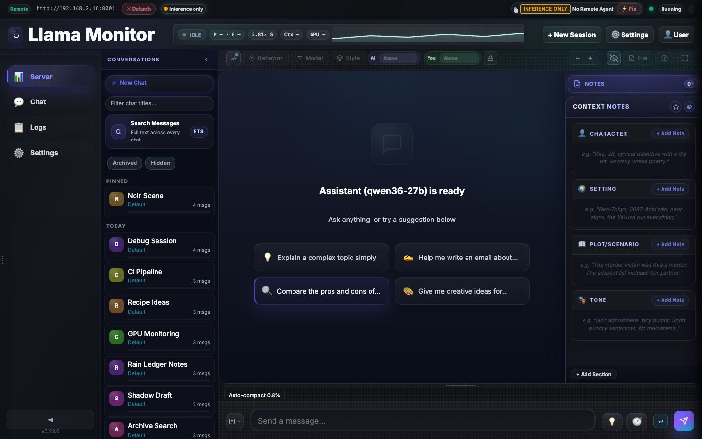
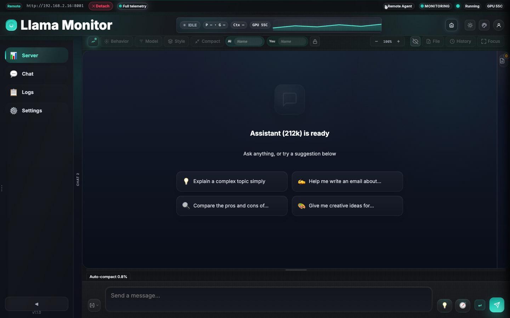

- **Recency groups** — Conversations are grouped into `Pinned`, `Today`, `Yesterday`, `This Week`, and `Older`
- **Per-conversation status** — Each row shows the conversation name, persona label, explicit-mode badge, message count, and a context-pressure bar derived from the last known context percentage
- **Accurate message counts** — Inactive and lazy-loaded tabs display the backend `message_count` from the database rather than `0`. Archived and hidden tabs also use the backend count.
- **Collapse/expand** — The collapsed state persists in `localStorage` and is restored when the page is reopened
- **Title filter** — The inline filter narrows the sidebar list by conversation names and visible persona labels only
- **Message search entry point** — A dedicated `Search Messages` button sits under the title filter so full-text search is visible without hunting for a header icon
- **Context menu** — Rename, pin/unpin, export JSON, export Markdown, duplicate, and delete are available from the `...` menu
- **Multi-select and bulk actions** — Hovering or selecting a conversation reveals a checkbox:
  - Left-click: selects only that conversation (clears others)
  - Ctrl/Cmd+click: toggles that conversation without clearing others
  - Checkboxes: toggle individual selection without changing the active tab
  - While one or more conversations are selected, the sidebar shows a bulk toolbar with:
    - **Delete** — deletes all selected conversations (with undo toast)
    - **Archive** — archives all selected conversations
    - **Clear** — clears the current selection

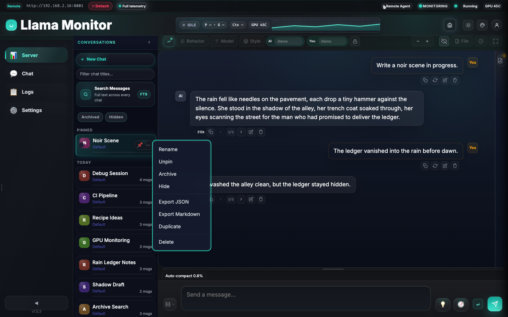

### Cross-Conversation Message Search

The sidebar's `Search Messages` button opens a larger flyout beside the conversation rail and searches message bodies across stored conversations.

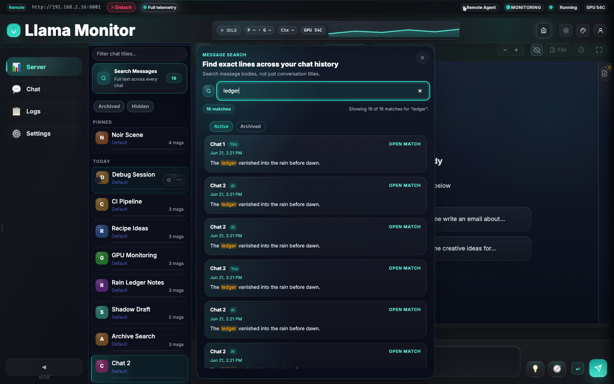

- **Message search** — Searches stored message content, not just conversation names
- **Wider results surface** — Matches render in a dedicated flyout instead of replacing the narrow sidebar list
- **Result paging** — Results load in pages so long histories stay scannable even when a query returns dozens of matches
- **Prefix and punctuation tolerant** — Short fragments and punctuation-heavy queries are normalized before matching
- **Collapse-safe** — If the sidebar was collapsed before search, closing search restores that state
- **Jump to match** — Clicking a result switches to the matching tab, scrolls to the stored message row, and briefly highlights it
- **Open via shortcut** — `Ctrl+Shift+F` opens the search flyout

## Appearance and Chat Preferences

Several appearance and chat behaviors are configurable via Settings and are applied globally (not per-tab).

- **Chat styles** — Visual styles for the chat view (e.g., standard, compact, bubbly, paper, terminal). Changes apply immediately.
- **Timestamps** — Controls how message timestamps are shown: off, hover, or always.
- **Message width** — Adjusts the horizontal width of the chat message area.
- **Chat date format** — Controls how dates are displayed (e.g., `MM/DD/YY`, `DD/MM/YY`, ISO). This setting is synced via `/api/settings`.
- **Enter to send** — Toggle whether Enter alone sends a message or if Shift+Enter / Ctrl+Enter is required. Synced via `/api/settings`.
- **Context card view** — Controls how the context card is rendered (e.g., gauge or compact).

## Messaging

- **Streaming** — Real-time SSE streaming from `/v1/chat/completions`
- **Markdown rendering** — Assistant output is rendered with Markdown, syntax-highlighted code blocks, and per-block copy controls
- **Thinking blocks** — If the upstream model sends `reasoning_content`, the UI renders it in an expandable thinking block during the active browser session
- **Token estimates** — The composer shows a rough `~N tok` estimate with warning colors at higher counts
- **Smart scroll** — Auto-scroll stays on only while you are near the bottom; scrolling upward during generation disables follow mode until you jump back down
- **Unread badge** — New assistant replies increment a scroll-to-bottom unread badge when you are reading older content
- **History pagination** — Long conversations render only the newest messages first (default 15) and expose older history through `Load More`
- **RP dialogue highlighting** — Quoted dialogue is colorized even when Markdown formatting splits the text across inline tags

### Composer Draft Persistence

Per-tab draft text in the composer is saved on input and persisted to the backend via the `composer_draft` field on the tab. On tab switch or page reload, the draft is restored. The draft is cleared on successful message send.

### Reply Plan Summary

A compact chip bar above the composer shows which steering inputs are active for the next reply:

| Chip | Shown When |
|------|-----------|
| Persona | A template is active on the tab |
| Explicit mode | Explicit level is greater than 0 |
| Context notes | Notes exist on the tab |
| Quick guide | A guide is active or a draft exists |
| Draft override | A suggestion-generated draft is armed in the main composer |
| Armed beats / surprise | Beats are armed with remaining turns |
| Auto-compact | Auto-compact is enabled; displays the threshold value |
| Rolling memory | One or more compacted memory blocks exist on the tab |

### Message Actions

Each message exposes action buttons in its footer:

- **Copy** — Copy message text to the clipboard
- **Edit** — Inline-edit any message. For user messages, "Save and Resend" regenerates from that point onward; for assistant messages, "Save" updates the content in-place
- **Regenerate (assistant)** — Right arrow on the variant badge (when only one response exists) truncates after the preceding user message and re-generates; if generation fails or times out, the previous response is restored
- **Branch / variant navigation** — When multiple variants exist for an assistant response, left/right arrows cycle through them; the badge shows current position (e.g. `2/3`)
- **Resend (user)** — On user messages, a "Resend" button truncates history after that message and re-sends it
- **Delete** — Removes the message from the conversation (with confirmation)

## Personas & Template Manager

The template manager is the central place for chat personas.

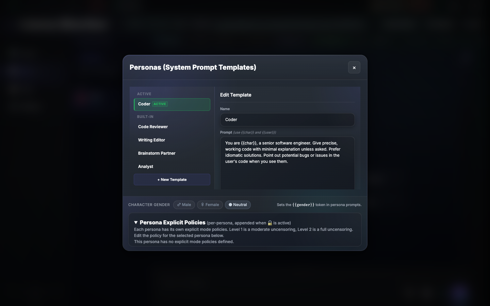

### Template List Sections

| Section | Description |
|---------|-------------|
| **Active** | The persona currently applied to this tab |
| **Custom** | User-created personas |
| **Built-in** | Personas shipped with llama-monitor |

### Applying a Persona

- Click the persona chip in the chat header to open quick-select
- Applying a persona stores its `active_template_id` on the current tab
- Use the pencil action on the chip to open the full manager

### Per-Persona Explicit Policies

Each persona stores separate Level 1 and Level 2 explicit-policy text. When explicit mode is enabled, the active persona's policy text is appended to the system prompt for that tab.

### Token Substitution

System prompts support:

| Token | Replaced With |
|-------|---------------|
| `{{char}}` | The AI name for the tab |
| `{{user}}` | The user name for the tab |
| `{{gender}}` | The AI gender (`male`, `female`, or `neutral`) |

### Role Boundary

The Behavior panel lets you override the default role-boundary instruction for the current tab. This value is held in memory and applied at send time; it is not part of the persisted SQLite schema. If blank, the app generates a default boundary from the current AI and user names.

## Behavior Panel

The behavior panel provides fast access to the active persona prompt, role-boundary controls, AI gender, and explicit-mode settings for the current tab.

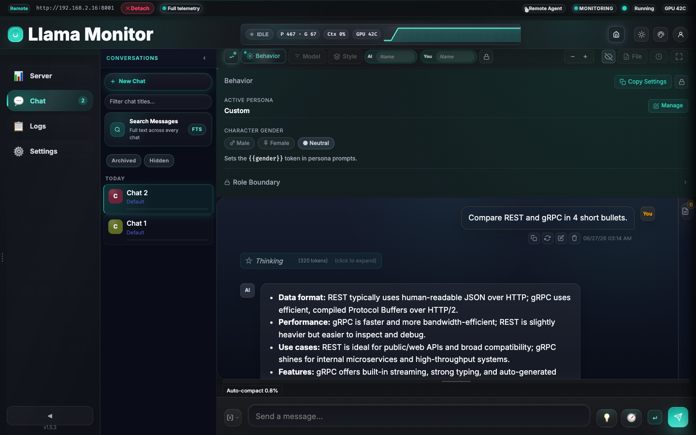

## Model Parameters

Per-tab controls for generation behavior. A dot indicator appears when the active tab differs from defaults.

| Parameter | Default | Description |
|-----------|---------|-------------|
| Temperature | `0.7` | Randomness |
| `top_p` | `0.9` | Nucleus sampling threshold |
| `top_k` | `40` | Top-k sampling |
| `min_p` | `0.01` | Minimum probability threshold |
| `repeat_penalty` | `1.0` | Repetition penalty |
| `max_tokens` | `4096` | Reply length cap |
| `stream_timeout` | `120s` | Abort if no content arrives within this interval |

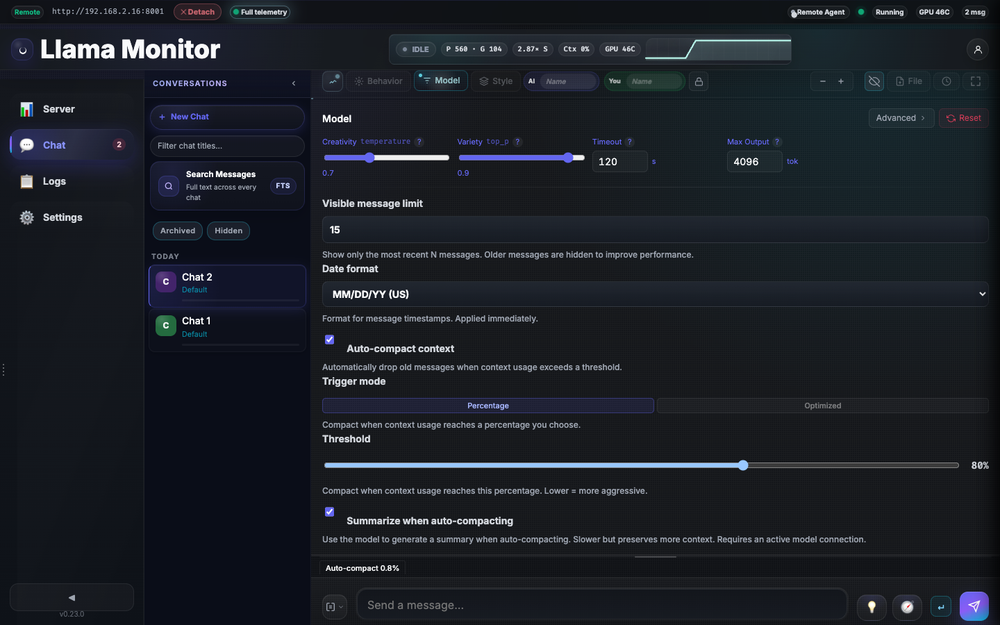

## Context Pressure Bar

A thin progress bar in the chat header reflects the estimated context-usage percentage for the active tab.

- **Color levels**:
  - Yellow (medium) at 50%+
  - Orange (high) at 75%+
  - Red (critical) at 90%+
- The chat input border mirrors the same color at high usage.
- When usage is near capacity, attempting to send a message triggers a "Context overflow" toast with a "Compact now" action.

## Context Compaction

Compaction turns older history into a memory/tombstone entry so the conversation can continue inside the model context window.

### Compact Confirmation Modal

- **Stats preview** — Shows message counts, estimated tokens freed, current context %, and model capacity
- **Summary preview** — When summarization is enabled, the generated summary appears before you confirm and can be edited
- **Exit animation** — The modal fades out after a completed compaction

### Compaction Modes

| Mode | Behavior |
|------|----------|
| **Percent** | Triggers once context usage passes the configured threshold |
| **Optimized** | Triggers when the remaining context budget drops below 25k tokens |

- **Auto-summarize** — Uses the model to summarize dropped history instead of only trimming it
- **Threshold slider** — Per-tab auto-compact threshold (used in "Percent" mode)
- **Rolling memory aware** — Existing compaction markers are folded back into later requests as `COMPACTED MEMORY`
- **Defer** — Auto-compact prompts can be deferred; the system will check again after the next response

## Prompt Debug Inspector

The debug inspector shows the exact outbound request shape used for the next reply. Open it with the `{...}` button in the chat input toolbar.

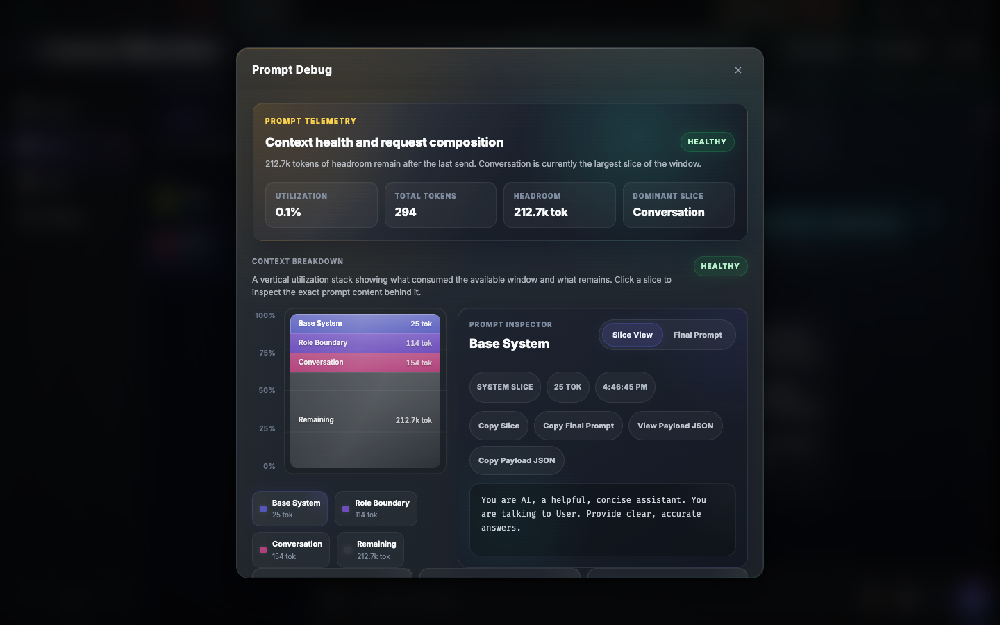

### What It Shows

| Section | Description |
|---------|-------------|
| **System slices** | The assembled system prompt split into base prompt, context notes, quick guide, armed story beat, role boundary, and compacted memory sections when present |
| **History** | The non-system message history that will actually be sent upstream |
| **Totals** | Rough token estimates versus the model context capacity |
| **Timing** | Prompt and generation timings once a reply finishes |
| **Model params** | The exact sampling parameters used for the request |

## Chat Telemetry

Real-time metrics for the active chat tab, accessible from the telemetry toggle in the chat header.

### Summary Rail

- **State chip** — Idle, prompting, or generating
- **Stage indicator** — Prompt vs generation phase
- **Throughput bars** — Prompt and generation speeds
- **Live rate** — Current generation tokens per second
- **Context ring** — Last known context pressure for the tab

### Expanded Detail Panel

- **Throughput grid**
- **Sparkline**
- **Task metadata**
- **Slot tiles**
- **Activity timeline**

The panel can float as a popover or be pinned inline below the toolbar.

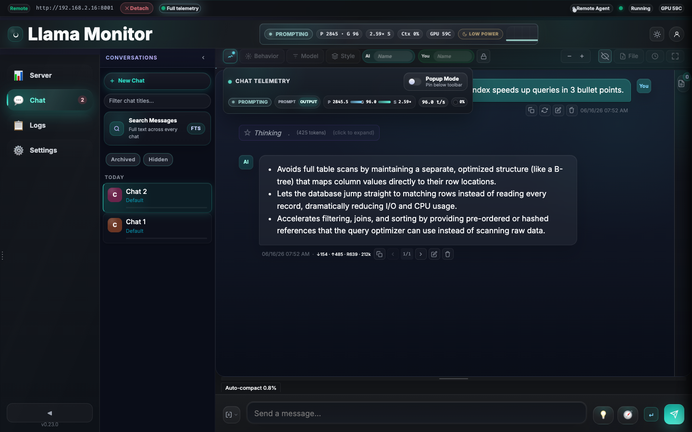
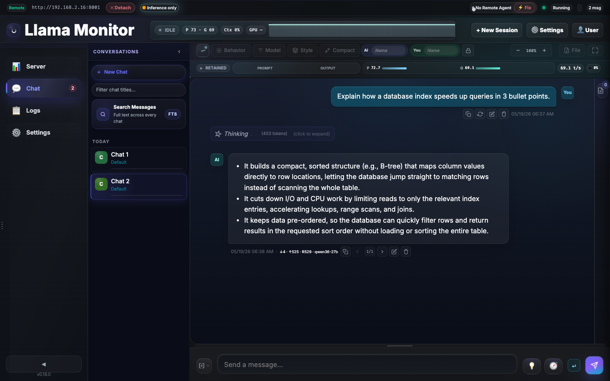

### Per-Message Metrics

Each assistant message footer shows:

- `↓N` — prompt tokens used for that request
- `↑N` — tokens generated in that reply
- `RN` — running total of all tokens in the conversation
- `N%` — estimated context-usage percentage at that point
- Model name (if known)

These values are derived from the live llama.cpp metrics and the token counts reported per message.

## Chat Style

The style panel changes message presentation for the current browser.

| Style | Description |
|-------|-------------|
| **Rounded** | Rounded bubbles with shadows |
| **Compact** | Tighter spacing and lighter chrome |
| **Minimal** | Flat layout with minimal decoration |
| **Bubbly** | Larger bubbles with stronger visual treatment |

Style selection persists in `localStorage` under `llama-monitor-chat-style`.

### Font Scaling

Message font size can be adjusted from 70% to 150% via the style panel.

### Date Format

Message timestamps follow the shared workspace date-format setting:

| Format | Example |
|--------|---------|
| `MM/DD/YY` | `05/06/26` |
| `DD/MM/YY` | `06/05/26` |
| `YYYY-MM-DD` | `2026-05-06` |
| `locale` | Browser locale |

### Enter Behavior

Enter-to-send is stored in shared settings. When disabled, `Enter` inserts a newline and `Ctrl+Enter` sends.

## History Q&A

The History Q&A panel lets you ask natural language questions about an active conversation without disturbing the live chat context.


### Opening the Panel

Click the **History** button (clock icon) in the chat header, to the left of the Focus button. The panel slides in from the right edge of the screen. Click the button again, or the × in the panel header, to close it.

### How It Works

When you submit a question, the panel:

1. Fires a lightweight keyword-extraction call to the model to identify search terms in your question.
2. Scores every message in the conversation against those keywords and pulls the top matches as a focused citation block.
3. Builds a full transcript of the message history — including compacted memory blocks — and combines it with the citation block and your question.
4. Sends that bundle to the model in a separate, ephemeral API call that never affects the live conversation.
5. Streams the answer back into the panel's Q&A thread.

For very long conversations that exceed the transcript budget, the panel preserves the first 25 % (setup, persona, initial context) and the last 75 % (recent events), inserting a placeholder where the middle was omitted.

### Multi-Turn Q&A

The panel maintains a conversation thread across questions within a session. Follow-up questions like "What happened before that?" or "Who else was involved?" are answered in the context of your prior Q&A exchanges — you do not need to re-state the conversation each time. The thread carries up to 6 prior turns before older turns are pruned.

### Q&A Thread

- Each question appears as an indigo-tinted bubble; answers render below it with full Markdown support.
- The thread is per-tab and per-session — it resets on page reload and is never persisted.
- Switching tabs while the panel is open resets the visible thread to that tab's history; the previous tab's thread is preserved in memory for the duration of the session.
- The **trash** icon in the panel header clears the current tab's thread.

### Stopping a Response

Click the red **stop** button that appears in the input area while a response is streaming to abort generation. Any partial answer that arrived before the stop is kept in the thread.

### Suggested Questions

When the thread is empty, four suggested questions appear as chip buttons. Clicking one fills the input and immediately sends it. Suggestions are generic starters; any free-form question works.

### Add Context

Click **+ Add context** (above the question input) to expand a text area where you can paste a passage from your notes, a previous session, or any text you want the model to draw from when answering the next question. The pasted text is prepended to that one question only, then automatically cleared. A dot badge on the button indicates pending context.

Use "Add context" to anchor a question to a specific scene you remember but that may not be surfaced by the keyword search.

### Inserting into Conversation History

When the model's answer reveals that a piece of story information is genuinely missing from the conversation, you can add it directly:

- **From a Q&A answer**: Click **↓ Insert into history** on any completed answer bubble. The text pre-fills an editor where you can revise it before confirming.
- **From scratch**: Click **✎ Write scene** in the footer to open the same editor blank.

The editor lets you:
- Edit the text freely before inserting.
- Choose the role: **User** (written from the user's perspective) or **Assistant** (narrator/AI perspective — the default).
- Confirm with **Insert into history** or dismiss with **Cancel**.

On confirm, the message is appended to the end of the conversation as a permanent turn. The main chat view updates immediately and the model will see the new content as part of its context in future exchanges. The insertion cannot be undone from the panel — use the main chat's message editing or deletion controls if you need to revise it afterward.

**Typical workflow when content is missing:**

1. Ask a question in the panel → model says "I don't have information about that."
2. Click **✎ Write scene** and write the missing scene (or paste notes you have from outside the app).
3. Choose role and confirm.
4. Ask the same question again — the model now has that content as part of the conversation history.

### Limitations

- Answers draw from the conversation transcript and any context you add. The panel does not have access to context notes, persona settings, or information outside the message history.
- The panel shares the same connected model as the main chat. If no model is running, questions will fail.
- Thread state is not persisted and is lost on page reload.
- Inserted messages are appended at the end of the conversation, not at a specific historical position. The model treats them as the most recent context, so write them as "what the AI now knows" rather than as time-stamped past events.

## Guided Generation

Guided-generation features shape the next assistant reply without forcing you to rewrite the base persona or model settings for the whole tab.

### Context Notes Sidebar

The right-side context notes panel stores structured notes on the active tab and injects them into the system prompt as grouped `### SECTION NOTES ###` blocks.

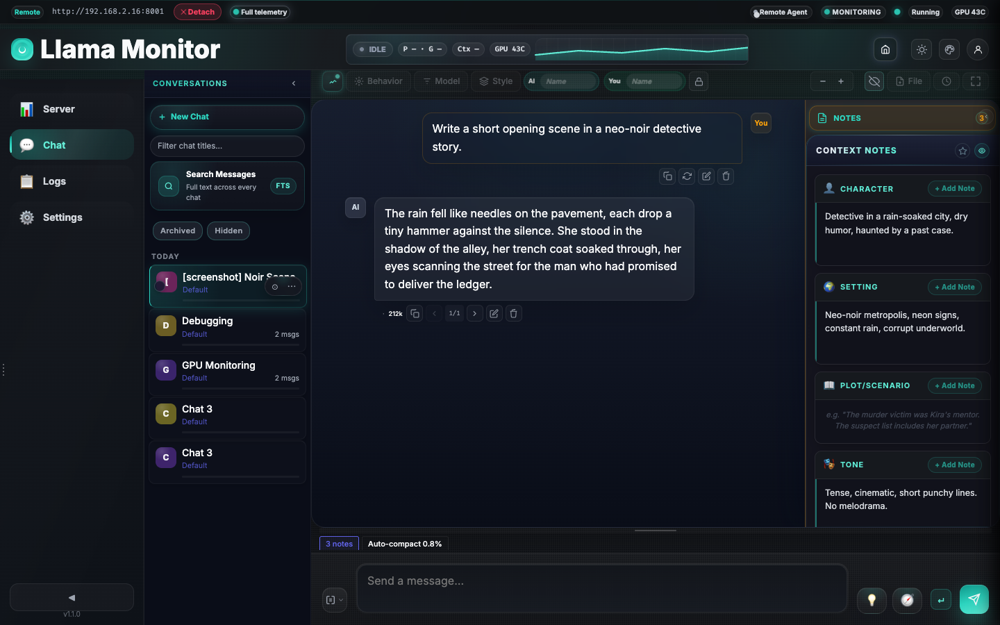

#### Built-In Sections

| Section | Purpose |
|---------|---------|
| Character | Character traits, motivations, voice, and relationships |
| Setting | Places, world rules, atmosphere |
| Plot/Scenario | Current beats, stakes, and scenario facts |
| Tone | Mood, pacing, and stylistic guardrails |

#### Behavior

- **Per-tab notes** — Notes live on the tab, not globally
- **Multiple notes per section** — A section can contain several entries; they are concatenated when injected
- **Custom sections** — You can create additional section names, which are also persisted with the tab
- **Resizable width** — Width is stored on the tab and also mirrored in `localStorage` for UI restore
- **Expanded/collapsed state** — The open state and intro visibility are shared workspace preferences loaded from `GET /api/settings`

#### AI Review

The `Analyze` action calls `POST /api/context-notes/analyze`.

- **Default scan depth** — The initial review uses the last 20 messages
- **Per-section full-context rerun** — Individual sections can be re-analyzed against the full conversation when needed
- **Statuses** — `new`, `current`, and `stale`
- **Actions** — Add the suggested note, replace your existing note, keep your version, skip, or delete the current note

### Suggestions Dropdown

Suggestions generate user-side next-step ideas from the current conversation context.

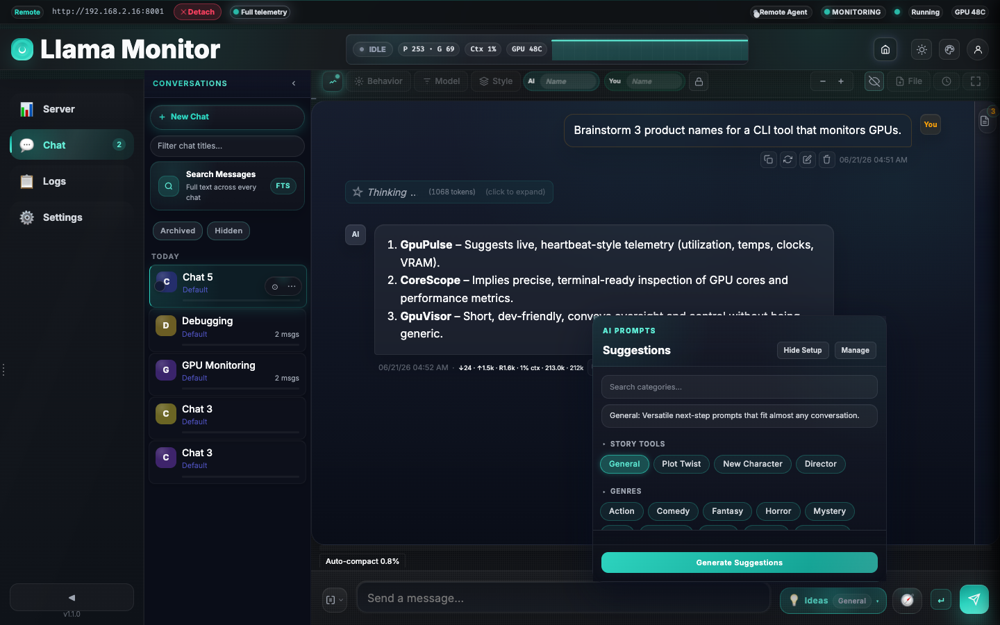

The browser sends recent messages, the current system prompt, non-empty context notes, and the active quick-guide instruction (if one is currently active) as suggestion context.

Custom suggestion categories are stored in shared settings so they follow the workspace across browsers.

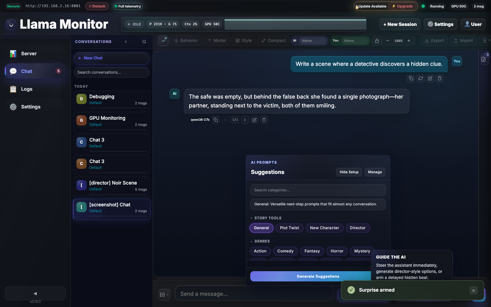
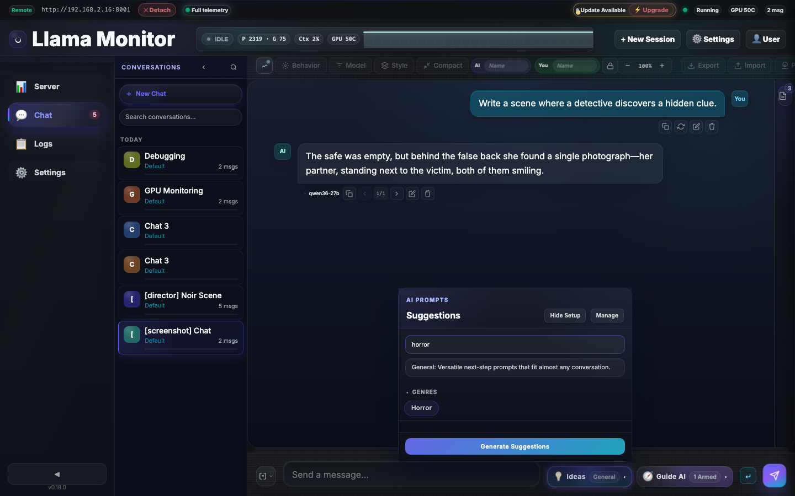
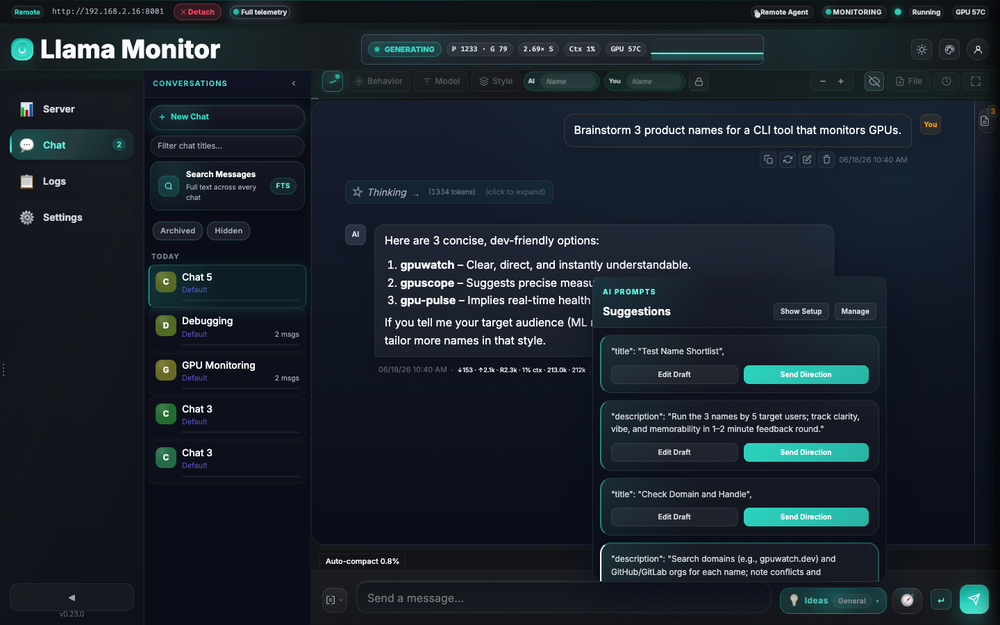

#### When They Appear

Suggestions appear after you:

1. Open the dropdown
2. Select a category
3. Trigger generation

They are generated on demand; there is no always-on suggestion stream.

#### Built-In Categories

The dropdown ships with categories for different styles and tones:

- General, Plot Twist, New Character, Director
- Action, Comedy, Fantasy, Horror, Mystery, Noir, Romance, Sci-Fi, Thriller, Character
- Explicit (visible when explicit mode is enabled)

Each category has a tunable prompt template.

#### Custom Categories

Custom categories appear alongside built-in ones and persist to `localStorage` (not the server config).

#### Manage Categories

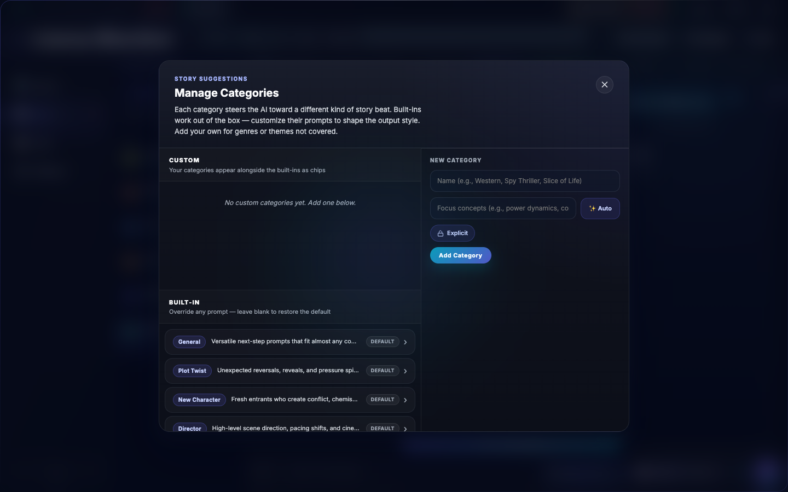

- **Built-in prompts** — Editable, reorderable, and individually disableable
- **Custom categories** — Add your own groups and prompt lists
- **Per-prompt edits** — Name, description, and prompt text

#### Focus Keywords

The setup panel can auto-generate focus keywords through `POST /api/keywords/generate`. That request disables model thinking for a fast keyword-only result.

#### Suggestion Draft Rewrite

`Edit Draft` opens a workspace that turns a suggestion into a fuller user-side message. The rewrite pass tries to match recent user voice and point of view before dropping the result into the main composer.

### Quick Guide

Quick Guide is the inline steering surface for one-off reply direction.

| Mode | Description |
|------|-------------|
| **Quick** | Applies a direct instruction to the next guided reply, then clears it |
| **Director** | Expands one directing note into four continuation options |
| **Surprise** | Arms a hidden future beat that lands on a later assistant reply |

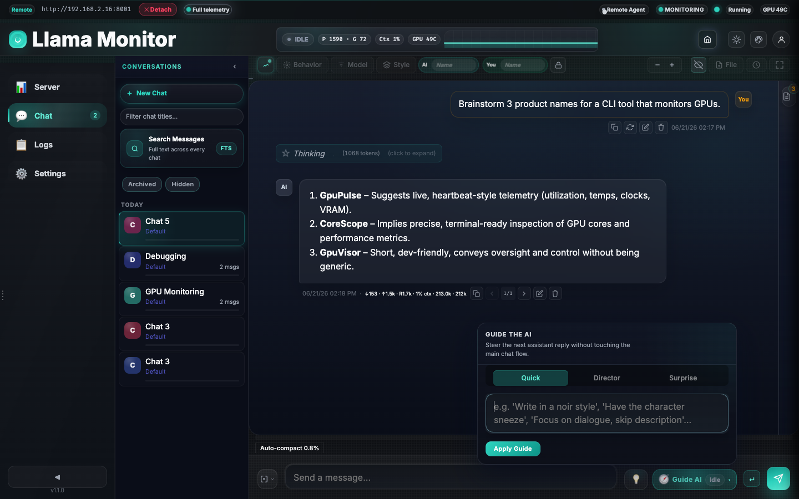

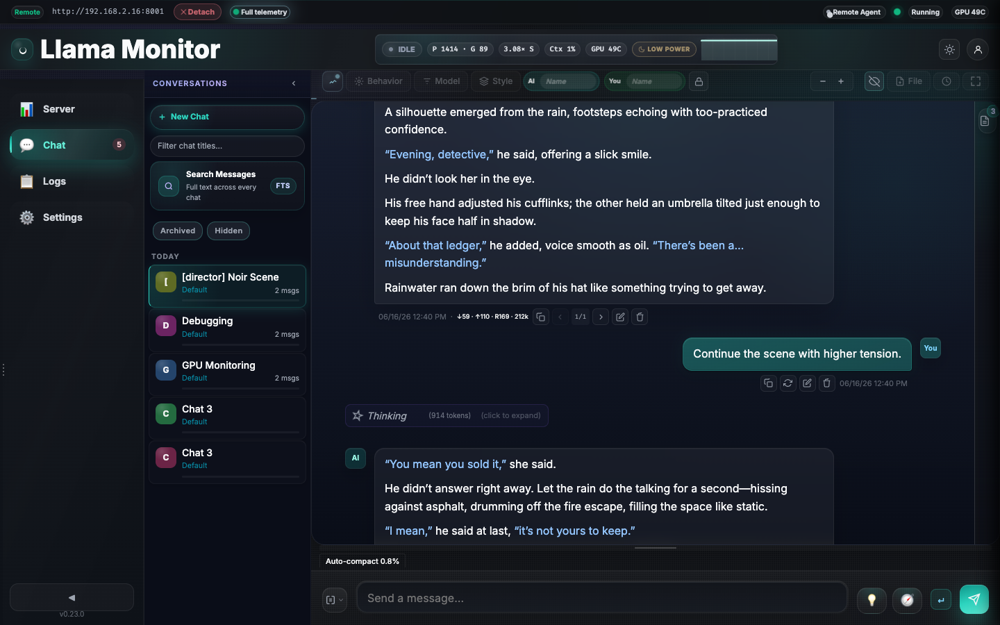

#### Quick Mode Details

- **Draft persistence** — The unsent quick-guide draft is stored on the tab
- **Immediate guided follow-up** — Submitting a quick guide triggers a guided reply flow instead of only changing future defaults
- **Restore previous guide** — If the last quick-guide reply is restorable, the app removes that assistant reply and reopens the instruction for editing

#### Director Mode Details

- Enter a short directing note
- The app calls the suggestions API to generate four distinct continuation options (e.g. Pressure, Reveal, Escalation, Twist)
- Apply one; it becomes the steering instruction for the next assistant reply

#### Surprise Mode Details

- **Delayed beats** — Each surprise stores `kind`, normalized instruction text, and `remaining_turns`
- **Countdown** — A beat fires when `remaining_turns` reaches `0`; other armed beats decrement after assistant replies complete
- **Per-tab queue** — Armed surprises are part of tab state

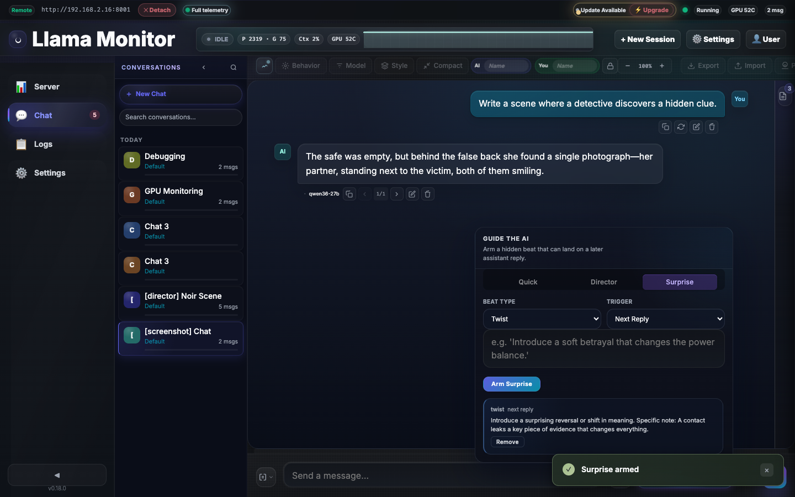

## Explicit Mode

Explicit mode is a three-level content filter layered on top of the active persona.

| Level | Icon | Description |
|-------|------|-------------|
| **Off** | 🔒 | Default filtering |
| **Unlocked** | 🔓 | Level 1 persona policy |
| **Unrestricted** | 🔥 | Level 2 persona policy |

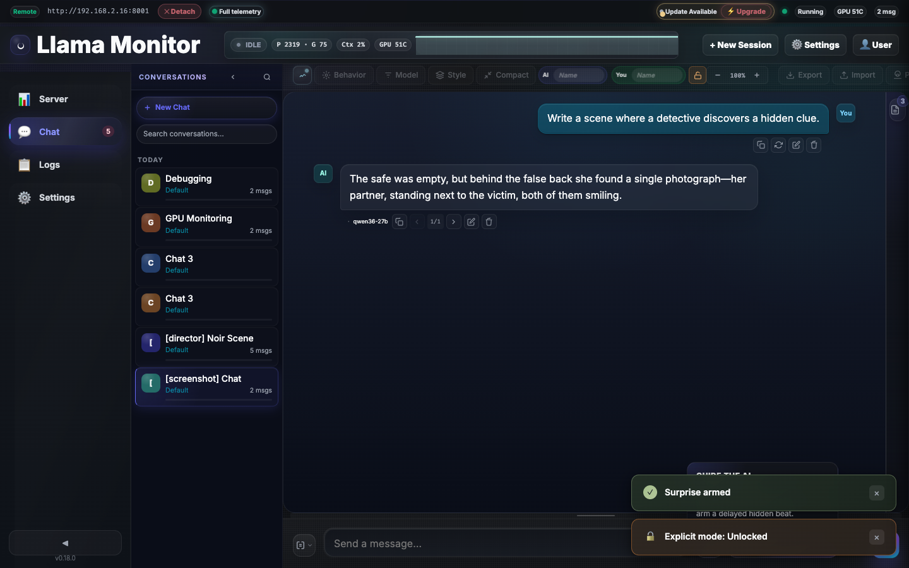
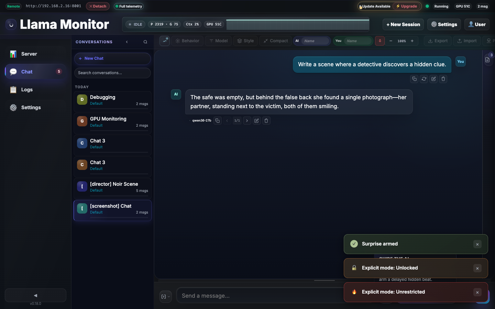
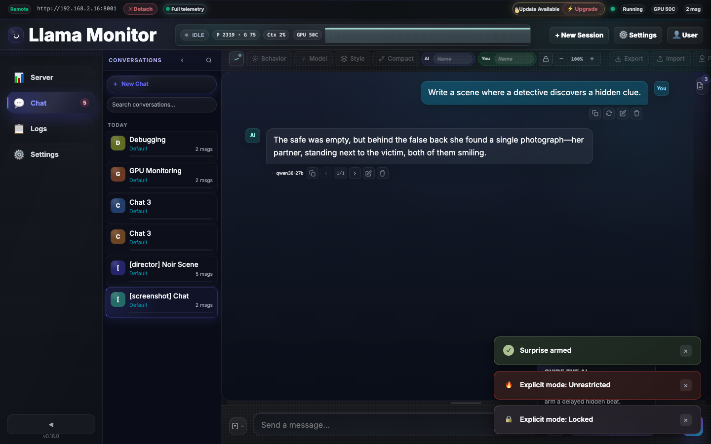

### Controls

- **Footer toggle** — Fast level switch in the composer footer
- **Behavior panel** — Full explicit controls for the current tab

## Message Management

| Feature | Description |
|---------|-------------|
| **Message limit** | Controls how many messages are rendered at once (default 15) |
| **Copy settings** | Copies prompt and parameter settings from another tab into the current one |
| **AI/You names** | Per-tab display names used in the UI and prompt token substitution |
| **Tab trash** | Deleted tabs are restorable from the in-memory trash menu until the page reloads or the trash entry ages out |

## Export & Import

### Markdown Export

- Exports only non-system messages
- Uses `**You**` and `**Assistant**` headings plus `---` separators
- Does **not** include timestamps, token counts, personas, system prompts, notes, or model parameters

### JSON Export

- Exports the active tab as a one-element array
- Includes the current in-memory tab object, including messages and tab-level settings that exist in the browser state at export time
- This is the only built-in export that carries personas, model params, notes, explicit level, quick-guide drafts, and similar tab metadata

### Import Behavior

| Format | Behavior |
|--------|----------|
| **Markdown** | Appends parsed user/assistant blocks to the active tab with fresh import timestamps |
| **JSON** | Creates a new conversation from the first array element in the file |

### Reasoning / Thinking Content

Thinking blocks are currently a live-session UI feature, not a durable storage feature.

- Assistant `thinking_content` can appear in the browser while a reply streams
- JSON export can include `thinking_content` if it is still present in the in-memory tab object
- By default, the app does not restore `thinking_content` from `chat.db`
- **Settings → Chat → Saved Thinking History** enables opt-in persistence and restore for users who want durable reasoning traces in chat history

## Guided-Generation Settings Ownership

Guided-generation settings (`enabled_context_notes`, `enabled_suggestions`, `enabled_quick_guide`, `suggestion_prompts`, `context_depth`, `suggestion_count`) are sourced from the backend via `GET /api/settings` through the central `settingsState` object. Additional workflow-continuity preferences (`chat_date_format`, `enter_to_send`, context-notes open state, intro visibility, and custom suggestion categories) are also shared there.

Purely device-specific presentation choices such as chat style and font scale remain browser-local.

## Data Flow

```text
User message -> /v1/chat/completions (SSE stream) -> Browser renders tokens live
                                                    -> Chat telemetry updates from live metrics
```

## Persistence

Chat persistence is backed by SQLite, not by the old flat JSON store.

- **Primary store** — `~/.config/llama-monitor/chat.db`
- **Schema** — Conversations live in `tabs` and `messages` tables, with full-text search on message content
- **Legacy migration** — If `~/.config/llama-monitor/chat-tabs.json` exists at startup, the app imports it into `chat.db` and renames the old file to `chat-tabs.json.bak`
- **Write pattern** — The browser saves whole-tab updates through `/api/chat/tabs/:id` and flushes pending tab data on page unload
- **Search backing** — Cross-conversation message search reads from the database-backed FTS index, not from transient browser-only state
