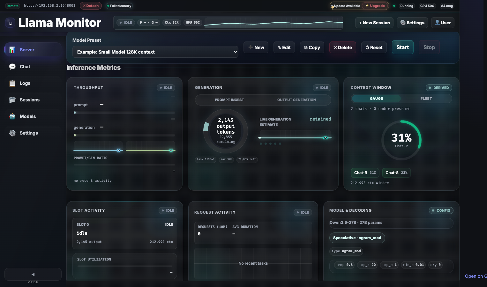
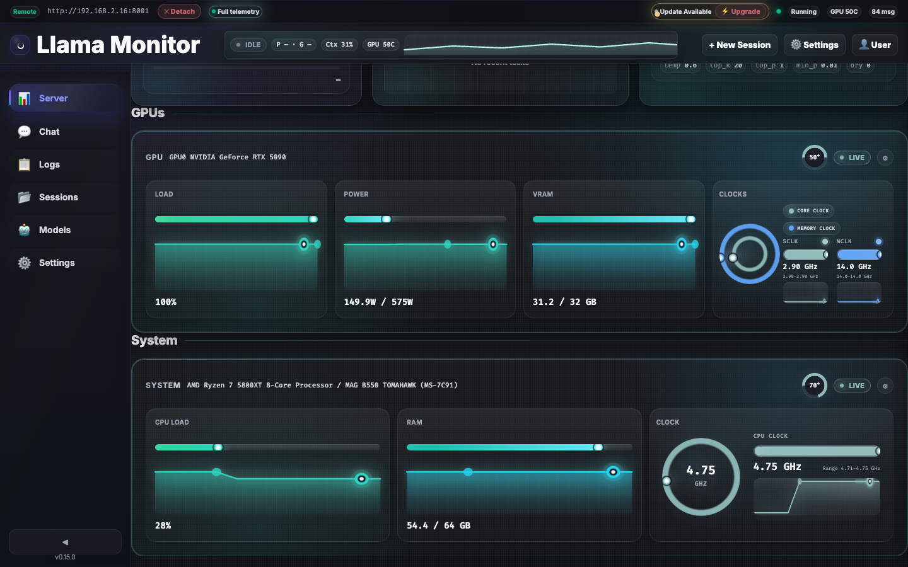
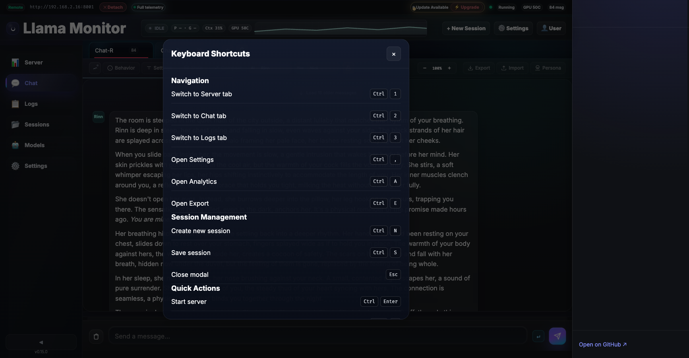

# Dashboard Capabilities & Metrics

Llama Monitor provides real-time visibility into your inference stack through a nav cockpit, inference metrics cards, and GPU/system hardware monitoring.

## Nav Cockpit

The nav cockpit replaces the old search bar with a live metrics strip visible on every tab:

| Chip | Description |
|------|-------------|
| **State** | Current server state: idle, attach, prompting, generating |
| **Throughput** | Prompt processing speed (P) and generation speed (G) in tokens/sec |
| **Context** | Highest context pressure percentage across all active chat tabs |
| **GPU** | Temperature of the hottest GPU in the system |
| **Sparkline** | Mini throughput chart showing recent generation speed over time |

Click the cockpit to navigate to the Server tab for full metrics. On narrow viewports, GPU and sparkline hide at 980px and context hides at 820px.

## Inference Metrics

The Server tab displays inference metrics sourced from llama.cpp's Prometheus `/metrics` endpoint and `/slots` JSON:

### Throughput Card
- Prompt processing speed (tokens/sec) with live sparkline
- Generation speed (tokens/sec) with live sparkline
- Prompt/generation ratio bar showing relative speeds
- Activity timeline showing recent task history

### Generation Card
- Current output token count and remaining context
- Prompt ingest and output generation progress stages
- Live generation estimate based on recent throughput samples
- Task metadata: task ID, max context, tokens remaining

### Context Window Card
Two views toggle between gauge and fleet:

**Gauge view** — Single large ring showing context pressure for the most loaded chat tab.

**Fleet view** — Per-chat context usage bars showing:
- Tab name and context percentage
- Stale chat indicators (tabs with no recent activity)
- Total context window size from the active server
- Falls back to chat-derived estimates when the server doesn't expose per-slot token counts

### Slot Activity Card
Per-slot status showing:
- Slot state: idle, loading, processing
- Current task output token count
- Context tokens in use
- Slot utilization sparkline

### Request Activity Card
Recent task history with:
- Request count and average duration
- Completion markers for finished tasks
- Activity timeline with 5-minute rolling window

### Model & Decoding Card
- Model name, parameter count, and quantization
- Speculative decoding state (ngram-mod, draft model)
- Sampler chain configuration

## GPU & System Metrics

Local sessions show real-time hardware monitoring. Remote sessions require a remote agent.

### GPU Metrics
| Metric | Source |
|--------|--------|
| GPU utilization (%) | `rocm-smi`, `nvidia-smi`, `mactop` |
| Power draw (W) | `rocm-smi`, `nvidia-smi` |
| VRAM usage (GB) | `rocm-smi`, `nvidia-smi`, `mactop` |
| Core clock (GHz) | `rocm-smi`, `nvidia-smi` |
| Memory clock (GHz) | `rocm-smi`, `nvidia-smi` |
| Temperature (°C) | `rocm-smi`, `nvidia-smi`, `mactop` |

Each metric displays a live sparkline, current value, and peak indicator.

### System Metrics
| Metric | Source |
|--------|--------|
| CPU model and load (%) | sysinfo crate |
| CPU temperature (°C) | Linux thermal zones, `mactop`, or `sensor_bridge.exe` on Windows |
| CPU clock speed (GHz) | Linux `/proc/cpuinfo`, `mactop` |
| RAM usage (GB) | sysinfo crate |
| Motherboard model | Linux `dmidecode`, Apple system profiler |

## Capability-Aware UI

The top nav status pill reflects the live telemetry level:

| State | Color | Meaning |
|-------|-------|---------|
| **Full telemetry** | Green | All metrics available (local session or remote with agent) |
| **Inference only** | Yellow | Only llama.cpp metrics (remote attach without agent) |
| **Limited** | Orange | Partial metrics (agent connected but some sensors unavailable) |
| **Error** | Red | Connection lost or metrics endpoint unreachable |

## Refresh Rate

Dashboard WebSocket refresh rate is configurable from 200ms to 10s via Settings > Performance. The default is 500ms. Network quality detection can auto-adjust the interval based on observed connection conditions.

## Settings Modal

Open with Ctrl+, or the settings button in the header. Changes are auto-saved (debounced 400ms). Ctrl+S forces a save, Escape closes the modal. A dirty indicator appears on the header when unsaved changes exist.

### Session Tab

| Setting | Description |
|---------|-------------|
| **Endpoint URL** | Remote llama.cpp server address |
| **Port** | Local server port |
| **Server path** | Path to `llama-server` binary for spawn mode |
| **Working directory** | CWD for the spawned server process |
| **Model preset** | Preset configuration with default parameters |

### GPU Tab

| Setting | Description |
|---------|-------------|
| **Device indices** | Comma-separated GPU device IDs to monitor |
| **Architecture** | GPU architecture: `auto`, `nvidia`, `amd`, `apple` |

### Models Tab

Manage model presets — named configurations with default parameters, model paths, and quantization settings.

### Appearance Tab

| Setting | Description |
|---------|-------------|
| **Theme** | `auto` (system), `light`, `dark` |
| **Date format** | Timestamp format for chat messages |
| **Context card view** | Toggle between gauge (single ring) and fleet (per-tab bars) |

### Performance Tab

| Setting | Description |
|---------|-------------|
| **WS push interval** | Manual interval (200ms–10s) or `auto` (network-adaptive) |

### Advanced Tab

| Setting | Description |
|---------|-------------|
| **Remote agent URL** | Override agent polling URL |
| **Agent token** | Bearer token for agent authentication |
| **SSH target** | `user@host` for SSH-based agent management |
| **SSH command** | Custom remote command to start the agent |
| **Explicit mode** | Toggle uncensored content policy |

## User Preferences

Accessible via the user menu button. Preferences persist in `localStorage` and affect the entire UI:

| Preference | Options |
|------------|---------|
| **Theme mode** | `auto`, `light`, `dark` |
| **Font scale** | Global font size multiplier |
| **Spacing scale** | Adjusts `--gap-md` CSS variable for tighter/wider layout |
| **Chat style** | `rounded`, `compact`, `minimal`, `bubbly` |
| **Enter-to-send** | Toggle Enter key behavior |

## Visualization Switchers

Each GPU and System metrics card has a gear button to switch its visualization style:

| Metric | Available Views |
|--------|-----------------|
| **GPU load** | Bar, ring, sparkline, stacked bar |
| **GPU power** | Bar, ring, sparkline |
| **GPU VRAM** | Bar, ring, sparkline |
| **GPU clocks** | Chips |
| **CPU load** | Bar, ring, sparkline |
| **RAM** | Bar, ring, sparkline |
| **CPU clock** | Chip |

Selections persist in `localStorage` (`llama-monitor-gpu-viz`, `llama-monitor-system-viz`).

## Keyboard Shortcuts

Open the shortcuts modal with Ctrl+/:

| Shortcut | Action |
|----------|--------|
| `Ctrl+1` | Server tab |
| `Ctrl+2` | Chat tab |
| `Ctrl+3` | Logs tab |
| `Ctrl+1–9` | Chat tab N |
| `Ctrl+Shift+←/→` | Previous/next chat tab |
| `Ctrl+,` | Settings |
| `Ctrl+A` | Analytics |
| `Ctrl+E` | Export |
| `Ctrl+N` | New session |
| `Ctrl+S` | Save |
| `Ctrl+Enter` | Start server |
| `Ctrl+.` | Stop server |
| `Ctrl+T` | Toggle theme |
| `Escape` | Close modals |

## Self-Update

Llama Monitor checks for new releases by polling GitHub. When an update is available:

1. An update pill appears in the header (dismissible for 24 hours)
2. Click to view release notes in a rendered markdown panel
3. Click "Update" to download and install — the app restarts automatically
4. The dashboard polls for the server to come back online, then reloads

## File Browser

The file browser modal provides directory navigation for selecting model files, presets, and configuration paths:

- **Directory listing** — Navigate folders by clicking; up button for parent directory
- **Path input** — Type a path directly and press Enter
- **Extension filter** — Filter by file type (e.g., `.gguf` for models)
- **Directory mode** — Select a folder instead of a file when prompted

Used in the session modal for model path selection and preset management.

## Session Management

Two session modes control how Llama Monitor connects to llama.cpp:

| Mode | Description |
|------|-------------|
| **Spawn** | Launches `llama-server` locally with configured path, CWD, and preset |
| **Attach** | Connects to an existing running server at the given endpoint URL |

- **Session list** — Shows active sessions with start/delete actions
- **Switching** — Switch between sessions; each maintains independent state
- **Persistence** — Sessions stored in `~/.config/llama-monitor/sessions.json`, auto-saved every 30 seconds

## Tray Features

### macOS / Linux

Clicking the tray icon opens a compact WebView popover (240×220px) showing a mini dashboard with key metrics. The popover resizes dynamically based on content.

### Windows

Native tray menu with live metrics:

| Item | Description |
|------|-------------|
| **Endpoint** | Current endpoint label |
| **Prompt / Generation** | Token processing speeds |
| **Inference** | Slot status (processing / idle) |
| **Host** | CPU load and temperature |
| **Open Dashboard** | Opens browser at `127.0.0.1:{port}` |
| **Quit** | Exit application |

All platforms show a dynamic tooltip with endpoint kind, session mode, CPU%, temperature, GPU temp/VRAM, and token speed. Tray refreshes every 500ms.
