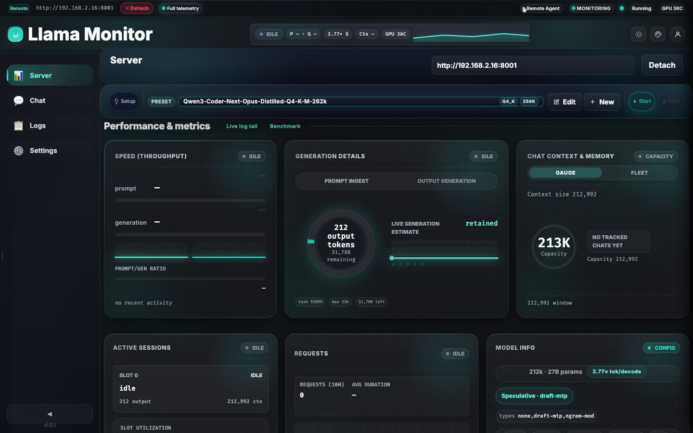
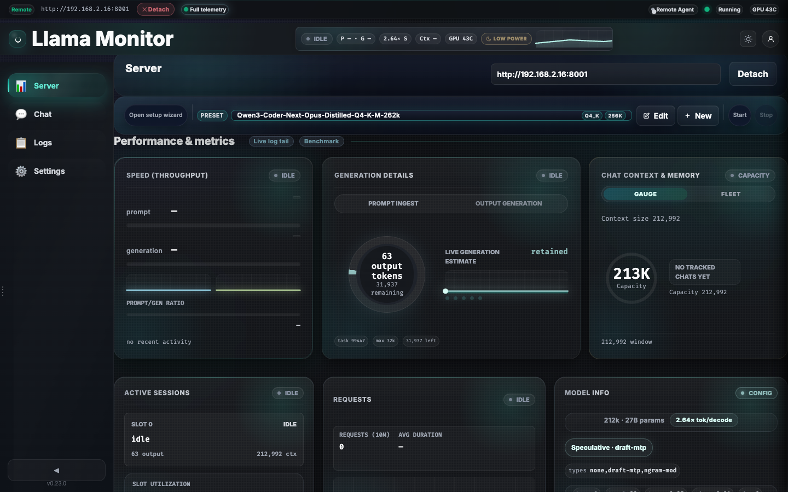
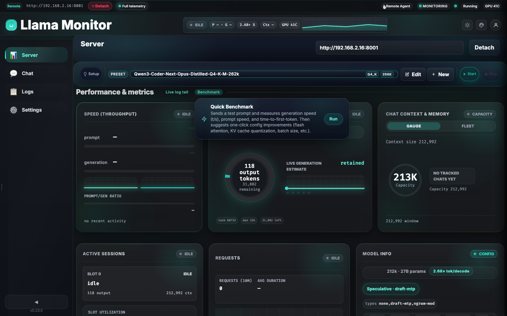
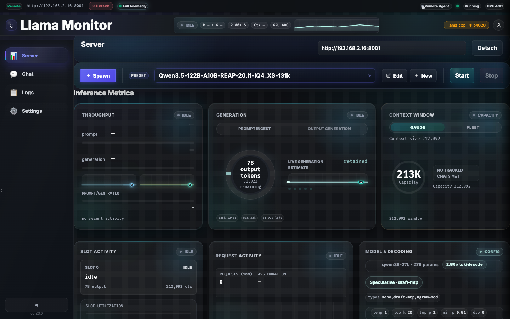
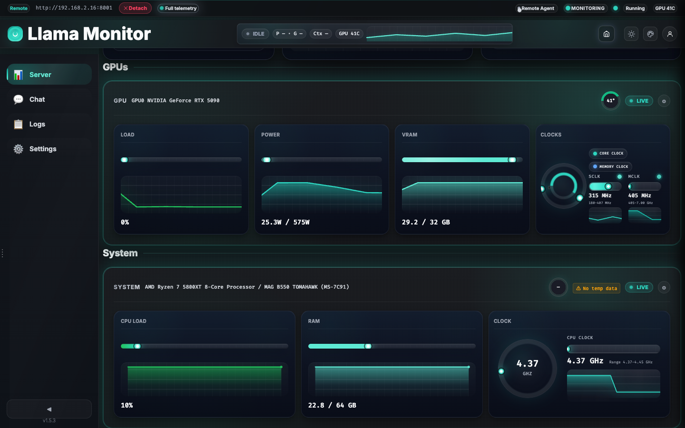
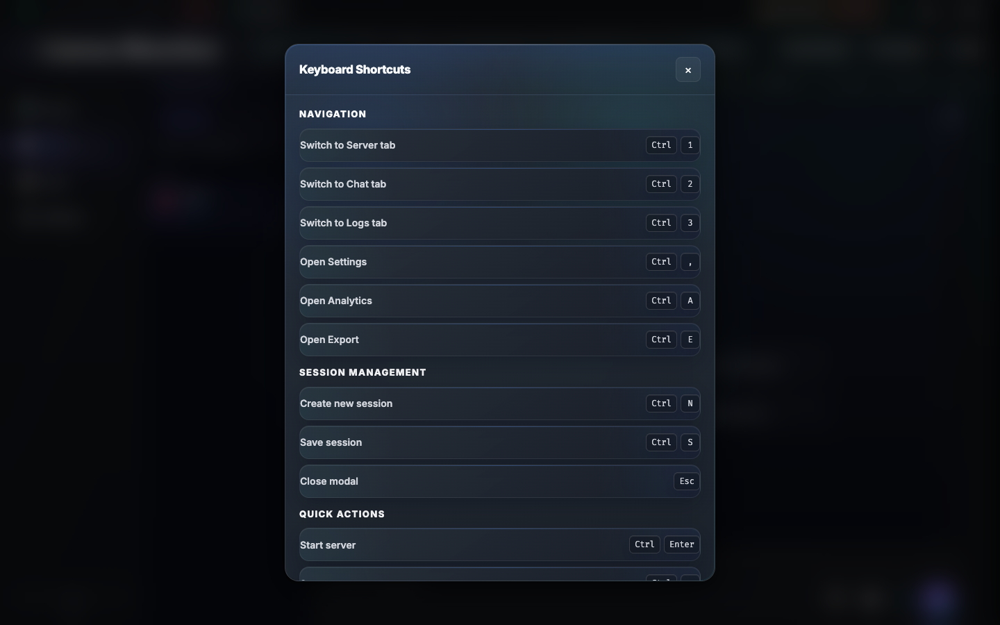

# Dashboard Capabilities & Metrics

Llama Monitor's monitoring surface is split between a live top-nav cockpit, the Server tab, and host telemetry cards that light up when the app can read local hardware or reach a remote agent.

## Monitoring Surfaces

### Top-nav cockpit

The compact strip in the top navigation shows the current endpoint state without leaving the active tab:

| Chip | Description |
|------|-------------|
| **State** | Current llama.cpp activity such as idle, attach, prompting, or generating |
| **Throughput** | Prompt (`P`) and generation (`G`) speed in tokens/sec |
| **Context** | Highest context-pressure percentage across open chat tabs |
| **GPU** | Temperature of the hottest available GPU |
| **Sparkline** | Recent generation-speed history |
| **Memory pressure** | macOS only; shown when memory pressure is warning or critical (based on vm_stat free pages and compressor ratio) |

Clicking the cockpit jumps to the Server tab. On narrower layouts the GPU and sparkline chips collapse first, then the context chip.

### Capability popover

Hovering the endpoint status chip in the top nav opens a popover listing per-subsystem telemetry states:

| Row | Meaning |
|-----|---------|
| **Inference** | Whether llama.cpp performance metrics are live |
| **Slots** | Whether slot data is available |
| **Metrics** | Whether throughput / context metrics are being reported |
| **Generation progress** | Whether the server exposes live generation budget |
| **Throughput** | Shows "retained avg + live estimate" if metrics are available |
| **Context capacity** | Whether context capacity is known |
| **Context usage** | Live if exposed by llama.cpp; otherwise "derived from chat" |
| **Host metrics** | Whether GPU/system telemetry is available |
| **Memory pressure** | Whether macOS memory-pressure telemetry is available (vm_stat-based) |
| **Remote agent** | Connected or disconnected |

The popover is populated in real time from WebSocket data; each row shows a green LED for live/ok and a muted indicator when unavailable.

### Server tab

The Server tab is the main monitoring dashboard. It combines llama.cpp inference data from `/metrics` and `/slots` with host telemetry when available.



| Card | What it shows |
|------|----------------|
| **Throughput** | Prompt and generation speeds, peak tracking, throughput ratio bar, metric age, and delta indicators |
| **Generation** | Output tokens, remaining budget, generation ring progress, stage indicators (Prompt/Output), live output estimation sparkline |
| **Context Window** | Gauge or fleet view of context pressure across chat tabs |
| **Active sessions** | Per-slot state, output tokens, context usage, slot utilization bar, and batch efficiency |
| **Connection details** | Activity rail (recent request timeline), request count, and average duration |
| **Model & Decoding** | Active model name, quantization, sampler config inline, speculative decoding chip and config grid |



### Fine-grained metrics

Additional metrics and indicators shown on the Server tab when data is available:

- **Peak throughput tracking**: Highest observed prompt and generation t/s are tracked and shown as "peak" labels.
- **Throughput ratio bar**: Displays the prompt-to-generation speed ratio when both are active.
- **Metric age indicators**: Shows how old the latest throughput data is (e.g., "2s ago").
- **Metric delta indicators**: Briefly shows +/- changes when throughput values shift.
- **Slot utilization bar**: Percentage of slots currently processing.
- **Batch efficiency**: Displays "busy slots per decode" on multi-slot servers.
- **Speculative decoding**:
  - A chip indicates whether speculative decoding is enabled and its type.
  - A config grid shows speculative parameters when exposed.
- **Sampler config inline**: Key sampler settings (temp, top_k, top_p, etc.) shown inline when available.
- **Generation ring progress**: A ring visualization of how far along the current generation budget is.
- **Stage indicators**: Shows whether the server is in prompt or output phase.
- **Live output estimation**: A sparkline tracking estimated live generation rate.
- **Activity rail**: A timeline bar of recent requests, color-coded by prompt vs. generation phases.
- **Recent task strip**: Summarizes the last completed task (task ID, output tokens, duration, estimated t/s).
- **Request stats**: Total completed requests and average duration over the last 10 minutes.

### Tuning panel

The Tuning panel provides access to server tuning settings, including sampling parameters and system-level tuning knobs.

- Open the **Tune** button in the Server tab header to reveal the panel.
- Adjust sampling (temperature, top_p, etc.), memory tuning, and speculative decoding settings where available.
- Changes apply to the running llama-server when supported.



## Llama Updater

The Llama Updater manages the `llama-server` binary version directly from the dashboard. It detects when a newer `llama.cpp` release is available, lets the user review release notes, and performs the install.

### Version pill

A pill in the top navigation bar displays the currently installed build number in the form `llama.cpp · bXXXXX`. When a newer build is available on GitHub, the pill turns red and shows an upward arrow (↑) with the latest build number, for example `llama.cpp · ↑ b5432`. Hovering the pill shows a tooltip with the full upgrade range (e.g., `Update available: b4321 → b5432. Click to manage.`).



### Version modal

Clicking the pill opens a version modal that lists the last 8 `llama.cpp` releases. Each row shows the tag, a relative age, and badges for **latest** and **installed**. The currently installed build is pinned at the bottom of the list when it is older than the 8-release window.

Clicking any row displays that release's notes in a side pane. The **Install** button is shown for every non-current release; clicking it downloads, validates, and promotes a new `llama-server` binary. During installation the pill displays `Installing…` with a live timer. On success the running llama-server is restarted automatically to pick up the new binary.


### Background version checks

On startup the frontend checks for a new version after a short delay to avoid competing with first-paint work. Thereafter a background poll fires every 30 minutes while the tab is visible. Polling stops while the tab is hidden (minimized or inactive) and resumes on visibility change.

### API endpoints

All endpoints require an `api-token`.

| Method | Path | Description |
|--------|------|-------------|
| `GET` | `/api/llama-binary/version` | Returns the installed build number and binary path |
| `GET` | `/api/llama-binary/latest` | Fetches the latest GitHub release (cached 30 minutes) |
| `GET` | `/api/llama-binary/releases` | Lists the last 8 releases (cached 30 minutes) |
| `GET` | `/api/llama-binary/release?build=XXXXX` | Fetches a single release by build number (cached 5 minutes) |
| `POST` | `/api/llama-binary/update` | Downloads and installs a release |

#### `GET /api/llama-binary/version`

Returns:

```json
{
  "build": 4567,
  "version": "b4567",
  "path": "/path/to/llama-server"
}
```

If the binary is missing or `--version` fails, `build` and `version` are returned as `null`.

#### `GET /api/llama-binary/latest`

Returns:

```json
{
  "tag": "b5432",
  "build": 5432,
  "assets": ["llama-server-metal-x86_64.bin", ...],
  "published_at": "2025-01-15T12:00:00Z"
}
```

#### `GET /api/llama-binary/releases`

Returns:

```json
{
  "releases": [
    {
      "tag": "b5432",
      "build": 5432,
      "published_at": "2025-01-15T12:00:00Z",
      "body": "Release notes text..."
    }
  ]
}
```

#### `POST /api/llama-binary/update`

Request body:

| Field | Type | Required | Description |
|-------|------|----------|-------------|
| `tag` | `string` | Yes | Tag to install (e.g., `b5432`) |

Response on success:

```json
{
  "ok": true,
  "sha256": "abcdef..."
}
```

Response on failure:

```json
{
  "ok": false,
  "error": "Cannot update llama-server while it is running. Stop the server first."
}
```

The endpoint refuses to overwrite the binary while a local llama-server is running. After a successful install the frontend attempts to restart the server automatically.

## Benchmark

The Benchmark feature runs a live throughput test against the active llama-server, grades the result, and returns actionable tuning suggestions. Access it through the **Tune** button in the Server tab header.

### Benchmark flow

The benchmark UI has three states:

1. **Idle**: A "Run Benchmark" button is displayed in the Tune panel.
2. **Running**: The button is disabled, a spinner is shown, and a hint line reads "Sending a test prompt and measuring throughput…".
3. **Results**: The grade chip, numeric results, and suggestion cards are displayed. A "Re-run" button allows re-testing after applying changes.

When the user clicks "Apply" on a suggestion card, the server is restarted with the modified configuration and the benchmark runs again automatically.

### Grade system

The generation throughput (`gen_tokens_per_second`) is mapped to a 5-tier letter grade:

| Grade | Minimum t/s | Label |
|-------|-------------|-------|
| **S** | 25 | Excellent |
| **A** | 12 | Good |
| **B** | 6 | Usable |
| **C** | 3 | Slow |
| **D** | 0 | Very Slow |

The grade chip appears in the results area with a color corresponding to the letter.

### Results

The benchmark sends a short test prompt through the server's chat completions endpoint and measures:

| Field | Description |
|-------|-------------|
| `gen_tokens_per_second` | Generation throughput (tokens/sec during decode) |
| `prompt_tokens_per_second` | Prefill throughput (tokens/sec during prompt processing) |
| `time_to_first_token_ms` | Time to first token in milliseconds |

The backend sends a 512-token generation request with `temperature: 0.5` and `stream: true`. Thinking mode is disabled (`enable_thinking: false`) so reasoning tokens do not inflate TTFT.

### Performance suggestions

The response includes a `suggestions` array of tuning recommendations, each with:

| Field | Type | Description |
|-------|------|-------------|
| `label` | `string` | Short title of the suggestion |
| `description` | `string` | Explanation of why the change helps |
| `param` | `string` | Config key to modify (empty for informational-only cards) |
| `value` | `any` | Target value for the param |
| `patch` | `object \| null` | Multi-field change; merged wholesale on Apply |

Common suggestions include:

- **Enable flash attention** — when TTFT exceeds 1.5 s.
- **Try a smaller context window** — when gen t/s is below 5.
- **Increase batch size** — when prompt t/s is below 300.
- **Offload MoE layers to CPU** — for MoE models, sets `n_cpu_moe` to a recommended value.

Each suggestion is rendered as a card with an **Apply** button. When the suggestion's `param` already matches the current config, the card is hidden automatically.

### Cooldown

The benchmark endpoint enforces a 15-second cooldown to prevent repeated heavy loads on the running llama-server. Attempts within the cooldown window return `429 Too Many Requests`.

### API

#### `POST /api/benchmark`

Requires `api-token`. Request body can be empty `{}`.

Response on success:

```json
{
  "prompt_tokens_per_second": 850.0,
  "gen_tokens_per_second": 15.3,
  "time_to_first_token_ms": 1200.0,
  "verdict": "good",
  "hints": ["String hint..."],
  "suggestions": [
    {
      "label": "Enable flash attention",
      "description": "Cuts time-to-first-token and reduces VRAM pressure at large context.",
      "param": "flash_attn",
      "value": "on",
      "patch": null
    }
  ]
}
```

Response on cooldown:

```json
{
  "ok": false,
  "error": "Benchmark rate limited. Try again in 15 seconds.",
  "seconds_remaining": 8
}
```

## Tuning Cards

The tuning cards system is a shared card renderer used by the Tune Panel, Setup wizard performance advisor, and Preset Editor advisor. A single rendering function displays tuning advice consistently across all surfaces.

### Card contract

Each suggestion follows this structure (defined in `spawn_wizard.rs`):

```json
{
  "label": "Enable flash attention",
  "description": "Cuts time-to-first-token and reduces VRAM pressure at large context.",
  "param": "flash_attn",
  "value": "on",
  "patch": null
}
```

| Field | Type | Description |
|-------|------|-------------|
| `label` | `string` | Short title displayed at the top of the card |
| `description` | `string` | Detailed explanation of the suggestion |
| `param` | `string` | Configuration key this suggestion modifies. Empty string (`""`) means the card is informational only |
| `value` | `any` | Target value to set for `param` |
| `patch` | `object \| null` | When present, a multi-field object merged wholesale onto the config on Apply |

### Applied vs pending

Cards are marked as pending if the current config does not yet have the suggestion's primary `param` set to the target `value`. Once a suggestion is applied, the card disappears from the list automatically. When all suggestions are applied, an empty-state message is shown: "Your config looks well-tuned for this hardware."

### Informational vs actionable

- **Informational cards**: `param` is an empty string. These provide context (e.g., "Dense model is bandwidth-bound on this Mac") but have no Apply button.
- **Actionable cards**: `param` is a non-empty string. These have an **Apply** button that triggers the caller's `onApply` handler. Clicking Apply modifies the config, restarts the server, and re-runs the benchmark (in the Tune Panel) or validates the new settings (in the Setup wizard and Preset Editor).

### n_cpu_moe tuning

The n_cpu_moe auto-tuner estimates the optimal number of MoE layers to offload to CPU based on available VRAM and model architecture. It is accessed via:

#### `POST /api/tune/ncpumoe`

Requires `api-token`. Request body:

| Field | Type | Required | Default | Description |
|-------|------|----------|---------|-------------|
| `name` | `string` | No | `""` | Model name for architecture detection |
| `param_b` | `number` | No | `0` | Model size in billions of parameters |
| `model_size_bytes` | `number` | No | `0` | GGUF file size |
| `available_vram_bytes` | `number` | No | `0` | Available VRAM |
| `ubatch_size` | `number` | No | `512` | Unified batch size |
| `verify` | `boolean` | No | `false` | Run empirical llama-bench sweep |
| `model_path` | `string` | No | `""` | Path to GGUF (required for `verify: true`) |
| `ngl` | `number` | No | `99` | GPU layers |
| `ctk` | `string` | No | `"q8_0"` | Key cache type |
| `ctv` | `string` | No | `"q8_0"` | Value cache type |
| `flash_attn` | `boolean` | No | `true` | Flash attention |

Response:

```json
{
  "recommended_n_cpu_moe": 3,
  "verified": false
}
```

When `verify: true`, the backend runs a llama-bench probe sweep across candidate values and returns the fastest configuration. The `verified` field indicates whether the recommendation was backed by empirical measurement. Empirical verification requires no server to be running (llama-bench needs exclusive GPU access).

### Context Window card

The Context Window card has two toggleable views:

- **Gauge view**: Shows a central gauge of context pressure (live runtime or busiest chat), a chat-strip of tracked chats, and aggregate stats.
- **Fleet view**: Shows per-chat rows with context pressure bars, aggregate utilization, and overflow for many chats.

Behavior:

- When llama.cpp exposes live KV-cache tokens, the card uses that.
- When it does not, the card derives context pressure from chat message history (cumulative output tokens plus last request's input tokens vs. capacity).
- Chats unchanged for 7+ days are dimmed and labeled "stale."
- If a smaller model is loaded and one or more chats exceed its context window, a warning toast appears with per-chat "Compact now" buttons.

## Host Telemetry

Host metrics are available in two ways:

- **Local session**: the dashboard reads GPU/system data directly from the same machine.
- **Remote session with agent**: the remote agent reports GPU/system/process telemetry back to the dashboard.
- **Remote session without agent**: you still get performance metrics, but GPU/system cards stay limited.

### GPU metrics

| Metric | Local sources |
|--------|---------------|
| Utilization | `rocm-smi`, `nvidia-smi`, `mactop` |
| Power draw | `rocm-smi`, `nvidia-smi` |
| VRAM usage | `rocm-smi`, `nvidia-smi`, `mactop` |
| Core clock | `rocm-smi`, `nvidia-smi` |
| Memory clock | `rocm-smi`, `nvidia-smi` |
| Temperature | `rocm-smi`, `nvidia-smi`, `mactop` |

Each metric shows a current value plus a sparkline or alternate visualization where supported.

Power capping:

- If power consumption reaches the configured power limit, the card highlights the metric with a cap indicator and exclamation mark.

Clock visualization:

- GPU clocks can be shown as dual-ring orbits (one for core, one for memory) with meters, or as chips, or as plain numeric values.



### System metrics

| Metric | Source |
|--------|--------|
| CPU load and model | `sysinfo` |
| CPU temperature | Linux thermal zones, `mactop`, or `sensor_bridge.exe` on Windows |
| CPU clock | `/proc/cpuinfo` on Linux, `mactop` on macOS |
| RAM usage | `sysinfo` |
| RAM available | `sysinfo` |
| Memory pressure level | macOS `vm_stat` (free pages + compressor ratio → ok/warning/critical) |
| Memory free (GB) | macOS `vm_stat` |
| Memory compressor (GB) | macOS `vm_stat` |
| Memory compressed (GB) | macOS `vm_stat` (pages stored in compressor) |
| Swapins / swapouts (counters) | macOS `vm_stat` |
| Motherboard / platform info | platform-specific host inspection |

CPU clock visualization:

- Can be shown as a single ring orbit with meter, as a chip, or as a plain numeric value.

Memory pressure (macOS only):

- Based on live `vm_stat` data: free pages, compressor pages, and total RAM.
- Levels:
  - **ok**: normal conditions
  - **warning**: free GB < 1.5 or compressor / total RAM ≥ 18%
  - **critical**: free GB < 0.5 or compressor / total RAM ≥ 30%
- Dashboard:
  - System card includes a Memory Pressure metric with sparkline.
- Top nav:
  - A memory-pressure pill appears only at warning or critical level.

Sensor bridge (Windows):

- On Windows, if CPU temperature is unavailable, a "No temp data" badge may appear.
- A callout with a "Setup" button is shown when the sensor_bridge service is not yet installed; clicking it triggers a UAC prompt to install the service.

## mlock Warnings

When running on macOS with a model whose estimated VRAM exceeds available GPU memory,
Llama Monitor warns that memory pages may be unmapped by the OS (mlock failure), causing
slowdowns or crashes.

- **Preset editor**: shows a warning when the estimated model VRAM exceeds available VRAM.
- **Spawn wizard**: shows the same warning on the final review step for macOS when the
  model is too large for available VRAM.
- These warnings are informational; they do not block launch but advise reducing layers,
  using a smaller quantization, or adding swap space.

## Capability states

The UI exposes telemetry availability directly:

| State | Meaning |
|-------|---------|
| **Full telemetry** | Performance metrics plus host GPU/system data |
| **Basic** | Connected to llama.cpp, but no host telemetry source is available |
| **Partial** | Partial host telemetry is available but some sensors are missing |
| **Error** | The dashboard cannot reach the required endpoint |

This matters most for remote endpoints: attaching to a remote llama.cpp server alone does not grant GPU or system metrics.

## Telemetry Grade

Remote endpoints use a unified 9-state telemetry grade to derive the agent connection quality:

| Grade | Meaning |
|-------|---------|
| `local_full` | Local session with full telemetry |
| `remote_inference_only` | Remote attach with no agent |
| `remote_agent_connecting` | Agent connection in progress |
| `remote_agent_connected` | Agent connected and healthy |
| `remote_agent_degraded` | Agent connected but protocol version below minimum |
| `remote_agent_firewall_blocked` | Agent connected via SSH but HTTP health unreachable |
| `remote_agent_update_available` | Agent connected but a newer version exists |
| `remote_partial_sensors` | Agent connected but some host sensors unavailable |
| `remote_error` | Agent connection failed or unreachable |

The grade chip is displayed on the agent badge for remote endpoints. The endpoint status strip uses grade-based labels. GPU and system cards show grade-aware empty-state copy when telemetry is partial or unavailable.

## Network detection

If the browser supports the Network Information API, the dashboard:

- Shows a small network status indicator with latency, downlink, and Data Saver status.
- In **Auto** refresh-rate mode, automatically adjusts the WebSocket polling interval based on connection quality:
  - Fast (4G/low RTT): 500 ms
  - Moderate (3G or 100–300 ms RTT): 1–2 s
  - Slow (2G or >300 ms RTT, or Data Saver): 2–5 s
- Displays an "Offline" indicator when the browser goes offline.

## Remote agent advanced states

For remote endpoints, the agent status area can show:

- **Connected**: Agent running and reachable.
- **Firewall blocked**: Agent connected via SSH but HTTP port unreachable; shows a "Fix" button to open the setup modal.
- **Update available**: A newer agent version exists; shows an "Upgrade" button.
- **Tooltip**: Hovering the agent status shows version and agent URL.
- **Grade chip**: A compact chip on the agent badge reflects the current telemetry grade (see [Telemetry Grade](#telemetry-grade)).

## Setup Screen — Recent Endpoints

The setup screen's attach card is replaced with a recent-endpoints dashboard:

- Shows up to 10 recent attach-mode sessions, fetched via `GET /api/sessions/recent`
- Each entry displays the endpoint name, relative last-connected time, connection count, status summary, and a status indicator
- The active recent session is labeled `Resume`; previously connected sessions use `Reconnect`
- A manual attach section remains available below the recent list for new endpoints

## Refresh rate

The dashboard pushes live data over WebSocket. The backend clamps the interval to **200 ms minimum** and **10 s maximum**; the default is **500 ms**.

Use the nav **Cadence** chip for quick changes, or go to **Settings → Performance → Dashboard Refresh Rate**. The current presets are:

| UI choice | Effective interval |
|-----------|--------------------|
| **Auto** | Adapts to network conditions using the browser Network Information API when available |
| **Normal** | 500 ms |
| **Balanced** | 1 s |
| **Battery Saver** | 2 s |
| **Low Power** | 5 s |

`Auto` uses the Network Information API (when available) to choose between 500 ms, 1 s, 2 s, or 5 s based on detected connection quality and Data Saver mode. If the browser cannot report network quality, it falls back to 500 ms.

Sleep-mode behavior:

- **Off (full monitoring)**: normal user-configured interval.
- **Logs only**: applies a slower interval (via `logs_only_ws_interval_ms`) and sends reduced payloads (no heavy metrics) with live logs.
- **Sleep (full)**: enforces the slowest interval (via `sleep_ws_interval_ms` or a 10 s minimum) and sends minimal heartbeat payloads (no logs, no metrics).

When the browser appears overloaded, Llama Monitor can also recommend **Battery Saver (2s)**. This uses browser timer drift as an inferred responsiveness signal; browsers do not expose reliable total CPU load across platforms.

## Sleep modes

The nav monitoring chip supports three modes, cycled by clicking:

| Mode | Label | Behavior |
|------|-------|----------|
| **Off** | Monitoring | Full telemetry and WebSocket pushes. |
| **Logs only** | Logs only | No heavy metrics or network calls; live server logs still streamed. |
| **Sleep** | Paused | Minimal heartbeat; no metrics, no logs. |

Details:

- **Cycling**: click the monitoring chip to rotate: Monitoring → Logs only → Paused → Monitoring.
- **Auto-sleep**:
  - Auto-sleep (idle timeout) uses a separate internal path and bypasses the toggle endpoint; it activates Sleep directly when needed.
- **WebSocket reconnect**:
  - Auto-sleep (non-manual) is cleared when a WebSocket connection opens.
  - Manual sleep (set via UI or API) persists across WebSocket reconnects.
- **Chat streaming override**:
  - While chat generation is active, the backend preserves the normal push interval even in low-power modes to avoid stalling the chat.
- **API**:
  - `POST /api/sleep-mode/toggle` cycles the mode through all three states.
  - `POST /api/sleep-mode/set` with `{"mode": "off" | "logs-only" | "sleep"}` sets explicitly.
  - Legacy `{"enabled": true/false}` still supported; maps to sleep/off.

## Settings vs. Configuration

The UI now separates **user-facing settings** from **runtime configuration**:

### Settings modal

Open **Settings** from the header or with `Ctrl+,`.

This modal owns:

- Guided-generation toggles and prompt defaults under **Chat**
- Dashboard refresh rate under **Performance**
- Shared workflow preferences such as timestamp format, enter-to-send, and context-notes panel continuity
- The handoff to runtime controls under **Advanced → Open Runtime Configuration**

This modal no longer shows placeholder runtime controls for model paths, GPU defaults, or server launch configuration.

Do not rely on the Settings tab labels as the place to configure process launch paths or remote-agent connectivity. Those runtime controls live in the separate Configuration modal.

Ownership summary for the visible Settings surfaces:

| Surface | Owner | Persistence |
|---------|-------|-------------|
| **Settings → Chat** guided-generation toggles, sidebar width, prompt templates | Shared workspace settings | `GET/PUT /api/settings` |
| **Settings → Performance** refresh interval | Shared workspace settings | `GET/PUT /api/settings` |
| **Settings → Model profile / GPU / Models** explanatory cards | Runtime/configuration handoff only | No direct save path in Settings |
| **Settings → Appearance** palette picker, color mode, chat style, font size, timestamps, message width | Device-local appearance | browser `localStorage` (`llama-monitor-preferences`) |
| **Settings → Advanced → Open Runtime Configuration** | Runtime configuration modal | `GET/PUT /api/settings` for config-backed fields |
| **User → Preferences** theme, spacing, chat style, font scale | Device-local preference | browser `localStorage` |
| **User → Preferences** enter-to-send | Shared workflow preference | `GET/PUT /api/settings` |

### Configuration modal

Open **Configuration** from **Settings → Advanced → Open Runtime Configuration**.

This modal owns the runtime-specific controls:

- **Local llama-server executable**: executable path and optional process working directory
- **GPU Environment**: local ROCm architecture, local GPU device list, local ROCm path
- **Remote Agent**: agent URL/token, SSH target, optional SSH autostart, guided SSH setup, install/start/update/remove actions

Device-local appearance choices (palette, theme, spacing, chat style, font scale) are split across **Settings → Appearance** (the primary surface) and the legacy **User → Preferences** modal, both persisting to `localStorage`. Neither is shared workspace state.

The endpoint you attach to is still chosen from the main session/setup flow. Configuration does not replace the attach/spawn session controls.

### Log console

The **Logs** page keeps each llama-server output entry on one line and provides horizontal scrolling for long entries. Use the `-` and `+` toolbar controls to adjust the console font from 8px to 18px. The selected size is stored in browser `localStorage`; click the size readout to reset it to 13px. The console retains the latest 500 lines and continues following new output as older entries rotate out.

## Visualization options

GPU and System cards each have a gear menu with per-metric visualization choices and a reset button. Selected styles persist in `localStorage`.

Available styles:

- **Load / Power / RAM**: bar, ring, or sparkline.
- **VRAM**: bar, stacked (used vs. free), ring, or sparkline.
- **GPU clocks**: dual-ring (core + memory), chips, or numeric-only.
- **CPU clock**: ring, chip, or numeric-only.

The reset button restores each card's defaults (bar for load/power/VRAM/ram, chips for GPU clocks, chip for CPU clock).

## Keyboard shortcuts

Open the shortcuts modal with `Ctrl+/`.

| Shortcut | Action |
|----------|--------|
| `Ctrl+1` | Server tab |
| `Ctrl+2` | Chat tab |
| `Ctrl+3` | Logs tab |
| `Ctrl+1-9` | Jump to chat tab N |
| `Ctrl+Shift+Left/Right` | Previous or next chat tab |
| `Ctrl+,` | Open Settings |
| `Ctrl+Enter` | Start server |
| `Ctrl+.` | Stop server |
| `Escape` | Close the active modal |


