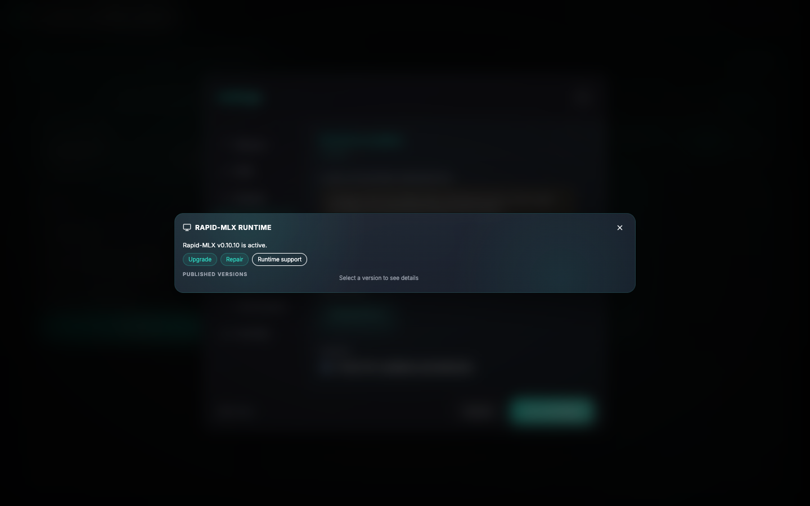
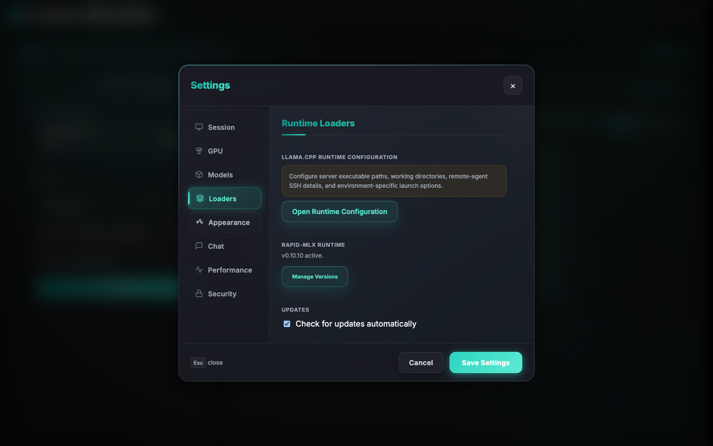

# Rapid-MLX Runtime Management

> **Status: Shipped.** Phase 7 completed. Rapid-MLX is now a first-class inference
> backend with a managed runtime, backend-neutral spawn wizard, live telemetry cards,
> VRAM estimator, and per-backend presets.

Llama Monitor treats Rapid-MLX as a first-class inference engine while keeping its
managed runtime isolated from the user's Python tooling. Local Rapid-MLX launch and
managed runtime changes are supported only on Apple Silicon macOS. Remote attachment
remains backend-aware on other platforms.



The managed runtime is designed with these goals:

- Fully app-owned and isolated.
- Immutable environments: no in-place edits.
- No leakage of internal filesystem paths into API responses.
- Capability-driven compatibility checks instead of hard-coded version allowlists.

### Capability evidence

Every launch re-runs bounded version, help, dependency, and optional-extra probes for
the selected executable. This avoids treating a Python-environment dependency update
as unchanged merely because the `rapid-mlx` executable did not change. A healthy
Homebrew, pip, pipx, or custom installation that passes the baseline probe is not
shown a global provisional warning; missing or indeterminate optional features are
reported only on the feature that needs them.

Managed environments keep the exact resolved dependency receipt and their most recent
user-driven update-validation result with the active runtime. The validation probe is
bounded and runs after managed installs, upgrades, repairs, and rollbacks. It checks
the core runtime separately from optional extras, so a missing `[guided]`, vision, or
embeddings extra produces actionable feature guidance rather than invalidating an
otherwise usable runtime.

## Cache policy

For a qualified one-user coding-agent workload, the optional Rapid retained
prefix-cache budget starts at **8 GiB** when it fits after model weights, active
KV/context, runtime overhead, and a safety reserve. **16 GiB** is an explicit
branch-retention choice: it can keep older conversation branches resident, but
is not presented as a guaranteed speed upgrade for the newest turn.

Hybrid entry count controls how many non-trimmable prompt snapshots may remain
inside that memory ceiling. The measured Qwen3.6 policy is workload-based:

- **4** is sufficient for one continuously active conversation tree, but not
  for returning after a separate child session runs.
- **8** retained both roots in a parallel-1 main-plus-one-sequential-child
  control and reduced resume TTFT from about 3.7–3.9 seconds to 0.65–0.70 seconds.
- **16** is the recommended general agent-workflow setting. It retained three
  alternating roots in the stress control, covering occasional orchestrator
  fan-out without improving or slowing the already-hot single-root path.

New Rapid-MLX wizard and preset flows select 16. Existing presets that stored
Auto/null remain backward-compatible and continue to omit the flag; Rapid-MLX
0.11.1 then uses its own default of 0, which disables hybrid snapshot reuse.

The entry count is not a memory allocation. More slots retain more candidate
boundaries only while they fit under the configured retained-cache memory cap.
Values 32 and 64 are advanced retention headroom, not measured speed presets.

Rapid disk checkpoints are not an interactive lower cache tier. Current builds
write snapshots but do not automatically reload evicted entries, so normal
presets keep their interval disabled. Manual cache export/import is an advanced
restart warm-start operation and is not offered as a memory-saving control.
See [cache benchmark results](cache-benchmark-results.md) for the measured
limits, runtime versions, and receipt locations.

## Reasoning profile and KV cache dtype

The installed `rapid-mlx serve --help` states this as upstream runtime behaviour, not
a llama-monitor policy choice:

> "Reasoning profile: pins `--kv-cache-dtype` to int8 regardless of the dtype flag"

Llama Monitor always launches with the reasoning profile on — the launched
`reasoning_mode` setting is unconditionally `"on"` (`src/web/api/rapid_mlx_runtime.rs:749`;
a stored legacy `off` is converted to `--no-thinking` rather than disabling the profile).
This means the **effective active-KV dtype is `int8` for every Rapid-MLX launch**, not
only for models the user thinks of as "reasoning models" — `reasoning_mode` sets the KV
policy, it does not mean "show thinking."

Because of this, `#spawn-kv-cache-dtype` in the wizard and preset editor is a read-only
"Effective: int8 (reasoning profile)" readout in Guided. In Pro it remains selectable
as a requested value, but any selection is immediately annotated with the requested→effective
diff already computed by `build_requested_vs_effective()`
(`src/web/api/rapid_mlx_runtime.rs:758`) — it must never look like a live knob when the
runtime is going to override it. The VRAM estimator models this correctly
(`reasoning_mode_overrides_kv_to_int8`, `rapid_mlx_runtime.rs:734`); the UI's job is to
say the same thing the estimator already computes, not to re-derive it.

An int8-vs-int4 KV comparison on this backend is not measurable with the current
benchmark harness — this is a runtime-behaviour finding, not a missing test.

## TurboQuant and PFlash

Both are wired end-to-end in the launch config but deliberately withheld at launch time;
neither is "in progress" or blocked on frontend work.

**TurboQuant** cannot be combined with standard KV-cache quantization by design, and
since the reasoning profile above pins standard KV to int8 on every launch, TurboQuant
and the shipped default configuration are mutually exclusive by construction. The
effective-policy mapper converts a requested `V4`/`K8V4` to `Off`
(`rapid_mlx_runtime.rs:725-731`), and the launch-config builder passes
`.turboquant_mode(None)` (`src/inference/rapid_mlx/mod.rs:1187`) — the requested value is
persisted for display and presets, but omitted from the actual launch, pending a
per-model/revision qualification receipt. It also would not measure what the wizard's
context-fit cards need: TurboQuant affects the retained reusable prefix-cache snapshots,
not cold active KV or model weights, so it is a retained-cache lever, not an active-KV
one — a card set built on it would be measuring the wrong memory pool. Separately, the
benchmark harness's recorded TurboQuant numbers have an unresolved provenance question:
it is not confirmed whether they captured the *effective* or the *requested* setting,
given the same V4/K8V4→Off silent-fallback class as the KV-dtype behaviour above.

`#spawn-turboquant-mode` stays an Advanced-tier control with an explicit
"Requested — not applied (awaiting model qualification receipt)" badge, and is excluded
from every VRAM-estimate scenario axis.

**PFlash** is more simply ruled out: at Rapid-MLX 0.11.0, `--pflash auto` measurably
degrades quality — retrieval recall collapsed to 0.0/0.2/0.4/0.2 at 63k/131k/160k/200k
context (vs. 1.0 with `pflash off`) while throughput rose roughly 4×, meaning the
compressed region was being dropped rather than lossily retained. In an agentic coding
loop this is a silent failure mode, not a speed/quality tradeoff a user can knowingly
accept — default guidance stays `off`, and `#spawn-rapid-pflash-policy` carries a warning
badge on `auto`/`always` citing this recall result. Do not re-enable `auto` as a default
without a source-level fix upstream.

## Context-fit scenario axes

With KV dtype pinned to int8, TurboQuant force-Off, and PFlash steered to off, the
levers that actually move Rapid-MLX unified-memory occupancy are context length
(`n_ctx`, the dominant term at fixed int8 KV), concurrency (`max_num_seqs` ×
`max_concurrent_requests`, which multiply active KV), the retained prompt-cache budget
(`retained_cache_mib` + `hybrid_cache_entries`), and `gpu_memory_utilization` as the
ceiling the other three are measured against
(`build_effective_policy()`, `rapid_mlx_runtime.rs:738-756`).

The wizard's context-fit cards vary concurrency and retained-cache budget at the user's
chosen context on a fixed int8 KV, rather than varying KV quantization — see
[vram-estimator.md](vram-estimator.md#mlx-context-fit-cards) for the card table.

## Chat request adaptation

The shared chat UI expresses backend-neutral intent, while the active backend
adapter owns wire-format differences. For Rapid-MLX, Llama Monitor renames
`repeat_penalty` to `repetition_penalty` and the reasoning-only
`thinking_budget_tokens` ceiling to `reasoning_max_tokens`, filters unsupported
llama.cpp fields, and requests stream usage when the qualified runtime supports
it. An explicit Rapid-native field takes precedence over its shared alias.

This distinction matters for reasoning models: `max_tokens` limits the complete
response, whereas `reasoning_max_tokens` force-closes the hidden reasoning phase
at its own ceiling so a long reasoning trace can still produce a final answer.

## Directory layout

All managed runtime files live under:

```text
<config-dir>/runtimes/rapid-mlx/
├── current.json
├── environments/
│   └── <version>-<random-suffix>/
│       ├── manifest.json
│       ├── .complete
│       ├── tool/
│       │   └── rapid-mlx/
│       │       └── bin/
│       │           └── rapid-mlx
│       └── bin/
│           └── rapid-mlx -> ../tool/rapid-mlx/bin/rapid-mlx
├── uv-cache/
└── uv-python/
```

Key rules:

- `current.json` is the activation pointer. It tracks:
  - `active_environment_id`: the currently active environment.
  - `previous_environment_id`: rollback candidate (last active before current).
- Each environment directory is:
  - Created fresh per install/upgrade/repair.
  - Considered immutable once its manifest and `.complete` marker are written.
- Only directories and files under this root are mutated by Llama Monitor.
- External installations (Homebrew, pip, pipx, custom) are never modified.

## Platform requirement

Local managed runtime changes (install, upgrade, repair, rollback) require:

- macOS
- aarch64 (Apple Silicon)

From code (`src/inference/rapid_mlx/mod.rs`):

```rust
pub fn ensure_local_platform_supported() -> Result<()> {
    if std::env::consts::OS != "macos" {
        return Err(anyhow!(
            "Rapid-MLX local execution requires macOS on Apple Silicon. Detected OS: {}",
            std::env::consts::OS
        ));
    }
    if std::env::consts::ARCH != "aarch64" {
        return Err(anyhow!(
            "Rapid-MLX local execution requires Apple Silicon (aarch64). Detected architecture: {}",
            std::env::consts::ARCH
        ));
    }
    Ok(())
}
```

Behavior:

- On non-Apple-Silicon platforms:
  - The runtime status API returns `supported: false`.
  - Mutation endpoints (install, upgrade, repair, rollback) respond with
    `400 Bad Request` and a stable message.
  - The UI still allows attaching to a remote Rapid-MLX server.

## Runtime sources

Llama Monitor can discover several Rapid-MLX runtime sources, but only the Managed
source is mutable. From `src/inference/rapid_mlx/runtime.rs`:

- `managed` — installed by Llama Monitor under `runtimes/rapid-mlx`.
- `homebrew`
- `pip`
- `pipx`
- `custom`
- `path_unknown`

Rules:

- Only `managed` environments are installed, upgraded, repaired, or removed by
  Llama Monitor.
- For other sources:
  - Llama Monitor may use them if found and compatible.
  - It never rewrites, removes, or "converts" them into managed runtimes.

## Install flow

Install is a single bounded transaction. From `updater.rs`:

1. Platform check:
   - If not Apple Silicon macOS, fail early with a clear message.

2. Release selection:
   - Confirm the exact version and channel (stable/prerelease) against published
     GitHub release metadata for `raullenchai/Rapid-MLX`.
   - Only non-draft published releases are allowed.
   - Version must be canonical `major.minor.patch`, at or above
     `0.10.9`.

3. Staging:
   - Generate a unique environment ID:
     - Format: `<version>-<12-byte hex suffix>` via `OsRng`.
   - Create directory under `environments/<id>/`.
   - Ensure `uv-cache/` and `uv-python/` exist and are app-owned.

4. uv install:
   - Runs:
     - `uv tool install rapid-mlx==<version>`
   - Environment:
     - `env_clear()` then restore only:
       - `PATH`
       - `SSL_CERT_FILE`
       - `SSL_CERT_DIR`
     - Sets:
       - `UV_TOOL_DIR` → `environments/<id>/tool`
       - `UV_TOOL_BIN_DIR` → `environments/<id>/bin`
       - `UV_CACHE_DIR` → `uv-cache`
       - `UV_PYTHON_INSTALL_DIR` → `uv-python`
       - `UV_NO_CONFIG=1`, `UV_NO_PROGRESS=1`, `NO_COLOR=1`
   - Flags:
     - `--no-config --link-mode copy --no-progress --no-color`

5. Binary resolution and integrity:
   - On Unix:
     - Expected: `tool/rapid-mlx/bin/rapid-mlx`
   - Confirms file exists, then:
     - Computes SHA-256.
     - Probes the binary for its version and serve capabilities via
       `probe_published_managed_release`.

6. Manifest:
   - Writes `manifest.json` (atomic, with file hardening) containing:
     - `schema_version`
     - `environment_id`
     - `version`
     - `release_channel`
     - `runtime_source: "managed"`
     - `binary_relative_path`
     - `binary_sha256`
     - `compatibility_state: "verified"`
   - Creates `.complete` (empty file, must be zero-length).

7. Activation:
   - Re-validates the environment (paths, symlink safety, hashes, manifest).
   - Atomically writes `current.json`:
     - New `active_environment_id` = this environment.
     - `previous_environment_id` = previous active (for rollback).
   - The response is constructed before `current.json` is written.

8. Cleanup:
   - After activation, removes any complete environments that are neither
     active nor previous.
   - Retention cleanup errors never override a successful activation.

Error handling:

- On any failure, timeout, capability mismatch, or version mismatch:
  - Installer process tree is killed and reaped.
  - Staging environment is removed.
  - `current.json` is left unchanged.
- Server logs retain operation/version and stage-specific diagnostics (staging,
  uv installation, executable lookup, compatibility probe, manifest/completion,
  and activation-pointer validation). Public job responses remain redacted.
- If an older `current.json` references a removed environment, activation logs
  the invalid candidate, skips it, and preserves the first valid rollback
  candidate instead of blocking an otherwise safe install.

## Upgrade flow

Upgrade is the same transactional path as install; only the name differs.

Key points:

- No in-place modification of an existing environment.
- A brand new environment is staged for the new version.
- On success, the old active becomes the previous (rollback candidate).
- After activation, unretained environments are cleaned up.

This means:

- You never "break" your currently running runtime in place.
- If the new version fails validation, the previous active continues to be used.

## Repair

Repair:

- Uses the active environment's manifest to determine its exact version and channel.
- Confirms that release exists in published metadata.
- Installs that same version into a fresh immutable environment.
- Does not modify the existing environment on disk.

From `updater.rs`:

```rust
// Excerpt logic:
let (manifest, _) = self.validate_environment(&pointer.active_environment_id)?;
if release.version != manifest.version
    || release.channel != manifest.release_channel
{
    bail!("Rediscovered Rapid-MLX release does not match the active managed runtime");
}
self.stage_and_activate_locked(release).await
```

Behavior:

- If the rediscovered release metadata no longer matches the active version,
  repair fails instead of silently changing versions.
- On success, the original environment becomes the rollback candidate.

## Rollback

Rollback:

- Uses `previous_environment_id` from `current.json`.
- Re-validates that environment:
  - Manifest checks.
  - Binary SHA-256 integrity.
  - Compatibility probe.
- On success, atomically swaps:
  - New active = previous_environment_id
  - New previous = former active

From `updater.rs`:

```rust
// If missing or tampered:
let previous = pointer.previous_environment_id.as_deref()
    .ok_or_else(|| anyhow!("No previous known-good Rapid-MLX runtime is available"))?;
```

If the rollback candidate fails revalidation, rollback is rejected and the
current active runtime remains unchanged.

## Release channels

Rapid-MLX uses a capability-driven, versioned release model.

Policy:

- Minimum allowed stable version: `0.10.9` (hard-coded floor).
- Stable releases:
  - Default channel.
  - Any exact published stable release ≥ floor can activate,
    subject to compatibility checks.
- Prereleases:
  - Allowed only when explicitly selected.
  - Must be a recognized non-draft GitHub prerelease.
  - Version must match prerelease channel; mismatches are rejected.
- Disallowed:
  - Drafts.
  - Mutable branches.
  - Arbitrary local or unversioned builds.
  - Versions with `+local` metadata.

Prerelease probe behavior:

- For a managed runtime, the probe is allowed to accept a prerelease only if
  the active manifest's `release_channel` is `prerelease` and the path matches
  (`src/web/api/rapid_mlx_runtime.rs::managed_prerelease_allowed`).

This design lets Llama Monitor:

- Track frequent Rapid-MLX updates via published releases.
- Fail safely when a new release changes required capabilities or contracts.

## Concurrency guard and timeouts

Only one runtime mutation (install/upgrade/repair/rollback) may run at a time.

Concurrency guard:

- Implemented with a `Semaphore(1)` in `RapidMlxRuntimeManager`.
- On a concurrent request:
  - If semaphore is acquired, the operation proceeds.
  - Otherwise, the API returns:
    - `429 Too Many Requests` with:
      - `"Another managed Rapid-MLX runtime operation is already in progress"`

Timeouts:

- Runtime commands (e.g., `uv` install) are bound by:
  - `DEFAULT_COMMAND_TIMEOUT = 10 minutes`.
- Output is limited:
  - `MAX_COMMAND_OUTPUT_BYTES = 256 KiB`.
- If uv:
  - Times out: process tree is killed and the staging environment is cleaned.
  - Exceeds output limit: treated as a failure; staging environment is removed.

All long-running mutations are executed as background jobs via the API. Clients:

- Receive a `job_id` on submission.
- Poll `/api/rapid-mlx/runtime/jobs/:id` for state and messages.

## Diagnostics and redaction

Public API responses never expose internal executable paths.

From `src/web/api/rapid_mlx_runtime.rs`:

- Internal `RuntimeInventoryEntry` includes:
  - `executable_path` for internal use.
- Public type (`PublicRuntimeInventoryEntry`) omits:
  - `executable_path`.

Example mapping:

```rust
#[derive(Debug, Clone, Serialize, PartialEq, Eq)]
struct PublicRuntimeInventoryEntry {
    environment_id: String,
    version: String,
    release_channel: ManagedReleaseChannel,
    active: bool,
    rollback_candidate: bool,
    complete: bool,
}
```

Error messages:

- Internal errors with filesystem paths are normalized to stable, redacted strings.
- The helper `public_runtime_error` ensures no raw paths leak:

```rust
// Examples:
"Another managed Rapid-MLX runtime operation is already in progress"
"Managed Rapid-MLX runtime changes require Apple Silicon macOS"
"No previous known-good Rapid-MLX runtime is available"
"No active managed Rapid-MLX runtime is available"
"Managed Rapid-MLX validation failed safely; the active runtime was not changed"
```

This guarantees that logs, UI, and HTTP responses do not reveal:

- User home directories.
- Internal runtime layout.
- Executable file paths.

## API and permissions summary



(For full HTTP contracts, see [api.md](api.md#rapid-mlx-runtime-management).)

- Read operations (status, releases, jobs):
  - Require: `api-token`.
- Mutation operations (install, upgrade, repair, rollback):
  - Require: `db-admin-token`.
  - Require an exact confirmation string:
    - Install: `INSTALL_RAPID_MLX_RUNTIME`
    - Upgrade: `UPGRADE_RAPID_MLX_RUNTIME`
    - Repair: `REPAIR_RAPID_MLX_RUNTIME`
    - Rollback: `ROLLBACK_RAPID_MLX_RUNTIME`
- On non-Apple-Silicon platforms:
  - Mutations respond with `400` and a clear platform-restriction message.
