# Setup Wizard Reference

The Setup wizard is a 6-step guided flow for configuring and launching a llama-server instance. It handles hardware detection, VRAM-aware parameter selection, model acquisition (local, HuggingFace, third-party), and binary management.

## Welcome Screen

The first screen a user sees when launching Llama Monitor. It has two main panes:

- **Connect to running model** (left): Connect to an existing llama-server instance by entering the URL and optional API key.
- **Local Server** (right): Configure and launch a local server using a preset or the Setup wizard.

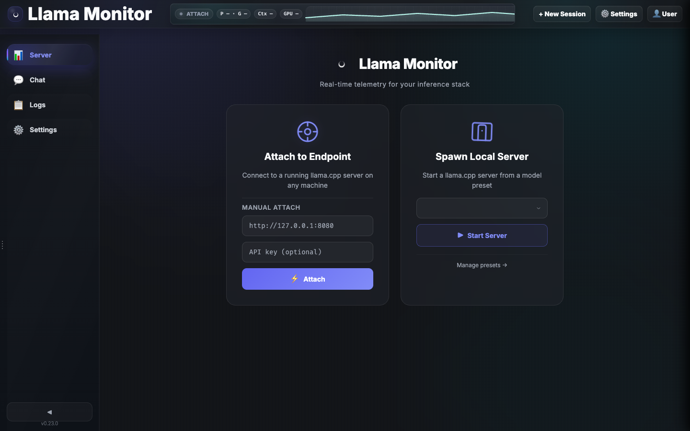

Entry points to the setup wizard: the **+ New model profile** button on the Local Server pane, the **+ New model profile** button in the top nav, and the **Start server** link on the logs empty state.

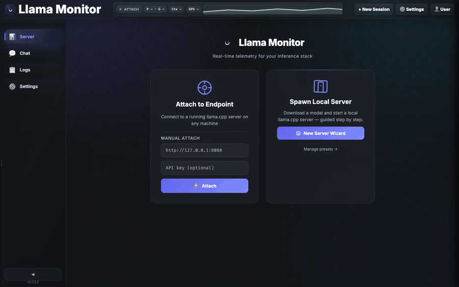

---

## Wizard Steps

### Step 1 — Profile

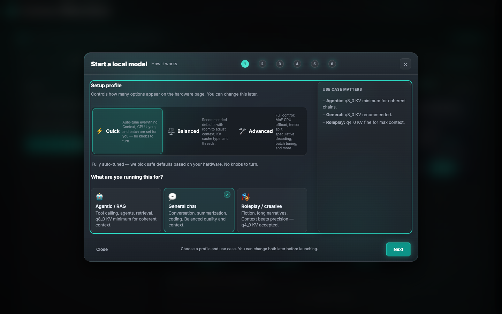

The user selects a **hardware profile** and a **use case**.

**Hardware profiles** set defaults for GPU layers, batch size, and fit granularity:

Fit has three states in both the setup wizard and preset editor. **Default** passes no fit
arguments, **On** passes `--fit on` with the selected target margin, and **Off** passes
`--fit off`.

| Profile | GPU Layers | Batch | Fit Granularity |
|---------|-----------|-------|-----------------|
| Quick / Low-end | 0 (CPU only) | 512 | 512 |
| Balanced | Auto | 1024 | 1024 |
| Workstation | All | 2048 | 2048 |
| Advanced | Manual | user-set | user-set |

**Use cases** influence KV quant defaults and ubatch:

| Use case | Min KV quant | Ubatch | Notes |
|----------|-------------|--------|-------|
| General | q8_0 | 1024 | Everyday chat, coding |
| Agentic | q8_0 | 1024 | Tool-calling, RAG; forces q8_0 minimum |
| Roleplay | q4_0 | 512 | Max context; q4_0 acceptable |

---

### Step 2 — Model

The user picks a model source. Three source types:

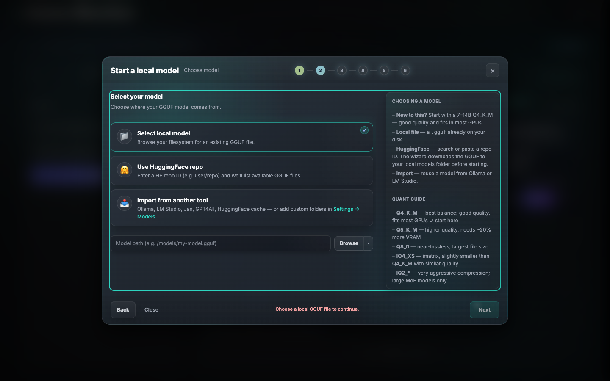

#### Local GGUF File
- User enters or browses an absolute path to a `.gguf` file.
- Parameter count (`param_b`) is inferred from the filename using `infer_param_b_from_name()`.
- Architecture heuristics are applied via `ModelArch::from_name_and_params()`.
- When launched from the local Models library, the wizard carries over discovered metadata and shows a small reminder card with filename, quant, and estimated size/parameter hints.

#### HuggingFace Hub
See [HuggingFace Integration](#huggingface-integration) below.

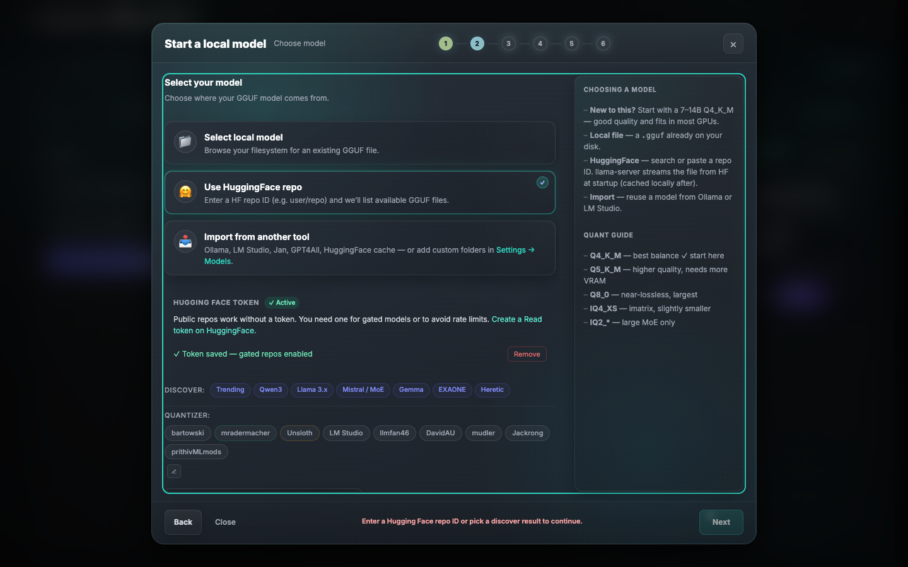

- The wizard includes a short helper explaining when a token is optional and links directly to `https://huggingface.co/settings/tokens`.
- Recommended token type: **Read**.
- Entry point for storing the token in-app: **Settings → Models**.

#### Third-Party Import
See [Third-Party Model Import](#third-party-model-import) below.

When selected, the wizard immediately scans known tool directories and renders discovered models as a grouped, clickable card list — no path typing required. A manual fallback text input and Browse button remain available for models outside the scanned locations.

#### Community Chat Templates

The model step detects families that benefit from maintained community templates.
The recommended template is downloaded into the local chat-template library and
passed to llama-server with `--chat-template-file`. **Use Embedded** leaves the
override unset. The preset editor exposes the same lookup through its
**Recommended** button next to the chat-template path.

| Model family | Recommended template | Source |
|---|---|---|
| Qwen 3.5 / 3.6 | froggeric's Fixed Template | HuggingFace |
| Gemma 4 | jscott3201's Gemma 4 Agentic Template | GitHub |

The Gemma 4 recommendation improves thinking defaults, tool argument formatting,
null handling, and multi-turn agentic histories. It is only offered when Gemma 4
is detected; older Gemma families keep their embedded template.

---

### Step 3 — Hardware & memory

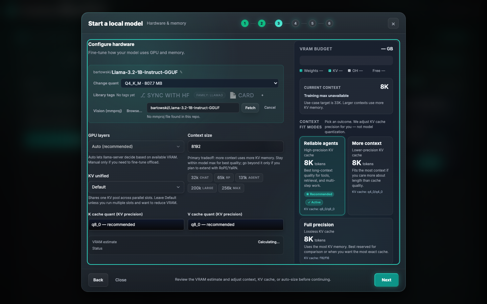

The core tuning step. Populated using `POST /api/vram/auto-size` after model selection.

The VRAM estimator is a hardware-aware configuration guide: it combines your detected memory capacity, backend (e.g., Metal vs CUDA), and the chosen model’s architecture (layers, experts, MoE depth) to propose settings that fit your machine. It is not a guarantee; extremely large or unusual models can exceed its estimates. For details on how it works and how to correct its assumptions, see [VRAM Estimator Reference](vram-estimator.md).

#### Model Header
Shows the selected repo (`owner/model-name`) and selected quant. If multiple GGUF files exist in the repo, a **Quantization** dropdown lets the user swap without leaving the step. A **Vision (mmproj)** dropdown appears when projector files are detected. For imatrix repositories whose model card links to a separate static-quant repository, the wizard follows that link and lists its projector files automatically. If a Qwen 3.5 variant's linked static repo has no projector, the wizard checks verified same-architecture repositories from mradermacher and then Unsloth.

To change the HuggingFace repo after initial selection:
- Click the small ✎ icon next to the repo label.
- Type a new repo ID (e.g. `owner/model-GGUF`), then press Enter or click Load.
- The wizard re-fetches GGUF files and quants from the new repo and refreshes the header.
- Escape or the ✕ button cancels and restores the previous repo.

Projector choices are ranked only after matching the selected model's filename/stem.
The wizard marks and auto-selects these family-specific formats when available:

| Model family | Preferred mmproj | Basis |
|---|---|---|
| Qwen 3.5 | F16 | Unsloth's documented llama.cpp vision default |
| Qwen 3.6 | F16 | Practical default; upstream publishes F16 and BF16 without claiming one is optimized |
| Gemma 4, including QAT | F16 | Unsloth's documented llama.cpp vision default |
| Other / unknown | None | Preserve compatibility without making an unsupported family claim |

Without a family-specific rule, compatible projectors are ordered by the
practical fallback `F16`, `BF16`, `Q8_0`, then `F32`, but no option receives a
family recommendation badge.

The recommendation applies to projector precision, not compatibility. Always use a
projector produced for the same model architecture and revision; do not mix a
recommended F16/BF16 projector from a different family.

Upstream references:
[Qwen 3.5 llama.cpp guide](https://unsloth.ai/docs/models/qwen3.5),
[Gemma 4 llama.cpp guide](https://unsloth.ai/docs/models/gemma-4), and
[Qwen 3.6 GGUF files](https://huggingface.co/unsloth/Qwen3.6-27B-GGUF/tree/main).

#### Main Hardware Grid

| Control | ID | Default | Notes |
|---------|----|---------|-------|
| GPU layers | `spawn-gpu-layers` | Auto | Auto / All / Manual |
| Layers count | `spawn-gpu-layers-manual` | — | Shown only when Manual selected |
| Context size | `spawn-context-size` | 8192 | Primary tuning control. Quick-pick buttons: 65k RP, 131k Agent, 160k Large, 212k Large, 262k Max, Model max |
| KV cache (K) | `spawn-cache-type-k` | q8_0 | f16 / q8_0 / q4_0 |
| KV cache (V) | `spawn-cache-type-v` | q8_0 | f16 / q8_0 / q4_0 |
| KV Unified | `spawn-kv-unified` | Default | Default omits the flag; On passes `--kv-unified`; Off passes `--no-kv-unified` |

#### Context Fit Modes
The right rail leads with a **Current context** summary and model-max status, then shows outcome-oriented presets:
- **Reliable agents** — high-precision KV cache (`q8_0/q8_0`)
- **More context** — lower-precision KV cache (`q4_0/q4_0`)
- **Full precision** — lossless KV cache (`f16/f16`)

Selecting a mode applies its KV quant preset and fills `Context size` to the maximum that fits that mode. The raw K/V cache dropdowns remain available underneath for advanced users and continue to populate from llama-server capabilities.

#### VRAM Breakdown Bar
Animated stacked bar updated live as controls change. Segments:

| Segment | Color | Content |
|---------|-------|---------|
| Weights | Indigo | Model weights after MoE CPU offload |
| KV cache | Amber | Context × KV bytes per token |
| mmproj | Cyan | Vision projector (if loaded) |
| MTP | Purple | MTP prediction heads |
| Overhead | Gray | GPU context + allocator (~300 MB base) |
| Free | Green → Red | Remaining headroom (red when over budget) |

Recommendation thresholds (from `full_estimate`):

| State | Condition | Indicator |
|-------|-----------|-----------|
| Fit | total ≤ 82% of VRAM | green |
| Tight | total ≤ 100% of VRAM | yellow |
| Risk | total ≤ 120% of VRAM | orange |
| WontFit | total > 120% of VRAM | red |

#### MTP Section
Shown automatically when the model has `mtp_depth > 0` (detected from GGUF metadata or architecture heuristics). Controls:
- **Enable MTP (experimental)** checkbox — adds `--spec-type draft-mtp,ngram-mod`. It defaults off on Apple Metal because current llama.cpp builds can lose throughput there; other backends keep the opt-out default.
- **Draft tokens/step** (`hw-mtp-depth`) — sets `--spec-draft-n-max` and forces `--parallel 1`. Benchmark enabled versus disabled because results vary by model, backend, context length, and acceptance rate.

#### mlock Warning (macOS)

When mlock is checked and the VRAM estimate is Tight or Risk, a warning appears:
- mlock pins model memory so macOS cannot page it out.
- On unified-memory Macs, with a tight estimate, this can push macOS into compression or swap and make the desktop unresponsive.
- If the warning is shown, either disable mlock, reduce context size, or choose a smaller quant.

This guidance is also shown in the preset editor.

#### Advanced Options Grid

| Control | ID | Default | Notes |
|---------|----|---------|-------|
| Batch size | `spawn-batch-size` | 2048 | Prompt batch size (`-b`) |
| Parallel slots | `spawn-parallel-slots` | 1 | Concurrent inference slots |
| Ubatch size | `spawn-ubatch-size` | 512 | Micro-batch for prompt processing |
| MoE CPU experts | `spawn-n-cpu-moe` | Auto | Experts offloaded to CPU RAM |
| Tensor split | `spawn-tensor-split` | — | Multi-GPU split ratios (e.g. `1,1`) |

#### Speculative Decoding

| Mode | Flag | Notes |
|------|------|-------|
| None | — | Disabled |
| N-gram | `--spec-type ngram-mod` | Zero model-memory overhead; workload-dependent speedup |
| MTP + N-gram | `--spec-type draft-mtp,ngram-mod` | Built-in MTP heads; benchmark per backend, especially on Metal |
| Draft model | `--spec-type draft-model` | Separate small draft model path required |

---

### Step 4 — Settings

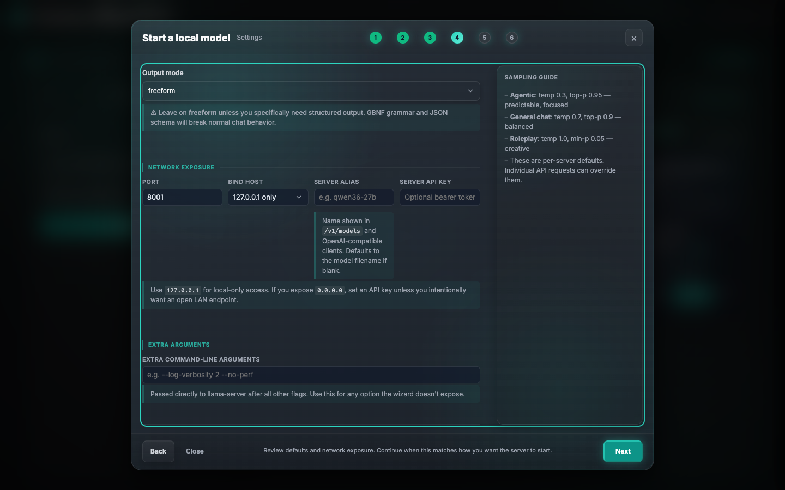

Shows a human-readable review of all selected parameters. Health checks:
- VRAM fit status
- Context fit relative to training context (`n_ctx_train`); the hardware step highlights whether the current value is within model max, at model max, or extended beyond it, and warns when n_ctx > n_ctx_train with a YaRN suggestion
- MoE CPU offload impact on generation speed
- KV quant quality warnings for agentic use cases
- Network exposure warnings when the user selects `0.0.0.0`, especially if no API key is set

This step also includes:
- Editable sampling defaults
- Model-family mode pills from `/api/model-defaults` so users can switch between recommended presets before editing individual fields
- Additional sampling controls for `top_k` and `max_tokens`
- Thinking and reasoning controls when the selected model family exposes them, including `enable_thinking`, `preserve_thinking`, reasoning mode, reasoning budget, and reasoning budget message
- A **Response shaping** section for constrained output using either `--grammar` (GBNF) or `--json-schema`
- Network controls for `Port`, `Bind host`, and optional `Server API key`
- Inline edit shortcuts back to Model and Hardware so the user can make one last adjustment without restarting the flow

---

### Step 5 — Review settings

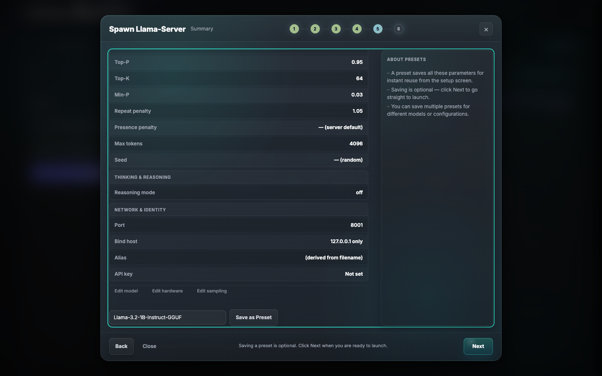

Displays every flag that will be saved with the preset in a table format. The user can save the configuration as a named preset from this step before proceeding.

- **Save as Preset** — stores all parameters for quick reuse from the setup screen
- Presets can be saved for different models or configurations
- Saving is optional — click Next to go straight to launch

---

### Step 6 — Start server

One-click launch. Shows live status (starting → waiting for endpoint → running / error). On success the wizard closes and the new model profile appears in the list.

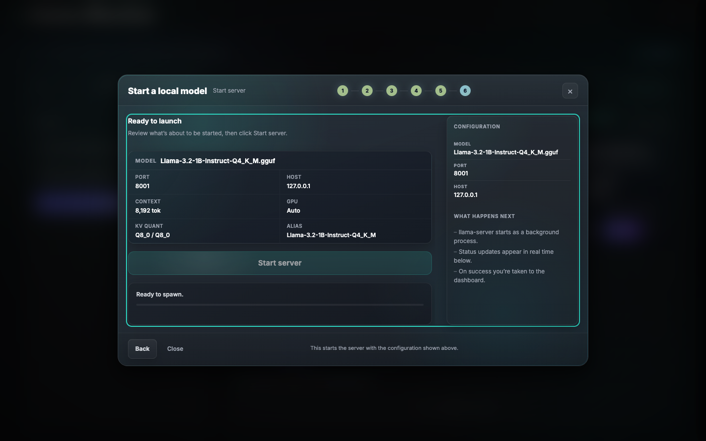


- The launched `llama-server` process is started with `--no-warmup`.
- Readiness is confirmed by a backend probe against the active session, so launches with a server API key still report status correctly.

---

## Structured Output (Grammar / JSON Schema)

Available in Review settings of the setup wizard and the preset editor.

Structured output forces the model to produce output matching a specific format instead of free-form text. The model cannot generate tokens that violate the rules — it's mechanically enforced at inference time, not just instructed via the prompt. This is useful for agent pipelines, data extraction, or any app that needs a guaranteed response shape.

### Options

| Option | What it is | When to use |
|--------|-----------|-------------|
| Freeform | No constraints | Normal chatting (default) |
| GBNF Grammar | Rules defining a custom output language | Fine-grained control, compact formats |
| JSON Schema | JSON structure definition | App contracts, most structured output use cases |

### GBNF Grammar

GBNF (Grouped Backus-Naur Form) defines rules for what the model can generate. The model can only produce tokens that match these rules. Think of it as a custom language the model is forced to write in.

Community grammars are available at [llama.cpp/grammars](https://github.com/ggml-org/llama.cpp/tree/master/grammars).

Example — a grammar that produces valid JSON objects:
```
root ::= object
object ::= "{" ws string ":" value ("," string ":" value)* "}" ws
```

### JSON Schema

JSON Schema defines the shape of the JSON the model returns (field names, types, required fields). Llama-server converts the schema to a GBNF grammar behind the scenes, so you get the same mechanical enforcement without writing grammar rules by hand.

Easier than raw GBNF for most cases.

Example — a schema requiring a `answer` field:
```json
{
  "type": "object",
  "properties": {
    "answer": { "type": "string" }
  },
  "required": ["answer"]
}
```

### Performance

Structured output adds a small per-token validation overhead. For simple schemas, this is typically a few percent slower. Complex grammars can be more noticeable, especially at long context lengths.

### API Payload

When a grammar or JSON schema is configured, the launch payload includes:
- `grammar`: the GBNF grammar string (passed as `--grammar`)
- `json_schema`: the JSON schema object (passed as `--json-schema`)

Only one should be set at a time. If both are configured, the output mode setting from the UI determines which takes precedence.

---

## HuggingFace Integration

### Search and Browse

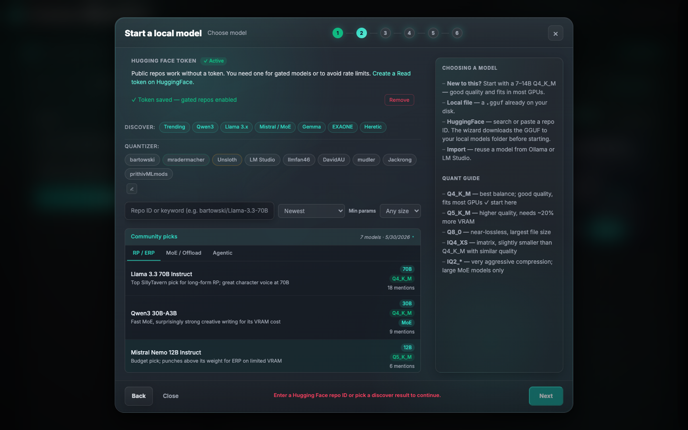

- Public repos can be searched and browsed without an HF token (no HuggingFace login needed).
- All /api/hf/... calls require llama-monitor's own api-token via Authorization header.
- A read-only HF token is recommended for gated/private repos and to avoid stricter anonymous rate limits.
- The discover panel includes:
  - Curated community picks (including MoE models).
  - “Trending” and model-specific views (e.g., Qwen3).
  - Quantizer-focused listings (e.g., Bartowski) for easier selection.
- The Step 2 wizard helper links directly to the Hugging Face token settings page and explains the `New token` → `Read` flow.

#### POST /api/hf/search
Search the HuggingFace Hub for GGUF model repos.

```json
// Request
{ "query": "qwen3", "limit": 20, "sort": "downloads" }

// Response
{
  "ok": true,
  "models": [
    {
      "id": "bartowski/Qwen3-30B-A3B-GGUF",
      "author": "bartowski",
      "downloads": 12345,
      "likes": 89,
      "last_modified": "2025-05-01T00:00:00Z",
      "tags": ["text-generation"],
      "param_b": 30.0,
      "quant_provider": "bartowski"
    }
  ]
}
```

- Requires: `api-token`
- Rate limit: 10 requests per 60 seconds
- Sort options: `downloads` (default), `likes`, `trending`, `createdAt`

#### POST /api/hf/author-models
Browse all GGUF repos by a specific author.

```json
// Request
{ "author": "bartowski", "limit": 40, "sort": "downloads" }
// Response: same shape as /api/hf/search
```

#### GET /api/hf/community-picks
Returns the curated community picks list (hot models shown in the wizard discover panel). Requires `api-token`.

#### GET /api/hf/quantizers
Returns the list of tracked quantizer authors (used to filter search results). Requires `api-token`.

#### PUT /api/hf/quantizers
Update the quantizer author list.
```json
{ "quantizers": [{ "username": "bartowski", "display_name": "bartowski", "description": "..." }] }
```

### File Listing

- GGUF lists are rendered without auto-selecting the first file.
  - The user must click a file explicitly so the selected quant is always intentional.
  - Recommended quants are still marked with a badge (★) for guidance.

#### POST /api/hf/files
List GGUF files in a repo.

```json
// Request
{ "repo_id": "bartowski/Qwen3-30B-A3B-GGUF" }

// Response
{
  "ok": true,
  "files": [
    {
      "path": "Qwen3-30B-A3B-Q4_K_M.gguf",
      "size": 18700000000,
      "label": "Q4_K_M",
      "quant_type": "standard",
      "is_imatrix": false,
      "is_mmproj": false,
      "repo_id": "owner/model-GGUF",
      "is_recommended_mmproj": false,
      "mmproj_recommendation": ""
    }
  ]
}
```

- `quant_type`: `"standard"` | `"imatrix"` | `"unsloth_dynamic"`
- `label`: normalized quant type extracted from filename (e.g. `"Q4_K_M"`, `"IQ3_S"`)
- `is_recommended_mmproj`: true when an mmproj matches the known family preference
- `mmproj_recommendation`: user-facing reason for that family preference, otherwise empty
- `repo_id`: repository that owns the file; companion mmproj files can come from a linked static-quant repository

### Quant Types

Every GGUF file listed by `/api/hf/files` includes a `quant_type` field indicating how the quantization was produced:

| `quant_type` | Label | Meaning |
|---|---|---|
| `standard` | Standard | Standard llama.cpp quantization (Q4_K_M, Q5_K_M, Q8_0, etc.). No calibration data required. |
| `imatrix` | imatrix | Importance-matrix calibrated (typically mradermacher's `i1-*` naming). Generally better quality at the same bits-per-weight. |
| `unsloth_dynamic` | UD (Unsloth) | Unsloth Dynamic quants (UD-*) use a mixed bits-per-weight approach per layer. Excellent quality/size tradeoff. |
| `bnb` | BnB | bitsandbytes quantization (rare in GGUF land). |
| `unknown` | Unknown | Could not be classified from filename. |

Detection is done from filename patterns: `i1-` prefixes for imatrix, `-ud-` or `UD-` for Unsloth Dynamic, everything else defaults to standard.

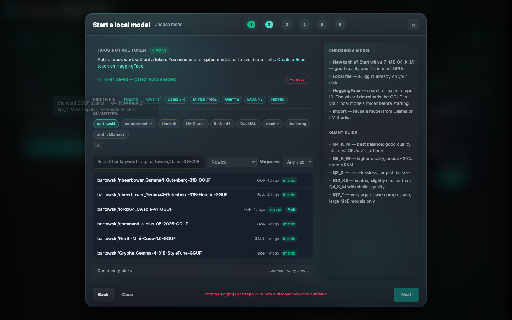

### Community Picks / Quick Picks

Note: The VRAM estimator runs before the wizard asks you to choose a context size. If you suspect its model-architecture assumptions are off (wrong expert count, wrong layers), see [VRAM Estimator Reference](vram-estimator.md) for how to verify and correct them.

The wizard discover panel includes quantizer quick-pick buttons to filter by known GGUF producers:

| Quantizer | Style | Description |
|---|---|---|
| bartowski | standard | Standard GGUF quants, most popular, extremely reliable |
| mradermacher | imatrix | imatrix specialist; `i1-*` files use importance calibration |
| Unsloth | ud | UD dynamic quants, mixed bpw per layer, excellent quality/size |

The community picks list is loaded from `GET /api/hf/community-picks` (curated, no auth required for reads; updating requires `api-token`).

The quantizer author list is loaded from `GET /api/hf/quantizers` and can be customized via `PUT /api/hf/quantizers` (requires `api-token`). Send an empty array to reset to defaults.

```json
// PUT /api/hf/quantizers — update quantizer list
{ "quantizers": [ { "username": "bartowski", "display_name": "bartowski", "description": "...", "quant_style": "standard" } ] }
```

```json
// GET /api/hf/quantizers — response
{ "ok": true, "quantizers": [ { "username": "bartowski", "display_name": "bartowski", "description": "...", "quant_style": "standard" } ], "is_custom": false }
```

- `is_custom`: true when the list was overridden by the user via `PUT`, false when using built-in defaults.

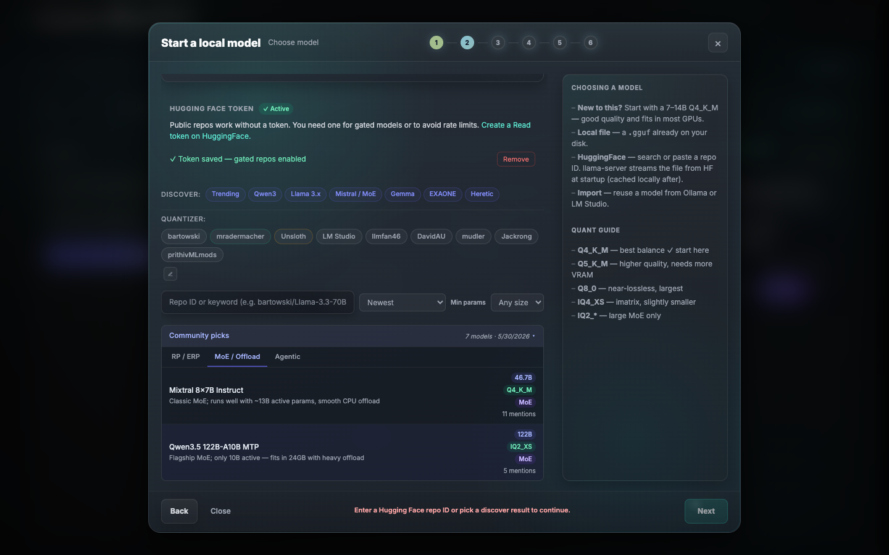

### Sort/Filter Controls

The HuggingFace search supports the following sort options (passed as `sort` in the `/api/hf/search` request):

| Sort Value | Behavior |
|---|---|
| `downloads` | Most downloaded (default; best signal for quality community quants) |
| `likes` | Most liked |
| `trendingScore` | HuggingFace trending score |
| `createdAt` | Newest first |

The search and browse UI includes param size filter controls for narrowing results by model parameter count range. The discover panel surfaces "Trending" and model-specific category views (e.g., Qwen3, MoE).

### Download

#### POST /api/hf/download
Start a streaming download. Returns immediately with a download ID; poll `/status` for progress.

```json
// Request
{ "repo_id": "bartowski/Qwen3-30B-A3B-GGUF", "file_path": "Qwen3-30B-A3B-Q4_K_M.gguf", "resume": true }

// Response
{ "ok": true, "download_id": "md-1234567890-abc12345", "local_path": "/Users/you/.config/llama-monitor/models/Qwen3-30B-A3B-Q4_K_M.gguf" }
```

- Requires: `api-token`
- Rate limit: 10-second cooldown between starts; companion downloads (e.g. mmproj alongside a model) bypass this cooldown so both can start at the same time.
- Max 2 concurrent downloads (to avoid overwhelming the connection and HF rate limits).
- Duplicate guard: rejects starting a second download for the same (repo, file) while the first is running.
- Existing-file guard: refuses to re-download if the target file already exists on disk (not a `.part` file).
- Path traversal guard: rejects `..`, leading `/`, leading `\`
- Uses `connect_timeout(30s)` only — no total timeout (large files stream indefinitely).
- On failure: partial file renamed to `.part`; terminal logs record reason.
- Error handling: stream errors are classified (transient, timeout, auth, not-found) and surfaced as human-readable toasts; the frontend shows start, conflict, and failure toasts so the user always knows the state.

#### GET /api/models/download/:id/status
Poll download progress.

```json
{
  "status": { "download_id": "md-...", "status": "running", "bytes_downloaded": 500000000, "total_bytes": 18700000000, "speed": 5242880.0, "eta": 3456, "message": "...", "local_path": "..." }
}
```

- `status`: `"running"` | `"completed"` | `"failed"` | `"cancelled"`
- `speed`: bytes/sec
- `eta`: seconds remaining (0 when unknown)

#### POST /api/models/download/:id/cancel
Cancel a running download. Returns `{ "ok": true }`.

#### GET /api/hf/download-dir
Returns the effective models directory.

```json
{ "ok": true, "dir": "/Users/you/.config/llama-monitor/models", "configured": false }
```

- `configured`: true if the user has overridden the default in Settings

#### Download UI

When the download starts, the model card displays an indeterminate progress bar and download status. On completion, the card shows the final download rate and a green check mark.

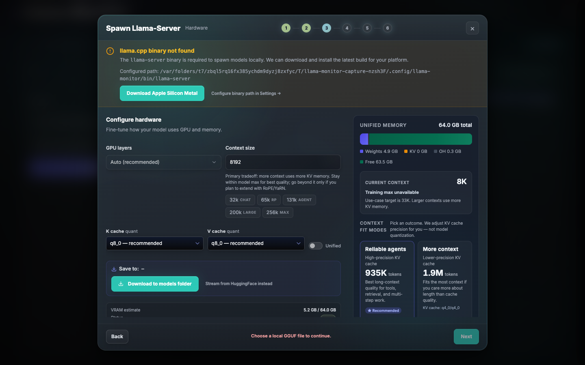
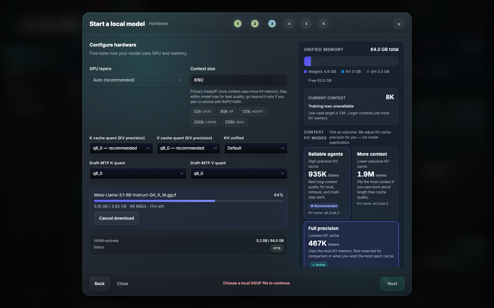

### MTP and IQ Quant Detection

The model browser and library recognize and label:
- MTP (Multi-Token Prediction) / draft models: detected via filename patterns including `-mtp.gguf` (Unsloth convention). These models are shown with an MTP badge (indigo pill) in the model cards.
- IQ quantizations: filenames with `-IQ` or `_IQ` (e.g., `IQ2_XXS`, `IQ3_M`, `IQ4_XL`) are correctly parsed, including the full `IQ` prefix in the quant label.

### Model Card

#### GET /api/hf/card?repo=owner/model
Fetch and return the raw model card markdown for display in the in-app card panel. Content is rendered with `marked` and sanitized with `DOMPurify` before display.

### HF Token

#### GET /api/hf/token
Returns whether a token is currently stored: `{ "set": true }`. Requires `api-token`.

#### PUT /api/hf/token
Set or update the HF token: `{ "token": "hf_xxxx..." }`. Requires `api-token`. Written to `~/.config/llama-monitor/hf-token` with mode 600.

#### DELETE /api/hf/token
Remove the stored token. Requires `api-token`.

### Wizard-to-Settings Flow

- The Hugging Face helper in Step 2 can open **Settings → Models** without closing the wizard.
- The binary prerequisite banner can open **Settings → Model profile** without discarding wizard progress.
- After saving settings, the wizard refreshes its token/binary state in place.

---

## Third-Party Model Import

#### POST /api/third-party-models
Scan local model directories from Ollama, LM Studio, Jan, GPT4All, and the HuggingFace hub cache. Returns models with display names and tool labels — no path knowledge required from the user.

```json
// Request
{}

// Response
{
  "ok": true,
  "models": [
    { "path": "/Users/you/.ollama/models/blobs/sha256-abc123", "name": "llama3.2:latest", "source_tool": "Ollama", "size": 4900000000 },
    { "path": "/Users/you/.lmstudio/models/bartowski/Qwen3-8B-Q4_K_M.gguf", "name": "Qwen3-8B-Q4_K_M", "source_tool": "LM Studio", "size": 5100000000 },
    { "path": "/Users/you/.cache/huggingface/hub/models--Qwen--Qwen3-8B-GGUF/snapshots/abc/Qwen3-8B-Q4_K_M.gguf", "name": "Qwen/Qwen3-8B-GGUF/Qwen3-8B-Q4_K_M", "source_tool": "HuggingFace", "size": 5100000000 }
  ]
}
```

- Requires: `api-token`

**Scanned tools and paths:**

| Tool | macOS | Linux | Windows |
|------|-------|-------|---------|
| Ollama | `~/.ollama/models/` | `~/.ollama/models/` | `%USERPROFILE%\.ollama\models\` |
| LM Studio | `~/.lmstudio/models/`, `~/.cache/lm-studio/models/`, `~/Library/Application Support/LM Studio/models/` | `~/.lmstudio/models/`, `~/.cache/lm-studio/models/` | `%USERPROFILE%\.lmstudio\models\` |
| Jan | `~/Library/Application Support/Jan/models/` | `~/.jan/models/` | `%APPDATA%\Jan\models\` |
| GPT4All | `~/Library/Application Support/nomic.ai/GPT4All/` | `~/.local/share/nomic.ai/GPT4All/` | `%LOCALAPPDATA%\nomic.ai\GPT4All\` |
| HuggingFace | `~/.cache/huggingface/hub/` | same | `%USERPROFILE%\.cache\huggingface\hub\` |

**Ollama notes:** Models are stored as content-addressed blobs (`sha256-<hash>`) without a `.gguf` extension. The scanner reads manifests under `manifests/` to resolve blob→model-name mappings. The blob files are valid GGUFs and can be passed directly to llama-server. The `OLLAMA_MODELS` environment variable is respected if set.

**HuggingFace notes:** Scans `models--{org}--{repo}/snapshots/{revision}/*.gguf`. Files are typically symlinks to blobs; canonical paths are resolved and deduplicated. `HF_HUB_CACHE` and `HF_HOME` overrides are respected. This covers Unsloth Studio downloads automatically.

**Model introspection:** Ollama blob paths are accepted by `POST /api/model/introspect` (the `.gguf` extension check is relaxed for paths matching `*/blobs/sha256-*`).

**Extra model directories:** Users can configure additional scan locations in Settings → Models → Additional model locations. These directories are:
- Scanned recursively (depth 5) and shown in the import card list under a `Local — <dirname>` group header
- Added to the file browser allowlist so Browse can navigate into them directly
- Accepted by the model introspection endpoint
- Useful for models spread across multiple drives (e.g. `E:\models`, `G:\models\CODE`, `G:\models\RP`)

---

## Model Introspection (GGUF Metadata Reader)

#### POST /api/models/gguf-meta
Read the KV metadata header of a GGUF file directly from the binary — no llama-server
process is required. Works on GGUF v1, v2, and v3. Calling this on a 70B model is
effectively instant because tensor weights are never touched. Works on GGUF v1, v2, and v3 files. Calling this on a 70B model is effectively instant because tensor weights are never touched.

```json
// Request
{ "model_path": "/path/to/model.gguf" }

// Response
{
  "ok": true,
  "architecture": "qwen3_6",
  "param_count": 27000000000,
  "block_count": 64,
  "head_count": 24,
  "head_count_kv": 4,
  "key_length": 256,
  "context_length": 262144,
  "embedding_length": 5120,
  "feed_forward_length": null,
  "expert_count": null,
  "expert_used_count": null,
  "mtp_depth": 0,
  "n_attn_layers": 16
}
```

- Requires: `api-token`
- Replaces the old `llama-server --print-model-metadata` invocation for architecture detection
- For hybrid DeltaNet models (Qwen3.5, Qwen3.6), `n_attn_layers` is computed via heuristics from the detected architecture and block count — only a subset of layers use traditional KV cache
- For MoE models, `expert_count` and `expert_used_count` are populated from the file's `expert_count` and `expert_used_count` keys
- The `architecture` field is the canonical key (`general.architecture`) used by llama.cpp to select its model loader, present in every well-formed GGUF regardless of filename

#### POST /api/model/introspect
Legacy endpoint. Runs `llama-server --print-model-metadata` on a local GGUF file and returns parsed architecture fields. Results are cached in `~/.config/llama-monitor/model-cache/<sha256>.json`.

```json
// Request
{ "model_path": "/path/to/model.gguf" }

// Response
{
  "ok": true,
  "cached": false,
  "metadata": {
    "n_layers": 32, "n_kv_heads": 8, "head_dim": 128,
    "n_experts": 0, "context_length": 131072,
    "general_architecture": "llama",
    "mtp_depth": 0
  }
}
```

- Requires: `api-token`
- Cache hit returns `"cached": true`
- Timeout: 30 seconds
- Used to override `ModelArch` heuristics with ground-truth values from the file

### HF Resolve Origin

#### POST /api/hf/resolve-origin
Identify the HuggingFace source of a local GGUF file from its filename. Searches HF for matching repos, scores candidates by filename match, file existence, and size, and returns a ranked list.

```json
// Request
{ "filename": "Qwen3-30B-A3B-Q4_K_M.gguf", "size_bytes": 18700000000 }

// Response
{
  "ok": true,
  "confident": true,
  "model_stem": "Qwen3-30B-A3B",
  "candidates": [
    {
      "repo_id": "bartowski/Qwen3-30B-A3B-GGUF",
      "confidence": 0.95,
      "reason": "Filename and size match",
      "preview_tags": ["gguf", "text-generation"],
      "card_url": "https://huggingface.co/bartowski/Qwen3-30B-A3B-GGUF",
      "family": "qwen3.6"
    }
  ],
  "errors": []
}
```

- Requires: `api-token`
- `confident`: true when the top candidate's confidence score is >= 0.8
- `model_stem`: the filename-derived stem used for search (quant suffixes, version tags, and MTP markers stripped)
- `errors`: any errors encountered during resolution (e.g., network failures); may be non-empty even when candidates are returned
- Candidate scoring considers filename similarity, file existence in the repo, size match, download count, and GGUF tag presence

### Spawn Wizard Helpers

#### POST /api/spawn-wizard/mtp-draft-check
Check whether a compatible MTP draft model is available (local or on HF) for a Gemma4 model.
Requires `api-token`.

```json
// Request
{ "model_name": "Gemma4-...", "repo_id": "owner/repo", "quant_label": "Q8_0" }

// Response
{
  "ok": true,
  "draft_available": true,
  "draft_path": "/path/to/draft.gguf",
  "tier": "gemma4-...",
  "hf_download_url": "https://huggingface.co/...",
  "hf_repo_id": "owner/draft-repo",
  "hf_filename": "draft.gguf",
  "local_filename": "Gemma4-...-draft.gguf"
}
```

- Validates whether the model name matches a known Gemma4 tier.
- Checks for an existing local draft model.
- Resolves Unsloth HF draft model info for download.

#### POST /api/spawn-wizard/import-launch-file
Import settings from an existing launch script (e.g. from another tool).
Requires `api-token`.

```json
// Request
{ "file": "..." }   // contents of the launch file

// Response
{ "ok": true, "preset": { ... }, "warnings": [ "..." ] }
```

### Chat Template Endpoints

These endpoints manage Jinja chat templates in the local template library.
All require `api-token`. Templates are stored under the config directory
(e.g. `~/.config/llama-monitor/chat-templates/`).

#### POST /api/chat-template/fetch
Fetch a chat template from a URL (https only; SSRF guard applied).

```json
{ "source_type": "url", "source": "https://example.com/template.jinja" }
// Response: { "ok": true, "template": "..." }
```

#### POST /api/chat-template/upload
Save a chat template to the local library; returns a template ID and on-disk path.

```json
{ "template": "..." }
// Response: { "ok": true, "template_id": "temp-...", "path": "/path/to/temp-....jinja" }
```

#### GET /api/chat-template/dir
Return the path to the local chat-template directory (creates it if needed).

```json
// Response: { "ok": true, "path": "/path/to/chat-templates" }
```

#### POST /api/chat-template/install-hf
Install a template from HuggingFace by repo and file; caches the file so it is not
redownloaded unless `force` is true.

```json
{ "repo": "owner/repo", "file": "template.jinja", "name": "qwen3.6-fixed" }
// Response: { "ok": true, "path": "/path/to/qwen3.6-fixed.jinja", "already_existed": false }
```

- Uses the configured HF token (if set) for gated repos.

#### POST /api/chat-template/install-url
Install a template from a GitHub raw URL (only raw.githubusercontent.com allowed);
cached by name like install-hf.

```json
{ "url": "https://raw.githubusercontent.com/...", "name": "gemma4-agentic" }
// Response: { "ok": true, "path": "/path/to/gemma4-agentic.jinja", "already_existed": false }
```

- Max 1 MB; no redirects; no SSRF escape via host allowlist.

---

## Binary Prerequisite System

When the wizard opens and no `llama-server` binary is found at the configured path, a banner is shown before the wizard steps begin.

After the binary is installed, the nav bar shows a version pill (e.g. "llama.cpp · b9512"). Clicking the pill opens the version modal — a release picker with the last 8 builds and a release notes panel. Any build can be installed from here, including older ones.

When you install a new build while a llama-server is already running, llama-monitor automatically restarts the server with the new binary using its existing configuration. The preset, model path, and tuning settings are preserved; only the binary is swapped.

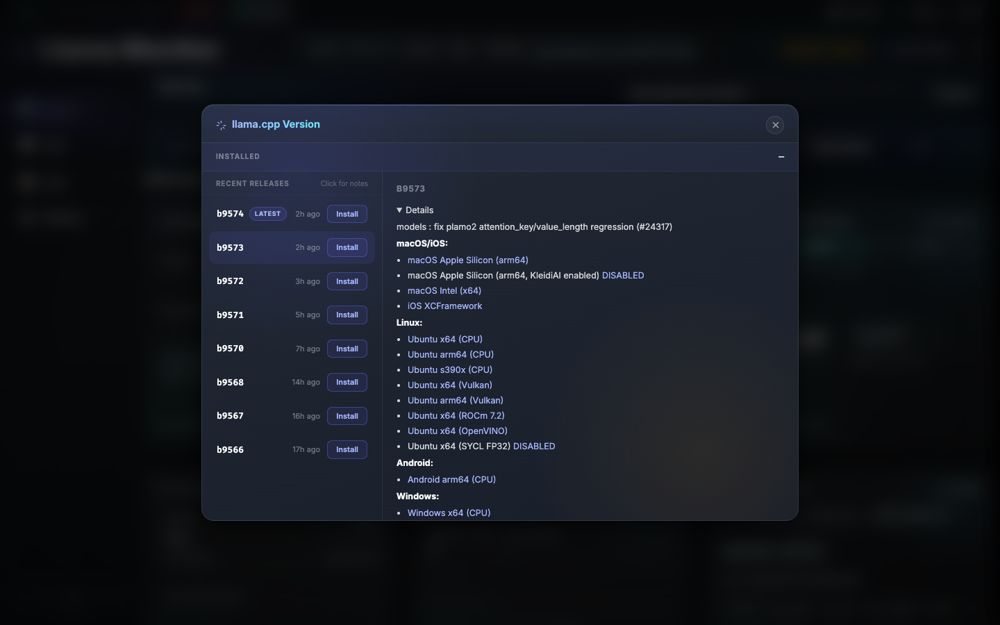

#### GET /api/llama-binary/platform-info
Returns instant (no network) platform and backend metadata.

```json
{
  "ok": true,
  "os": "macos",
  "arch": "aarch64",
  "label": "Apple Silicon Metal",
  "backends": [
    { "id": "metal", "label": "Apple Silicon Metal", "description": "Recommended for M-series Macs", "default": true }
  ]
}
```

#### GET /api/llama-binary/latest
Returns the latest available release version (cached, fetched from GitHub). Used with `platform-info` to show the version that will be downloaded.

#### POST /api/llama-binary/update
Download and install a llama.cpp release binary.

```json
// Request (optional backend override)
{ "backend": "cuda13" }

// Response
{ "ok": true, "version": "b5678", "backend": "metal", "arch": "aarch64", "path": "/Users/you/.config/llama-monitor/bin/llama-server" }
```

- Requires: `api-token`
- Copies the full release archive (not just `llama-server`) to `~/.config/llama-monitor/bin/` — CUDA/Vulkan/SYCL builds require their shared libraries to be co-located
- All extracted files get `chmod 755` on Unix
- Default install path: `~/.config/llama-monitor/bin/llama-server` (configurable in Settings)

---

## Benchmark

#### POST /api/benchmark
Run a quick performance test against the running llama-server. Sends a fixed prompt, measures prompt processing throughput, generation throughput, and time-to-first-token, then classifies the result.

```json
// Request
{}

// Response (successful run)
{
  "prompt_tokens_per_second": 1245.32,
  "gen_tokens_per_second": 12.8,
  "time_to_first_token_ms": 890.0,
  "verdict": "moderate",
  "hints": ["Slow first-token response; try enabling flash attention."],
  "suggestions": [
    { "label": "Enable flash attention", "description": "Cuts time-to-first-token and reduces VRAM pressure at large context.", "param": "flash_attn", "value": "on" }
  ]
}
```

- Requires: `api-token`
- 15-second cooldown between runs to prevent repeated heavy loads on the server
- Returns `429 Too Many Requests` with `"seconds_remaining"` if called during cooldown
- Returns an error if no llama-server is running

### Verdicts

The verdict is determined by generation throughput and time-to-first-token:

| Verdict | Condition |
|---|---|
| `good` | gen >= 15 t/s AND TTFT <= 1500 ms |
| `moderate` | gen >= 4 t/s AND TTFT <= 3000 ms |
| `poor` | below moderate thresholds |

### Hints and Suggestions

Hints are plain-text diagnostics. Suggestions are structured one-click fixes:

| Suggestion | Trigger Condition |
|---|---|
| Enable flash attention | TTFT > 1500 ms |
| Reduce context window | gen < 5 t/s |
| Increase batch size | prompt < 300 t/s |
| Increase n_cpu_moe | MoE model detected |

For MoE models, suggestions include a specific `n_cpu_moe` value computed from the model size and available VRAM.

---

## VRAM Estimation API

See [vram-estimator.md](vram-estimator.md) for the estimation formulas and `ModelArch` field reference.

#### POST /api/vram/estimate
Quick estimate for a single configuration.

```json
// Request
{
  "model_path": "/path/to/model.gguf",
  "model_name": "Qwen3-30B-A3B",
  "param_b": 30.0,
  "context_size": 65536,
  "cache_type_k": "q8_0",
  "cache_type_v": "q8_0",
  "parallel_slots": 1,
  "ubatch_size": 1024,
  "n_cpu_moe": 0,
  "available_vram_bytes": 68719476736
}

// Response: VramEstimate (legacy shape)
{
  "ok": true,
  "estimated_vram_bytes": 28000000000,
  "estimated_ram_bytes": 0,
  "available_vram_bytes": 68719476736,
  "recommendation": "fit",
  "note": "Fits comfortably with >18% headroom."
}
```

#### POST /api/vram/estimate-breakdown
Full estimate with per-component breakdown.

```json
// Response: VramBreakdown
{
  "ok": true,
  "weights_bytes": 16000000000,
  "kv_cache_bytes": 8000000000,
  "linear_attn_state_bytes": 0,
  "mmproj_bytes": 0,
  "mtp_bytes": 0,
  "overhead_bytes": 314572800,
  "total_bytes": 24314572800,
  "available_bytes": 68719476736,
  "headroom_bytes": 44404903936,
  "ram_bytes": 0,
  "recommendation": "fit",
  "note": "Fits comfortably with >18% headroom."
}
```

#### POST /api/vram/auto-size
Compute optimal settings for a model + hardware combination.

```json
// Request
{
  "model_path": "...", "model_name": "...", "param_b": 30.0,
  "available_vram_bytes": 68719476736,
  "use_case": "general",
  "parallel_slots": 1,
  "fit_granularity": 1024
}

// Response: AutoSizeResult
{
  "ok": true,
  "context_size": 131072,
  "kv_quant_k": "q8_0",
  "kv_quant_v": "q8_0",
  "fit_ctx": 1024,
  "ubatch_size": 1024,
  "n_cpu_moe": null,
  "breakdown": { ... },
  "scenarios": [
    { "label": "Max coherence", "kv_quant_k": "q8_0", "kv_quant_v": "q8_0", "context_size": 131072, "n_cpu_moe": null, "vram_total_gb": 22.5, "recommended": true, "warning": null, "note": "q8_0 KV — min for agentic" },
    { "label": "Max context", "kv_quant_k": "q4_0", "kv_quant_v": "q4_0", "context_size": 204800, "n_cpu_moe": null, "vram_total_gb": 21.0, "recommended": false, "warning": null, "note": "q4_0 KV — roleplay OK, agentic ⚠" }
  ],
  "warnings": [],
  "notes": ["MoE: all 64 experts in VRAM."]
}
```

- `use_case`: `"general"` | `"agentic"` | `"roleplay"`

**MTP Depth:** For models with Multi-Token Prediction capability (`mtp_depth > 0`), the VRAM estimator includes the MTP prediction-head overhead in the `mtp_bytes` field of the breakdown. The overhead is estimated as 1.5% of the model size per MTP depth level. This is visible in the VRAM Breakdown Bar as a purple segment labeled "MTP".

#### POST /api/vram/quant-compare
Pre-download quant comparison table for a model. Shown in the wizard as the **Quant Advisor** panel.

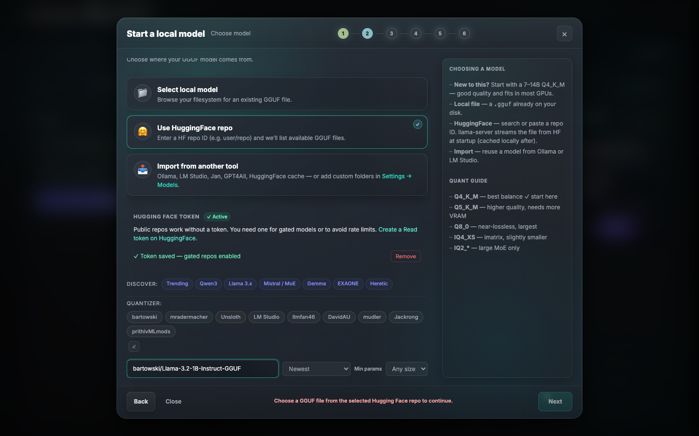

```json
// Request
{ "model_name": "Qwen3-30B-A3B", "param_b": 30.0, "available_vram_bytes": 68719476736 }

// Response
{
  "ok": true,
  "quants": [
    { "quant": "Q4_K_M", "label": "Q4_K_M", "model_size_gb": 18.5, "fits_vram": true, "max_ctx_q8": 131072, "max_ctx_q4": 204800, "recommended": true }
  ]
}
```

#### POST /api/model-defaults
Returns model-family sampling recommendations for the Step 4 wizard review form and the preset editor.

```json
// Request
{ "model_name_or_repo": "Qwen3.6-30B-A3B", "size_bytes": 0, "tags": [] }

// Response
{
  "defaults": {
    "temperature": 1.0,
    "top_p": 0.95,
    "top_k": 20,
    "min_p": 0.0,
    "repeat_penalty": 1.0,
    "presence_penalty": 0.0,
    "max_tokens": 32768,
    "enable_thinking": true,
    "preserve_thinking": true,
    "reasoning": true,
    "reasoning_budget": 16384,
    "reasoning_budget_message": "\nFinal Answer:"
  },
  "presets": [
    {
      "name": "Agentic / Coding (thinking)",
      "description": "Recommended default for coding agents and tool-heavy work.",
      "temperature": 1.0,
      "top_p": 0.95
    }
  ]
}
```

- `defaults` is always the primary preset that should be preselected in the UI.
- `presets` is the full model-specific mode list shown as clickable pills.

---

## Security

- All endpoints require `api-token` (Bearer token in `Authorization` header).
- HF token never appears in logs; masked in the GET response.
- Download `file_path` rejects `..`, leading `/`, leading `\` (path traversal guard).
- `target_path` for downloads is canonicalized and verified to remain within `models_dir`.
- Download rate-limited: 10-second cooldown between starts, max 2 concurrent. Includes duplicate and existing-file guards.
- Model introspection primarily reads the GGUF binary header directly (fast, no external process) via `/api/models/gguf-meta`; the legacy `/api/model/introspect` still runs `llama-server` as a subprocess with a 30-second timeout. Neither endpoint passes unsanitized user input as shell arguments.
- Benchmark is rate-limited with a 15-second cooldown to prevent repeated heavy loads on the running llama-server.

---

## Related Files

| File | Purpose |
|------|---------|
| `src/llama/vram_estimator/` | All VRAM estimation logic and `ModelArch` (module dir: `estimate.rs`, `arch_heuristics.rs`, `quant_table.rs`) |
| `src/llama/spawn_wizard.rs` | `auto_size` wrapper called by the wizard API |
| `src/model_download.rs` | Streaming download manager with resume support |
| `src/llama/gguf_meta.rs` | GGUF metadata reader (binary header parsing) |
| `src/hf/mod.rs` | HuggingFace API client, file listing, token management, resolve origin, quantizers |
| `src/web/api/spawn_wizard.rs` | Wizard-related route handlers |
| `src/web/api/vram.rs` | VRAM estimation route handlers |
| `src/web/api/models.rs` | Model library and GGUF metadata routes |
| `src/web/api/mod.rs` | API module registry (31 route modules) |
| `static/js/features/spawn-wizard.js` | Wizard frontend (all 5 steps) |
| `static/css/spawn-wizard.css` | Wizard styles |
| `docs/reference/vram-estimator.md` | VRAM estimation formulas and heuristics reference |
