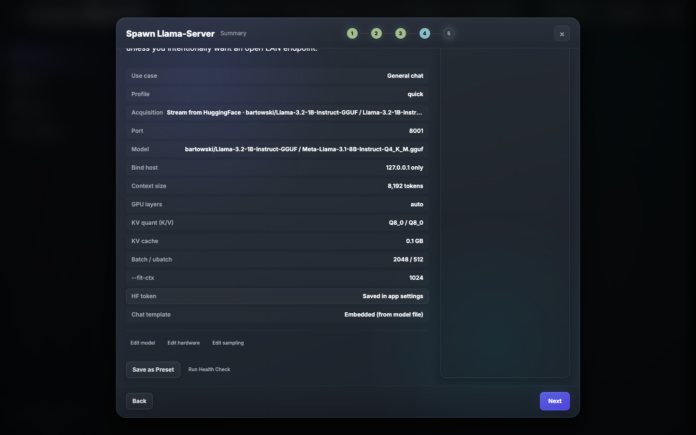

# Spawn Wizard Reference

The Spawn Wizard is a 5-step guided flow for configuring and launching a llama-server instance. It handles hardware detection, VRAM-aware parameter selection, model acquisition (local, HuggingFace, third-party), and binary management.

Entry points: the **New Server Wizard** card on the welcome screen, the **+ New Session** button in the top nav, and the **Spawn Local Server** link on the logs empty state.


---

## Wizard Steps

### Step 1 — Profile


The user selects a **hardware profile** and a **use case**.

**Hardware profiles** set defaults for GPU layers, batch size, and fit granularity:

| Profile | GPU Layers | Batch | Fit Granularity |
|---------|-----------|-------|-----------------|
| Quick / Low-end | 0 (CPU only) | 512 | 512 |
| Balanced | Auto | 1024 | 1024 |
| Workstation | All | 2048 | 2048 |
| Advanced | Manual | user-set | user-set |

**Use cases** influence KV quant defaults and ubatch:

| Use case | Min KV quant | Ubatch | Notes |
|----------|-------------|--------|-------|
| General | q8_0 | 1024 | Everyday chat, coding |
| Agentic | q8_0 | 1024 | Tool-calling, RAG; forces q8_0 minimum |
| Roleplay | q4_0 | 512 | Max context; q4_0 acceptable |

---

### Step 2 — Model

The user picks a model source. Three source types:


#### Local GGUF File
- User enters or browses an absolute path to a `.gguf` file.
- Parameter count (`param_b`) is inferred from the filename using `infer_param_b_from_name()`.
- Architecture heuristics are applied via `ModelArch::from_name_and_params()`.
- When launched from the local Models library, the wizard carries over discovered metadata and shows a small reminder card with filename, quant, and estimated size/parameter hints.

#### HuggingFace Hub
See [HuggingFace Integration](#huggingface-integration) below.


- The wizard includes a short helper explaining when a token is optional and links directly to `https://huggingface.co/settings/tokens`.
- Recommended token type: **Read**.
- Entry point for storing the token in-app: **Settings → Models**.

#### Third-Party Import
See [Third-Party Model Import](#third-party-model-import) below.

---

### Step 3 — Hardware


The core tuning step. Populated using `POST /api/vram/auto-size` after model selection.

#### Model Header
Shows the selected repo (`owner/model-name`) and selected quant. If multiple GGUF files exist in the repo, a **Quantization** dropdown lets the user swap without leaving the step. A **Vision (mmproj)** dropdown appears when mmproj files are detected in the repo.

#### Main Hardware Grid

| Control | ID | Default | Notes |
|---------|----|---------|-------|
| GPU layers | `spawn-gpu-layers` | Auto | Auto / All / Manual |
| Layers count | `spawn-gpu-layers-manual` | — | Shown only when Manual selected |
| Context size | `spawn-context-size` | 8192 | Quick-pick buttons: 65k, 131k, 200k, 256k |
| KV cache (K) | `spawn-cache-type-k` | q8_0 | f16 / q8_0 / q4_0 |
| KV cache (V) | `spawn-cache-type-v` | q8_0 | f16 / q8_0 / q4_0 |
| KV Unified | `spawn-kv-unified` | unchecked | `--kv-unified` flag |

#### KV Cache Scenarios
Three cards show the context/quality tradeoff for the current VRAM budget:
- **Max coherence** — q8_0/q8_0 KV
- **Max context** — q4_0/q4_0 KV

Selecting a card applies its KV quant and triggers auto-size.

#### VRAM Breakdown Bar
Animated stacked bar updated live as controls change. Segments:

| Segment | Color | Content |
|---------|-------|---------|
| Weights | Indigo | Model weights after MoE CPU offload |
| KV cache | Amber | Context × KV bytes per token |
| mmproj | Cyan | Vision projector (if loaded) |
| MTP | Purple | MTP prediction heads |
| Overhead | Gray | GPU context + allocator (~300 MB base) |
| Free | Green → Red | Remaining headroom (red when over budget) |

Recommendation thresholds (from `full_estimate`):

| State | Condition | Indicator |
|-------|-----------|-----------|
| Fit | total ≤ 82% of VRAM | green |
| Tight | total ≤ 100% of VRAM | yellow |
| Risk | total ≤ 120% of VRAM | orange |
| WontFit | total > 120% of VRAM | red |

#### MTP Section
Shown automatically when the model has `mtp_depth > 0` (detected from GGUF metadata or architecture heuristics). Controls:
- **Enable MTP acceleration** checkbox — adds `--spec-type draft-mtp,ngram-mod`
- **Draft tokens/step** (`hw-mtp-depth`) — sets `--spec-draft-n-max`; forces `--parallel 1`; typical speedup 50–200% on dense models

#### Advanced Options Grid

| Control | ID | Default | Notes |
|---------|----|---------|-------|
| Batch size | `spawn-batch-size` | 2048 | Prompt batch size (`-b`) |
| Parallel slots | `spawn-parallel-slots` | 1 | Concurrent inference slots |
| Ubatch size | `spawn-ubatch-size` | 512 | Micro-batch for prompt processing |
| MoE CPU experts | `spawn-n-cpu-moe` | Auto | Experts offloaded to CPU RAM |
| Tensor split | `spawn-tensor-split` | — | Multi-GPU split ratios (e.g. `1,1`) |

#### Speculative Decoding

| Mode | Flag | Notes |
|------|------|-------|
| None | — | Disabled |
| N-gram | `--spec-type ngram-mod` | Zero VRAM overhead; ~10–30% speedup |
| MTP + N-gram | `--spec-type draft-mtp,ngram-mod` | Built-in MTP heads; ~50–200% on dense |
| Draft model | `--spec-type draft-model` | Separate small draft model path required |

---

### Step 4 — Summary



Shows a human-readable review of all selected parameters. Health checks:
- VRAM fit status
- Context fit relative to training context (`n_ctx_train`); warns when n_ctx > n_ctx_train and suggests YaRN
- MoE CPU offload impact on generation speed
- KV quant quality warnings for agentic use cases
- Network exposure warnings when the user selects `0.0.0.0`, especially if no API key is set

This step also includes:
- Editable sampling defaults
- Network controls for `Port`, `Bind host`, and optional `Server API key`
- Inline edit shortcuts back to Model and Hardware so the user can make one last adjustment without restarting the flow

The user can save the configuration as a named preset from this step.

---

### Step 5 — Spawn

One-click launch. Shows live status (starting → waiting for endpoint → running / error). On success the wizard closes and the new session appears in the session list.

- The spawned `llama-server` process is started with `--no-warmup`.
- Readiness is confirmed by a backend probe against the active session, so launches with a server API key still report status correctly.

---

## HuggingFace Integration

### Search and Browse


- Public repos can be searched and browsed without an HF token.
- A read-only token is recommended for gated/private repos and to avoid stricter anonymous rate limits.
- The Step 2 wizard helper links directly to the Hugging Face token settings page and explains the `New token` → `Read` flow.

#### POST /api/hf/search
Search the HuggingFace Hub for GGUF model repos.

```json
// Request
{ "query": "qwen3", "limit": 20, "sort": "downloads" }

// Response
{
  "ok": true,
  "models": [
    {
      "id": "bartowski/Qwen3-30B-A3B-GGUF",
      "author": "bartowski",
      "downloads": 12345,
      "likes": 89,
      "last_modified": "2025-05-01T00:00:00Z",
      "tags": ["text-generation"],
      "param_b": 30.0,
      "quant_provider": "bartowski"
    }
  ]
}
```

- Requires: `api-token`
- Rate limit: 10 requests per 60 seconds
- Sort options: `downloads` (default), `likes`, `trending`, `recent`

#### POST /api/hf/author-models
Browse all GGUF repos by a specific author.

```json
// Request
{ "author": "bartowski", "limit": 40, "sort": "downloads" }
// Response: same shape as /api/hf/search
```

#### GET /api/hf/community-picks
Returns the curated community picks list (hot models shown in the wizard discover panel). No auth required for reads; updating the list requires `api-token`.

#### GET /api/hf/quantizers
Returns the list of tracked quantizer authors (used to filter search results). Requires `api-token`.

#### PUT /api/hf/quantizers
Update the quantizer author list.
```json
{ "quantizers": [{ "username": "bartowski", "display_name": "bartowski", "description": "..." }] }
```

### File Listing

#### POST /api/hf/files
List GGUF files in a repo.

```json
// Request
{ "repo_id": "bartowski/Qwen3-30B-A3B-GGUF" }

// Response
{
  "ok": true,
  "files": [
    {
      "path": "Qwen3-30B-A3B-Q4_K_M.gguf",
      "size": 18700000000,
      "label": "Q4_K_M",
      "quant_type": "standard",
      "is_imatrix": false,
      "is_mmproj": false
    }
  ]
}
```

- `quant_type`: `"standard"` | `"imatrix"` | `"unsloth_dynamic"`
- `label`: normalized quant type extracted from filename (e.g. `"Q4_K_M"`, `"IQ3_S"`)

### Download

#### POST /api/hf/download
Start a streaming download. Returns immediately with a download ID; poll `/status` for progress.

```json
// Request
{ "repo_id": "bartowski/Qwen3-30B-A3B-GGUF", "file_path": "Qwen3-30B-A3B-Q4_K_M.gguf", "resume": true }

// Response
{ "ok": true, "download_id": "md-1234567890-abc12345", "local_path": "/Users/you/.config/llama-monitor/models/Qwen3-30B-A3B-Q4_K_M.gguf" }
```

- Requires: `api-token`
- Rate limit: 10-second cooldown between starts
- Max 5 concurrent downloads
- Path traversal guard: rejects `..`, leading `/`, leading `\`
- Uses `connect_timeout(30s)` only — no total timeout (large files stream indefinitely)
- On failure: partial file renamed to `.part`; terminal logs record reason

#### GET /api/models/download/:id/status
Poll download progress.

```json
{
  "status": { "download_id": "md-...", "status": "running", "bytes_downloaded": 500000000, "total_bytes": 18700000000, "speed": 5242880.0, "eta": 3456, "message": "...", "local_path": "..." }
}
```

- `status`: `"running"` | `"completed"` | `"failed"` | `"cancelled"`
- `speed`: bytes/sec
- `eta`: seconds remaining (0 when unknown)

#### POST /api/models/download/:id/cancel
Cancel a running download. Returns `{ "ok": true }`.

#### GET /api/hf/download-dir
Returns the effective models directory.

```json
{ "ok": true, "dir": "/Users/you/.config/llama-monitor/models", "configured": false }
```

- `configured`: true if the user has overridden the default in Settings

### Model Card

#### GET /api/hf/card?repo=owner/model
Fetch and return the raw model card markdown for display in the in-app card panel. Content is rendered with `marked` and sanitized with `DOMPurify` before display.

### HF Token

#### GET /api/hf/token
Returns whether a token is currently stored: `{ "set": true }`. Requires `api-token`.

#### PUT /api/hf/token
Set or update the HF token: `{ "token": "hf_xxxx..." }`. Requires `api-token`. Written to `~/.config/llama-monitor/hf-token` with mode 600.

#### DELETE /api/hf/token
Remove the stored token. Requires `api-token`.

### Wizard-to-Settings Flow

- The Hugging Face helper in Step 2 can open **Settings → Models** without closing the wizard.
- The binary prerequisite banner can open **Settings → Session** without discarding wizard progress.
- After saving settings, the wizard refreshes its token/binary state in place.

---

## Third-Party Model Import

#### POST /api/third-party-models
Scan common local model directories from Ollama, LM Studio, and similar tools.

```json
// Request
{ "include_subdirs": true }

// Response
{ "ok": true, "models": [{ "path": "/path/to/model.gguf", "name": "llama-3.1-8b", "source": "ollama", "param_b": 8.0 }] }
```

- Requires: `api-token`
- Scan paths (macOS): `~/.ollama/models`, `~/.cache/lm-studio/models`
- Scan paths (Linux): `~/.ollama/models`, `~/.local/share/lm-studio/models`
- Scan paths (Windows): `%LOCALAPPDATA%\Ollama\models`, `%APPDATA%\LM-Studio\models`

---

## Model Introspection

#### POST /api/model/introspect
Run `llama-server --print-model-metadata` on a local GGUF file and return parsed architecture fields.

```json
// Request
{ "model_path": "/path/to/model.gguf" }

// Response
{
  "ok": true,
  "cached": false,
  "metadata": {
    "n_layers": 32, "n_kv_heads": 8, "head_dim": 128,
    "n_experts": 0, "context_length": 131072,
    "general_architecture": "llama",
    "mtp_depth": 0
  }
}
```

- Requires: `api-token`
- Results cached in `~/.config/llama-monitor/model-cache/<sha256>.json`; cache hit returns `"cached": true`
- Timeout: 30 seconds
- Used to override `ModelArch` heuristics with ground-truth values from the file

---

## Binary Prerequisite System

When the wizard opens and no `llama-server` binary is found at the configured path, a banner is shown before the wizard steps begin.

#### GET /api/llama-binary/platform-info
Returns instant (no network) platform and backend metadata.

```json
{
  "ok": true,
  "os": "macos",
  "arch": "aarch64",
  "label": "Apple Silicon Metal",
  "backends": [
    { "id": "metal", "label": "Apple Silicon Metal", "description": "Recommended for M-series Macs", "default": true }
  ]
}
```

#### GET /api/llama-binary/latest
Returns the latest available release version (cached, fetched from GitHub). Used with `platform-info` to show the version that will be downloaded.

#### POST /api/llama-binary/update
Download and install a llama.cpp release binary.

```json
// Request (optional backend override)
{ "backend": "cuda13" }

// Response
{ "ok": true, "version": "b5678", "backend": "metal", "arch": "aarch64", "path": "/Users/you/.config/llama-monitor/bin/llama-server" }
```

- Requires: `api-token`
- Copies the full release archive (not just `llama-server`) to `~/.config/llama-monitor/bin/` — CUDA/Vulkan/SYCL builds require their shared libraries to be co-located
- All extracted files get `chmod 755` on Unix
- Default install path: `~/.config/llama-monitor/bin/llama-server` (configurable in Settings)

---

## VRAM Estimation API

See [vram-estimator.md](vram-estimator.md) for the estimation formulas and `ModelArch` field reference.

#### POST /api/vram/estimate
Quick estimate for a single configuration.

```json
// Request
{
  "model_path": "/path/to/model.gguf",
  "model_name": "Qwen3-30B-A3B",
  "param_b": 30.0,
  "context_size": 65536,
  "cache_type_k": "q8_0",
  "cache_type_v": "q8_0",
  "parallel_slots": 1,
  "ubatch_size": 1024,
  "n_cpu_moe": 0,
  "available_vram_bytes": 68719476736
}

// Response: VramEstimate (legacy shape)
{
  "ok": true,
  "estimated_vram_bytes": 28000000000,
  "estimated_ram_bytes": 0,
  "available_vram_bytes": 68719476736,
  "recommendation": "fit",
  "note": "Fits comfortably with >18% headroom."
}
```

#### POST /api/vram/estimate-breakdown
Full estimate with per-component breakdown.

```json
// Response: VramBreakdown
{
  "ok": true,
  "weights_bytes": 16000000000,
  "kv_cache_bytes": 8000000000,
  "linear_attn_state_bytes": 0,
  "mmproj_bytes": 0,
  "mtp_bytes": 0,
  "overhead_bytes": 314572800,
  "total_bytes": 24314572800,
  "available_bytes": 68719476736,
  "headroom_bytes": 44404903936,
  "ram_bytes": 0,
  "recommendation": "fit",
  "note": "Fits comfortably with >18% headroom."
}
```

#### POST /api/vram/auto-size
Compute optimal settings for a model + hardware combination.

```json
// Request
{
  "model_path": "...", "model_name": "...", "param_b": 30.0,
  "available_vram_bytes": 68719476736,
  "use_case": "general",
  "parallel_slots": 1,
  "fit_granularity": 1024
}

// Response: AutoSizeResult
{
  "ok": true,
  "context_size": 131072,
  "kv_quant_k": "q8_0",
  "kv_quant_v": "q8_0",
  "fit_ctx": 1024,
  "ubatch_size": 1024,
  "n_cpu_moe": null,
  "breakdown": { ... },
  "scenarios": [
    { "label": "Max coherence", "kv_quant_k": "q8_0", "kv_quant_v": "q8_0", "context_size": 131072, "n_cpu_moe": null, "vram_total_gb": 22.5, "recommended": true, "warning": null, "note": "q8_0 KV — min for agentic" },
    { "label": "Max context", "kv_quant_k": "q4_0", "kv_quant_v": "q4_0", "context_size": 204800, "n_cpu_moe": null, "vram_total_gb": 21.0, "recommended": false, "warning": null, "note": "q4_0 KV — roleplay OK, agentic ⚠" }
  ],
  "warnings": [],
  "notes": ["MoE: all 64 experts in VRAM."]
}
```

- `use_case`: `"general"` | `"agentic"` | `"roleplay"`

#### POST /api/vram/quant-compare
Pre-download quant comparison table for a model. Shown in the wizard as the **Quant Advisor** panel.


```json
// Request
{ "model_name": "Qwen3-30B-A3B", "param_b": 30.0, "available_vram_bytes": 68719476736 }

// Response
{
  "ok": true,
  "quants": [
    { "quant": "Q4_K_M", "label": "Q4_K_M", "model_size_gb": 18.5, "fits_vram": true, "max_ctx_q8": 131072, "max_ctx_q4": 204800, "recommended": true }
  ]
}
```

---

## Security

- All endpoints require `api-token` (Bearer token in `Authorization` header).
- HF token never appears in logs; masked in the GET response.
- Download `file_path` rejects `..`, leading `/`, leading `\` (path traversal guard).
- `target_path` for downloads is canonicalized and verified to remain within `models_dir`.
- Download rate-limited: 10-second cooldown between starts, max 5 concurrent.
- Model introspection runs `llama-server` as a subprocess with a 30-second timeout; never passes unsanitized user input as shell arguments.

---

## Related Files

| File | Purpose |
|------|---------|
| `src/llama/vram_estimator.rs` | All VRAM estimation logic and `ModelArch` |
| `src/llama/spawn_wizard.rs` | `auto_size` wrapper called by the wizard API |
| `src/model_download.rs` | Streaming download manager with resume support |
| `src/hf/mod.rs` | HuggingFace API client, file listing, token management |
| `src/web/api.rs` | All wizard-related route handlers |
| `static/js/features/spawn-wizard.js` | Wizard frontend (all 5 steps) |
| `static/css/spawn-wizard.css` | Wizard styles |
| `docs/reference/vram-estimator.md` | VRAM estimation formulas and heuristics reference |
