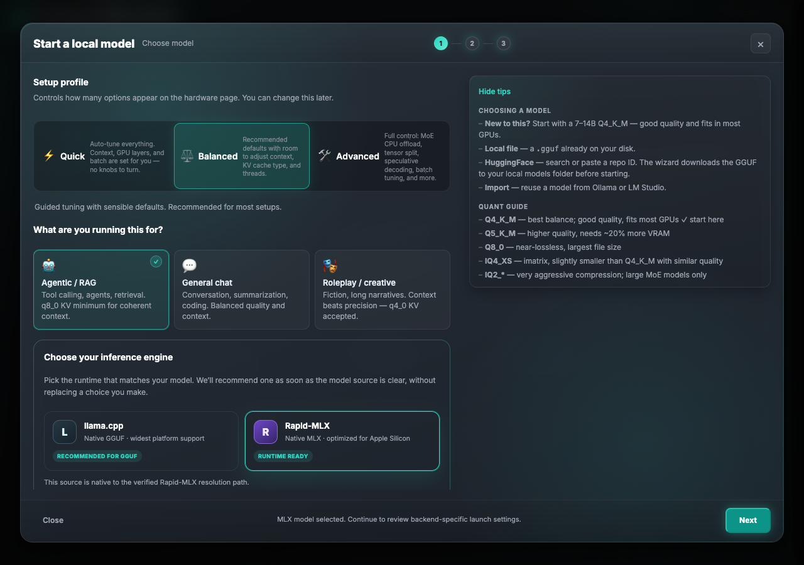
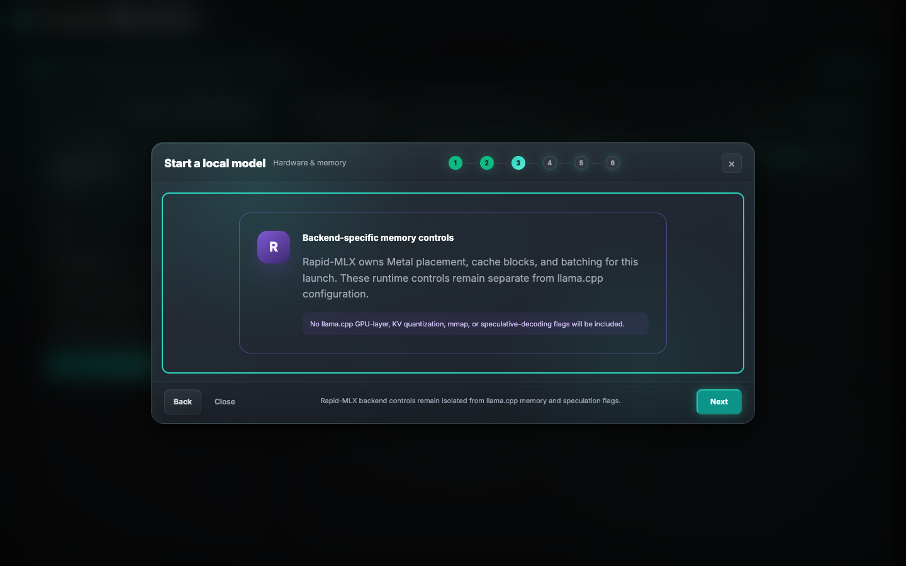

# Spawn Wizard

The Spawn Wizard is the guided flow for creating a model server. It provides:

- Profile selection (Speed / Balanced / Quality) and use-case selection (agentic / general / roleplay)
- Engine selection between llama.cpp and Rapid-MLX
- Model source input (local GGUF, Hugging Face, or import)
- Architecture-aware VRAM breakdown and context fit modes
- Auto-size recommendations and MoE tuning
- Per-backend settings isolation
- Workload scenario mapping (page-1 use-case selection drives backend VRAM policy)

## Steps

| Step | Purpose |
|------|---------|
| 0. Profile | Choose Speed / Balanced / Quality profile and use case (agentic / general / roleplay) |
| 1. Model | Select engine, choose model source, set model-specific options |
| 2. Hardware & memory | Tune context, offload, batching, speculative decoding, VRAM, Rapid-MLX controls |
| 3. Settings | Review network, security, and advanced launch flags |
| 4. Review | Summary of the configuration before launch |
| 5. Start server | Launch and monitor start-up |

### Step 0: Profile

The wizard opens with a profile + use-case selection screen (wizard-step-0):

- **Profile cards**: Speed, Balanced, Quality — influence the default hardware policy.
- **Use-case cards**: agentic, general, roleplay — maps to a `workload_scenario` string sent to the backend VRAM estimator (see below).

The use-case selection drives the backend's memory policy:
- `agentic` → `interactive_coding_agent` (coding agent workload, 80% priority)
- `general` → `general_chat` (standard chat, moderate context)
- `roleplay` → `roleplay_storytelling` (long-context narrative)

### Step 1: Model

Engine selection, model source input, and model-specific options. See [Engine selection](#engine-selection) below.

### Step 2: Hardware & Memory

Backend-specific hardware controls. The controls shown depend on the selected engine.

For llama.cpp: GPU layers, KV cache types, MoE offload, mlock, threads, speculative decoding, MTP, mmproj, flash attention, fit-to-memory, priority.

For Rapid-MLX: a dedicated `rapid-hardware-panel` is shown with:

- **KV cache dtype**: int4 / int8 / bf16 selection. When reasoning mode is ON, int4 is blocked and KV is pinned to int8 (effective "reasoning profile"). The review step (step 4) shows "INT4 → INT8 (reasoning profile)" to make the override visible.
- **Retained cache**: 8 GiB (recommended), 16 GiB (retain branches), or Off.
- **Tool-call parser**: Auto (Rapid alias profile) with explicit override options (qwen3, qwen3_xml, qwen3_coder, qwen3_coder_xml, gemma4, hermes, mistral, llama3, deepseek_v31, kimi_k2, glm4, minimax_m2, gpt_oss). Shows "Detected: <value>" hint when the Rapid-MLX profile auto-detects a parser.
- **Reasoning parser**: Auto (Rapid alias profile) with explicit override options (qwen3, gemma4, hy_v3, hy3, deepseek_r1, vibethinker, glm4, gpt_oss, harmony, minimax, ui_tars). Shows "Detected: <value>" hint when the profile auto-detects a parser.
- **Hybrid architecture**: Auto (model/profile detection), Force hybrid, Disable hybrid. For hybrid DeltaNet models (Qwen3-Coder-Next, Qwen3.6).
- **Prefill step size**: 512 (qualified text default), 1024/1536 (vision fallback).
- **TurboQuant mode**: None (standard), K8V4, V-only.
- **Reasoning mode**: Toggle ON for reasoning models (pins KV to int8).
- **Web UI availability**: Auto, On, Off.

### Step 3: Settings

Network, security, and advanced launch flags.

### Step 4: Review

Summary of the full configuration before launch. Shows Rapid-MLX advanced settings (KV dtype, prompt storage, workload scenario, sampling mode, reasoning mode, Web UI) when applicable. When reasoning mode is ON and requested KV dtype is not int8, the summary shows "INT4 → INT8 (reasoning profile)" to make the override visible.

### Step 5: Start Server

Launch and monitor start-up. Preset save/load options are available here.

## Engine selection

The wizard supports two inference backends:

- llama.cpp — native for GGUF models
- Rapid-MLX — optimized for MLX-ecosystem models on Apple Silicon

Engine selection appears on Step 1 (Model) as two cards.

The wizard:

- Prefers llama.cpp by default.
- Automatically recommends Rapid-MLX when the chosen model source is native to it.
- Allows the user to override the recommendation (choice is preserved).

### When Rapid-MLX is recommended

The wizard calls `/api/rapid-mlx/recommend` after:

- a model source or file is selected,
- a HF repo is entered (with explicit Rapid-MLX engine),
- the engine is changed.

The endpoint uses `recommend_backend()` (src/inference/backend.rs) which makes a recommendation based on:

- the classified artifact type (see below),
- whether Apple Silicon is detected locally,
- whether a compatible Rapid-MLX runtime is available.

Recommendation outcomes:

- GGUF file or GGUF inventory
  - Recommended: llama.cpp. Reason: "GGUF runs natively with llama.cpp."
- MLX directory, authoritative Safetensors, Rapid-MLX HF repository, Rapid-MLX alias:
  - Not Apple Silicon:
    - State: platform_unavailable
    - Rapid-MLX card becomes visually "unavailable"; user can still attach a remote Rapid-MLX endpoint.
  - Apple Silicon, runtime not installed:
    - State: runtime_required
    - Wizard blocks next step; message instructs user to install from Settings.
  - Apple Silicon, runtime available:
    - Recommended: Rapid-MLX.
    - If the user hasn't explicitly chosen an engine, Rapid-MLX is auto-selected.
- Unknown source:
  - State: manual_selection
  - User must pick an engine after defining the model source.

### Artifact classification

The wizard classifies the selected artifact (spawn-wizard.js:classifyWizardArtifact):

- gguf:
  - path or hfFile ends with .gguf, or quant file list contains a .gguf file.
- authoritative_safetensors:
  - model source kind is "authoritative_safetensors" (from a typed library entry).
- rapid_mlx_alias:
  - model source kind is "alias" (e.g., HF-style alias name resolved by Rapid-MLX).
- rapid_mlx_hf_repository:
  - model source kind is "hugging_face_repo" (Rapid-MLX managed HF repository reference).
- mlx_directory:
  - model source kind indicates MLX directory.
- unknown:
  - none of the above.

The classification is used both by the UI (to show appropriate hints) and by the recommendation endpoint.

## Rapid-MLX wizard UX

When Rapid-MLX is selected, the wizard adapts the Step 1 and Step 2 UI:

- Model source description:
  - Switches to "Choose a validated MLX directory or a Rapid-MLX Hugging Face repository."
- Local model card:
  - Label changes to "Select local MLX model".
  - Description: "Browse to a validated MLX model directory."
  - Browse button switches to directory mode instead of GGUF-only.
- HF source card:
  - Description: "Enter a Rapid-MLX-compatible Hugging Face repository ID."
  - For Rapid-MLX, entering a repo ID is sufficient (no GGUF file picker).
- Import source card:
  - Hidden when Rapid-MLX is selected (Rapid-MLX does not support the import path).
- Hardware step:
  - llama.cpp-specific controls (GPU layers, KV cache types, MoE offload, mlock,
    threads, speculative decoding, MTP, mmproj) are hidden.
  - A Rapid-MLX-specific panel (rapid-hardware-panel) is shown for backend-specific
    configuration, keeping its settings isolated from llama.cpp flags.

- Launch guard:
  - Step 1 validation:
    - Blocks if Rapid-MLX is selected but not Apple Silicon.
    - Blocks if Rapid-MLX is recommended-ready but a GGUF was chosen under it;
      instructs switching engines or choosing a validated MLX source.
    - Blocks if a Rapid-MLX-specific model source (alias, HF repository, MLX directory)
      is used under llama.cpp; instructs switching to Rapid-MLX engine.

## Runtime install and upgrade

The Rapid-MLX runtime is managed by Llama Monitor. The wizard does not ship its own installer;
it relies on the runtime management APIs documented in rapid-mlx-runtime.md.

Wizard behavior tied to runtime state:

- On open:
  - Calls `/api/rapid-mlx/runtime/status` and platform-info.
  - If Apple Silicon and runtime is active, the Rapid-MLX card shows "Runtime ready".
  - If Apple Silicon but runtime is missing, it shows "Runtime setup required".
  - On non-Apple Silicon, the card is marked "Local launch · Apple Silicon only".
- Step 1 validation:
  - If Rapid-MLX is selected but runtime_required:
    - User cannot proceed; hint points to Settings → Rapid-MLX to install a version.
- Engine badge:
  - Displays one of:
    - "Runtime ready"
    - "Runtime setup required"
    - "Local launch · Apple Silicon only"

The user installs or upgrades the runtime from Settings, using the managed runtime
UI (version picker, channel selection, job polling). After a successful install,
the wizard reflects the new runtime-ready state.

## HF alias support

Rapid-MLX integrates HF-style aliases. These are human-readable model names (for
example, "Qwen2.5-0.5B-Instruct") that Rapid-MLX can resolve to the correct source
repository and revision.

Wizard behavior:

- When a Rapid-MLX model source has kind "alias" in `rapidMlxSource` or
  `localMeta.model_source`, `classifyWizardArtifact()` classifies it as `rapid_mlx_alias`.
- The recommendation endpoint treats this as native to Rapid-MLX:
  - If runtime is compatible and platform supports it, it auto-selects Rapid-MLX.
  - If the user attempts llama.cpp, the validation step blocks with:
    "This typed model source requires Rapid-MLX. Switch engines to continue."
- Alias-based models behave the same as other Rapid-MLX-native sources for VRAM
  estimation, hardware panel rendering, and launch.

## VRAM estimator

The spawn wizard uses the backend VRAM estimator as the single source of truth; there
are no local VRAM formulas.

- The wizard sends requests to `/api/vram-estimate` via `scheduleEstimate()`
  in vram-estimate.js.
- `buildEstimateBody()` sets:
  - `backend: "rapid_mlx"` when Rapid-MLX is selected.
  - `backend: "llama_cpp"` by default.
- The backend returns a normalized breakdown (weights, KV cache, overhead, free)
  for the selected backend.

### Workload scenario

The page-1 use-case selection (agentic / general / roleplay) maps to a `workload_scenario`
string sent to the VRAM estimator via the `/api/vram-estimate` endpoint. The estimator
uses this to determine memory policy:

- `interactive_coding_agent` — coding agent workload, 80% priority, 128K planning context, 32K retained cache. Default when no explicit selection.
- `general_chat` — standard chat, moderate context, 32K planning context, 8K retained cache.
- `roleplay_storytelling` — long-context narrative, 64K planning context, 32K retained cache.

The workload scenario also affects TurboQuant eligibility, MTP eligibility, parallel
slot recommendations, and the recommended KV dtype.

Behavior per backend:

- llama.cpp:
  - Uses GGUF-introspected architecture, layer counts, quantization, MoE settings.
  - Reflects GPU layers, context size, KV cache type, speculation, mmproj, etc.
- Rapid-MLX:
  - Uses Rapid-MLX-specific memory modeling based on the selected model.
  - Incorporates workload_scenario for memory policy (KV dtype, retained cache, TurboQuant).
  - Reflects backend-specific overhead and any Rapid-MLX-native memory considerations.

The VRAM bar and side panel always use the same visual layout regardless of engine,
but the underlying numbers differ because the `backend` field is respected server-side.

## Backend-aware settings

The wizard isolates settings per backend:

- llama.cpp-only settings (hidden under Rapid-MLX):
  - GPU layers (-ngl)
  - KV cache types (ctk/ctv)
  - MoE CPU offload (-n-cpu-moe)
  - mlock, threads, threads-batch
  - Speculative decoding and MTP controls
  - mmproj projector selection
  - Flash attention, fit-to-memory, priority
- Rapid-MLX-only settings:
  - Exposed via a dedicated Rapid-MLX hardware panel
  - No llama.cpp flags; Rapid-MLX models do not send llama.cpp args.
  - Includes KV dtype, retained cache, parser overrides, hybrid mode, reasoning mode, TurboQuant, Web UI.

This ensures generated launch commands only include parameters valid for the chosen backend.

## Model sources and sampling modes

Rapid-MLX presets store a typed model source rather than relying on a display path.
Supported sources include a local MLX directory, a Hugging Face repository and revision,
an alias, an authoritative Safetensors conversion source, and a GGUF source that is retained
for migration but shown as llama.cpp-only. Older Rapid-MLX presets are migrated to the typed
source when loaded or saved; the legacy `model_path` is not retained as a second identity.
Unknown future source kinds are preserved for editing/export but cannot launch until the
installed Llama Monitor version understands them.

Sampling choices come from one backend API catalog. Each mode includes its stable ID,
source/provenance, workload badges, and backend field coverage. The catalog always includes
Model/author default (omit sampler defaults) and Custom (preserve user-entered values), in
addition to applicable curated family modes. Explicit request values take precedence over a
selected mode; explicit `0` and `false` remain explicit values rather than being replaced by
defaults.

For llama.cpp, supported selected defaults become launch defaults exactly once. Rapid-MLX
sampling defaults remain informational until the selected runtime's per-field capability
snapshot qualifies them; the wizard does not claim they are active or emit unsupported flags.
