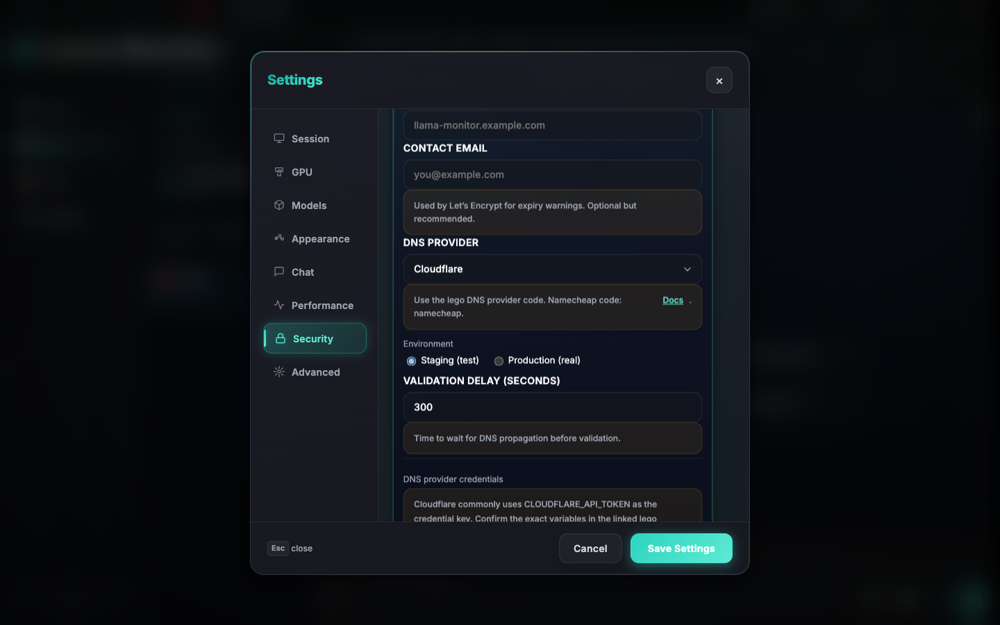
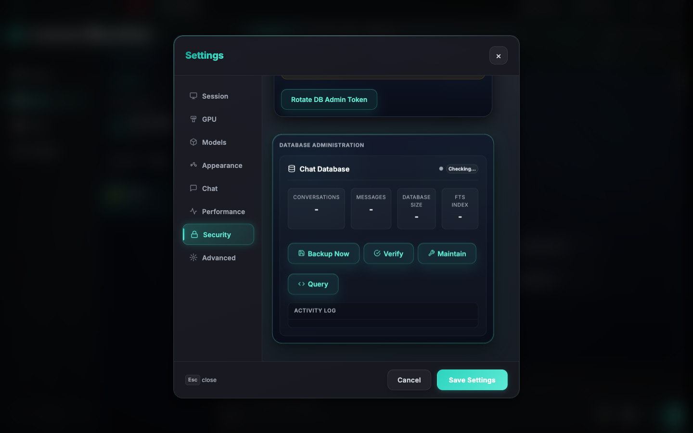

# TLS / ACME / mTLS Architecture

This document describes how TLS, ACME (Let’s Encrypt), and mTLS work in llama-monitor.
It is intended for:
- Operators configuring TLS or ACME.
- Developers extending or debugging TLS behavior.

TLS and ACME endpoints are implemented in `src/web/api/tls.rs` and wired into the
main router in `src/web/api/mod.rs`.

High-level principles:
- TLS is optional and never forced.
- llama-monitor can run:
  - As plain HTTP.
  - With self-signed TLS.
  - With user-provided certificates.
  - With ACME-managed certificates (Let’s Encrypt).
  - Behind a reverse proxy that terminates TLS.
- TLS and ACME integrate with mTLS used for remote-agent communication.

## TLS Modes


llama-monitor supports four TLS modes, configured via:
- CLI flags.
- Settings → Security & Certificates (UI).
- tls-config.json (advanced).

Config is persisted to:
- ~/.config/llama-monitor/tls-config.json

### tls-config.json Schema

```json
{
  "mode": "none",
  "acme": {
    "enabled": false,
    "fqdn": "",
    "environment": "staging",
    "dnsProvider": "cloudflare",
    "dnsConfig": {},
    "validationDelay": 300,
    "lastRenewal": null,
    "certPath": "",
    "keyPath": ""
  },
  "customCertPath": "",
  "customKeyPath": ""
}
```

| Field | Type | Values |
|-------|------|--------|
| `mode` | string | `"none"`, `"self-signed"`, `"custom"`, `"acme"` |
| `acme.enabled` | boolean | Whether ACME is active |
| `acme.fqdn` | string | Fully-qualified domain name |
| `acme.environment` | string | `"staging"` or `"production"` |
| `acme.dnsProvider` | string | DNS provider name (e.g., `"cloudflare"`) |
| `acme.dnsConfig` | object | Provider-specific credentials |
| `acme.validationDelay` | integer | Delay in seconds before DNS validation |
| `acme.lastRenewal` | string or null | ISO timestamp of last renewal |
| `acme.certPath` | string | Path to ACME-managed cert |
| `acme.keyPath` | string | Path to ACME-managed key |
| `customCertPath` | string | Path to custom certificate |
| `customKeyPath` | string | Path to custom private key |

Modes:

1) No HTTPS (HTTP only)
2) Self-Signed
3) Bring Your Own Key (Custom certificate)
4) Let’s Encrypt (ACME)

Each mode is described below.

### 1) No HTTPS

Behavior:
- Server listens on plain HTTP.
- No TLS, no ACME, no certificate management.
- Suitable for:
  - Local-only use.
  - Reverse proxy setups where TLS is terminated externally.

Configuration:
- Default mode.
- CLI:
  - Omit all --tls flags.
- Settings UI:
  - Security & Certificates → select “No HTTPS”.

Notes:
- If you bind to 0.0.0.0, a LAN warning is shown to remind you that traffic is unencrypted.

### 2) Self-Signed

Behavior:
- llama-monitor generates a self-signed certificate and private key.
- Useful for:
  - Local HTTPS without an external CA.
  - Testing and development.
  - Environments where you trust devices manually.

Configuration:
- CLI:
  - --tls --tls-self-signed
- Settings UI:
  - Security & Certificates → select “Self-Signed”.

Details:
- Certificate and key are stored under ~/.config/llama-monitor/.
- Browsers will show a certificate warning; you must accept it manually.

### 3) Bring Your Own Key (Custom certificate)

Behavior:
- llama-monitor uses certificates and keys you provide.
- Useful for:
  - Internal CAs.
  - Certificates issued by your own PKI or a commercial CA.

Configuration:
- CLI:
  - --tls --tls-cert /path/to/cert.pem --tls-key /path/to/key.pem
- Settings UI:
  - Security & Certificates → select “Bring Your Own Key”.
  - Enter certificate and key file paths.
- tls-config.json (advanced):
  - mode: "Custom"
  - customCertPath and customKeyPath set.

Notes:
- Files must be readable by the user running llama-monitor.
- Changing certificate/key paths requires a restart to take effect.

### 4) Let’s Encrypt (ACME)



Behavior:
- llama-monitor uses the ACME protocol to obtain and renew TLS certificates from Let’s Encrypt.
- Uses DNS-01 validation via the lego client.
- Suitable for:
  - Public servers with a fully-qualified domain name (FQDN).
  - Environments where you want automated certificate lifecycle.

Prerequisites:
- A public FQDN (e.g., llama.example.com).
- A DNS provider supported by lego.
- lego installed and available on PATH.
- DNS credentials (API key, tokens, etc.) configured.

Configuration (high level):
- Settings UI:
  - Security & Certificates → select “Let’s Encrypt (ACME)”.
  - Enter:
    - Domain (FQDN).
    - Environment: Staging (for testing) or Production.
    - DNS provider (e.g., Cloudflare, Route53, DigitalOcean, Namecheap, etc.).
    - Provider-specific credentials (key/value pairs).
- Backend:
  - Stores ACME configuration and lego data under:
    - ~/.config/llama-monitor/acme-data
  - Uses lego to:
    - Request initial certificate.
    - Renew certificates automatically (every 24 hours if within 60 days of expiry).

Integration notes:
- When ACME is enabled and a valid certificate exists:
  - llama-monitor starts TLS using the ACME certificate.
- If ACME certificate is not yet available:
  - llama-monitor starts HTTP.
  - Logs indicate that ACME is pending.
- Secrets are never logged in plaintext; UI masks them.

Provider-agnostic design:
- TLS/ACME endpoints (`src/web/api/tls.rs`):
  - Treats providers via:
    - A lego DNS provider code (e.g., "cloudflare", "route53", "namecheap").
    - A map of environment variables (dns_config).
  - build_lego_command() assembles the lego command dynamically.
- To add support for a new provider:
  - Ensure lego supports it.
  - Use its lego provider code from https://go-acme.github.io/lego/dns/.
  - Enter the required environment variables as ACME credential key/value pairs.

## mTLS for Remote Agent

Remote-agent communication uses mutual TLS (mTLS) to ensure only trusted clients can connect.

Key points:
- mTLS is separate from ACME.
- Trust root:
  - Each device has its own CA (`ca.pem` / `ca.key`) that signs its own client cert.
  - ACME leaf certificates are not used as the agent trust root.
- Agent-side trust (who can connect to the agent):
  - `cas/` directory: one `.pem` per enrolled device CA.
  - Legacy single-CA fallback (`ca.pem`) supported for old installs.
  - A watch channel allows new `cas/` entries to be trusted without restart.
  - AgentClientCertVerifier validates each client cert against the loaded CA set and requires the "agent-client" role marker.
- Dashboard-side trust (which agents can be connected to):
  - `remote-cas/` directory: one `.pem` per remote agent host.
  - The dashboard loads all entries in this directory when building its HTTPS client.
- Enrollment:
  - The dashboard automatically enrolls via SSH bootstrap when mTLS fails.
  - No user interaction is required beyond SSH setup.
  - See the Remote Agent reference doc for the full enrollment flow.
- Logging:
  - On agent connection, logs:
    - Client certificate subject.
    - Remote address.

For agent clients:
- Must present a client certificate signed by their device’s CA.
- The device CA must be enrolled in the agent’s `cas/` directory.
- Must carry the expected role marker ("agent-client") in the certificate.

## Reverse Proxy Usage

llama-monitor can run behind a reverse proxy (Nginx, Caddy, HAProxy, etc.) that terminates TLS.

Recommended patterns:

- llama-monitor in HTTP mode:
  - Set TLS mode to “No HTTPS”.
  - Bind llama-monitor to:
    - 127.0.0.1 or an internal interface.
  - Let the reverse proxy:
    - Terminate TLS with its own certificate (ACME or custom).
    - Forward traffic to llama-monitor over HTTP.

- llama-monitor with its own TLS:
  - Use “Self-Signed”, “Bring Your Own Key”, or “Let’s Encrypt”.
  - Configure reverse proxy to:
    - Connect via HTTPS to llama-monitor.
    - Optionally terminate TLS externally and forward as HTTP or HTTPS.

Notes:
- If the reverse proxy handles ACME:
  - Prefer “Bring Your Own Key” or “No HTTPS” in llama-monitor.
  - Avoid double ACME management unless intentionally designed.

## Security Considerations

- TLS is defense-in-depth:
  - Always recommended when:
    - Exposed on LAN.
    - Accessible via public network.
    - Used with remote-agent.
- ACME:
  - Use Staging environment first to validate:
    - DNS provider configuration.
    - FQDN and propagation.
  - Switch to Production only after confirming DNS-01 challenges work.
- Secrets:
  - ACME credentials and private keys:
    - Stored locally.
    - Never logged in full.
- mTLS:
  - Ensures only authorized remote agents can connect.
  - Protects against impersonation and man-in-the-middle.

## Troubleshooting

Common issues:

- “TLS failed to start”:
  - Check tls-config.json for correct mode.
  - For “Bring Your Own Key”:
    - Confirm cert and key paths exist and are readable.
  - For ACME:
    - Confirm lego is installed and on PATH.
    - Confirm FQDN and DNS provider config.

- ACME certificate not issued:
  - Verify:
    - FQDN is public and resolvable.
    - DNS provider credentials are correct.
    - You are using Staging initially.
  - Check logs for lego errors.

- Browser shows certificate warning:
  - If using “Self-Signed” or internal CA:
    - This is expected; you must trust the certificate on each client.
  - If using ACME:
    - Confirm you are using the correct domain.
    - Confirm no reverse proxy is interfering.

- Remote-agent mTLS connection refused:
  - The dashboard will automatically attempt SSH bootstrap enrollment on the next poll.
  - To force re-enrollment: remove the relevant entry from `remote-cas/` on the client and from `cas/` on the agent, then restart the agent.
  - Manual check:
    - Client certificate is signed by the device’s CA.
    - Device CA is present in the agent’s `cas/` directory.
    - Certificate includes "agent-client" role marker.

## DB Admin & Security

The Security & Certificates panel includes a DB Admin section for high-impact operations protected by the db-admin-token (e.g., database backups and restores).

- View or regenerate the db-admin-token.
- Perform DB backups, restores, and advanced operations via the UI or API.

These operations require:
- Proper authentication (api-token and/or db-admin-token).
- Confirmation for destructive actions to prevent accidental use.



For deeper technical details and code references, see:
- docs/archive/security/20260516-tls_acme_implementation.md
